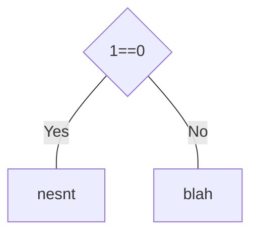

## if … else

conditional statement

branching



```c
int x = 4;
if (x == 5)
{
  printf("Yes");
  printf("hi");
}

print("outside everything");
```

```
outside everything
```

```c
if(x>10)
{
 if(y < 10) 
 {
   printf("hi");
 }
}
else
{
  printf("hi");
}
```

```c
if(x>10 && y<10)
{
   printf("hi");
}
else
{
  printf("hi");
}
```

```python
elif
```

```
hi
outside everything
```

`for`, `if` and `else` go to the immediate next block

```python
x = 5
if x == 5:
  print("yes")
  print("block 1")
else:
  print("no")
  print("block 2")
```

## Ternary Operator

cooler way of doing if else

```c
(y<10)?(x=10):(x=0)
```

## Switch

```c
switch(s):
{
  case 1: something; break;
  case 2: something; break;
  default: something;
}

switch(s):
{
  case 'a': something; break;
  case 'b': something; break;
  default: something;
}
```

