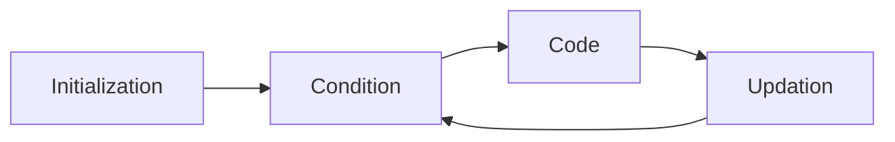

## Types

- `while`
    - Entry-controlled loop
- `do...while`
    - Exit-controlled loops
- `for`

## Components

- Initialization
    - $n$
    - $i$
- Loop condition checked
- Code to execute is run
- Updation occurs



```c
/*
int n = 10;
int i = 1; // comesntenret

for (; ; )
{
 
  if(i>n)
    break;
  
  // code
  
  i++;
}
*/

for (int i = 1, n=10; i<=n; i++)
{

}

int i = 1, n=10;
for (; i<=n; i++)
{
  ;// nothing happens
}

printf("%d", i); 11
```

```c
for (int i = 1, n=10; i<=n; i++)
  printf("%d\n", i);
```

```
1
2
...
9
10
```

```c
for (int i = 1, n=10; i<=n; i++)
  printf("%d\n", i);
  printf("%d\n", i);

for (int i = 1, n=10; i<=n; i++)
{
  printf("%d\n", i);
}
printf("%d\n", i);

// here
```

```
1
2
3
...
9
10
11
```

```c
for (int i = 1, n=10; i<=n; i++)
{
  printf("%d\n", i);
  printf("%d\n", i);
}

// here
```

```
1
1
2
2
...
9
9
10
10
```

```c
int i, n;
for (i = 1, n=10; i<=n; i++);
  printf("%d\n", i);

int i, n;
for (i = 1, n=10; i<=n; i++)
{
 ; 
}
  
printf("%d\n", i);
```

```
11
```

```c
int i = 1, n = 10;

// curly brace
// run 10 times
while(i<=n)
{
 print("hi");
 i++;
}
```

```c
int i = 1, n = 10;
// curly brace

do
{
  // code
  i++;
} while (i<n); // has semi-colon
```

```python
x=5, y=10
```

## Pyramid example

```
*
*
*
*
```

```c
#include <stdio.h>

int main()
{
  int n = 4; // no of lines
  for (int i=1; i<=n; i++) // run the loop 4 times
  {
    printf("*\n");
  }
  
  return 0;
}
```

```
*
**
***
****
```

```c
#include <stdio.h>

int main()
{
  printf("*\n");
    printf("**\n");
    printf("***\n");
    printf("****\n");
  
  return 0;
}
```

1. DUMB
2. Not scalable
3. Not elegant

Hence, we need loops (iterative statements)

```c
#include <iostream.h>

int main()
{
  for (int i=1; i<=n; i++)
  {
    for (int j=1; j<=i; j++)
    {
      printf("*");
    }
    
    printf("\n");
  }
  return 0;
}
```

# jump statements

- break
    - exits the current loop
- continue
    - skips the below code of the current iteration
    - goes to the update segment of (for)loop
    - in other loops, it goes to condition
    - then continues as usual

```c
for (int i=1; i<=5; i++)
{
  if(i==3)
  {
    break;
    printf("%d\n", i);
  }
  
   printf("%d\n", i);
}

// come here
```

```
1
2
```

```c
for (int i=1; i<=5; i++)
{
  if(i==3)
  {
    continue;
    printf("%d\n", i);
  }
  
   printf("%d\n", i);
}
```

```
1
2
4
5
```

```c
int i=1;
while(i<=5)
{
  if(i==3)
  {
    continue;
    printf("%d\n", i);
  }
  
   printf("%d\n", i);
  
  i++;
}
```

```
1
2
(infinite loop)
```

```c
int i=1;
do
{
  if(i==3)
  {
    continue;
    printf("%d\n", i);
  }
  
   printf("%d\n", i);
  
  i++;
} while(i<=5); // has terminator
```

```
1
2
(infinite loop)
```

# Loop Printining Questions

```c
int n = 4; // no of lines
int j = 1;
for (int i=1; i<=n; i++) // controls no of lines
{
  printf("%d", j);
  j++;

}
```

```
1
2
3
4
```

```c
int n = 4; // no of lines

for (int i=1; i<=n; i++) // controls no of lines
{
  int j = 1;
  printf("%d", j);
  j++;
}
```

```
1
1
1
1
```
