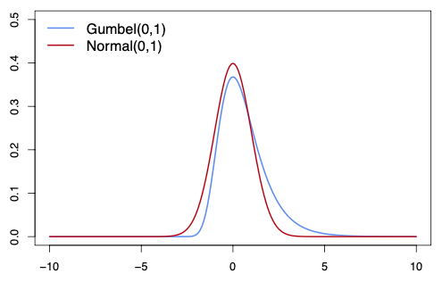
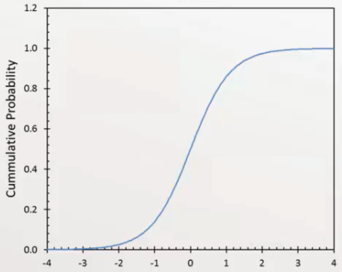

# Continuous Random Variable

takes value on a continuum of scale, ie, can take **any** decimal value

## PDF

$$
\begin{aligned}
f(x) &\ge 0 \\
\int f(x) \ \mathrm{d} x &= 1
\end{aligned}
$$

## CDF

$$
\begin{aligned}
F(x) &= P(X \le x) \\
&= \int\limits_{- \infty}^x f(x) \ \mathrm{d} x \\
P(a \le X \le b) &= P(a < x < b) \\
&= \int\limits_a^b f(x) \ \mathrm{d} x
\end{aligned}
$$

## Terms

|          |            Formula            |
| :------: | :---------------------------: |
|  $E(x)$  |  $\int x \cdot f(x) \ \mathrm{d} x$  |
| $E(x^2)$ | $\int x^2 \cdot f(x) \ \mathrm{d} x$ |

(others are the same as discrete)

## Distributions

| Distribution                                     | Comment                                                                                                                                                                                 | Application                                                                                                                                                                                 | Assumption              |                                                                         $f(x)$                                                                         |                                                                                                            |                              Mean $\mu$                               |                                         Variance $\sigma^2(x)$                                         | Median             | Mode                                                    | Skewness | Kurtosis | Symmetry | Diagram                                                                                                                                |
| ------------------------------------------------ | --------------------------------------------------------------------------------------------------------------------------------------------------------------------------------------- | ------------------------------------------------------------------------------------------------------------------------------------------------------------------------------------------- | ----------------------- | :----------------------------------------------------------------------------------------------------------------------------------------------------: | ---------------------------------------------------------------------------------------------------------- | :----------------------------------------------------------------------: | :-------------------------------------------------------------------------------------------------------: | ------------------ | ------------------------------------------------------- | :------: | :------: | :------: | -------------------------------------------------------------------------------------------------------------------------------------- |
| Uniform                                          |                                                                                                                                                                                         |                                                                                                                                                                                             |                         |                                   $\begin{cases} \frac 1 {B-A} & A \le x \le B \\ 0 & \text{elsewhere} \end{cases}$                                    |                                                                                                            |                             $\dfrac {B+A} 2$                             |                                          $\dfrac 1 {12} (B-A)^2$                                          |                    |                                                         |          |          |    ✅     |                                                                                                                                        |
| Normal/ Gaussian/ Bell-Curve/ $z$ |                                                                                                                                                                                         |                                                                                                                                                                                             |                         |                      $\dfrac {1}{\sigma \sqrt{2\pi}} \exp \left\{ \dfrac {-1}{2} \left(\dfrac{x-\mu}{\sigma} \right)^2 \right\}$                       | $\begin{aligned} P(x<k) &= P \left(z<\frac{k-\mu}{\text{SD}} \right) \\ P(x>k) &= P(x < -k) \end{aligned}$ |                           $\mu$ Standard: 0                           |                                         $\sigma^2$ Standard: 1                                         | $\mu$              | $\mu$                                                   |    0     |    3     |    ✅     |                                         |
| Gumbel/Type 1 Extreme Value                      | Normal distribution with skew and fatter tails                                                                                                                                          |                                                                                                                                                                                             |                         |                                          $\exp \Bigg[ - \exp \left( \dfrac{-(x-\mu)}{\sigma} \right ) \Bigg]$                                          |                                                                                                            | $\mu + \sigma \gamma_e$ $\gamma_e \approx 0.577$ (Euler’s constant) |                                        $\dfrac{\pi^2 \sigma^2}{6}$                                        |                    |                                                         |          |          |          |                                                                                |
| Log-Normal                                       | Log of distribution is Normal  Type of gumbel distribution?                                                                                                                       |                                                                                                                                                                                             |                         |                                           $\log_b f \sim N(\mu, \sigma^2)$ $\ln f \sim N(\mu, \sigma^2)$                                            |                                                                                                            |      $b ^ {\{\mu + \sigma^2/2 \}}$ $\exp \{\mu + \sigma^2/2 \}$       | $(b^{\sigma^2} - 1) b ^{\{ 2 \mu + \sigma^2 \}}$ $(\exp \{\sigma^2\} - 1) \exp \{ 2 \mu + \sigma^2 \}$ | $b^\mu$ $e^\mu$ | $b^{\{\mu - \sigma^2 \}}$ $\exp \{\mu - \sigma^2 \}$ |          |          |          |                                                                                                                                        |
| Student $t$                                 | Tends to normal distribution for large dof                                                                                                                                              |                                                                                                                                                                                             |                         |                                                            $\dfrac{\bar x-\mu}{s/\sqrt{n}}$                                                            |                                                                                                            |                                    0                                     |                                                    >1                                                     |                    |                                                         |          |          |    ✅     |                                                                                                                                        |
| Binomial $\to$ Normal Approx                     | $np \ge 10$ or $n(1-p) \ge 10$                                                                                                                                                          |                                                                                                                                                                                             |                         |                                                                  Normal distribution                                                                   | $\begin{aligned} x' &= x \pm 0.5 \\ z &= \frac{x' - \mu}{\text{SD}} \end{aligned}$                         |                                   $np$                                   |                                                 $np(1-p)$                                                 |                    |                                                         |          |          |          |                                                                                                                                        |
| Gamma                                            | PDF of $\sum \limits_i N_i(0, \sigma_i^2)$, where $N_i$ is independent of $N_j, \ \forall i \ne j$                                                                                      | Time between $n$ occurrences of event                                                                                                                                                       | Follows Poisson Process |                            $\dfrac{1}{B^\alpha \lceil\alpha} \cdot x^{\alpha-1} \cdot \exp \left(\dfrac{-x}{\beta} \right)$                            |                                                                                                            |                              $\alpha \beta$                              |                                             $\alpha \beta^2$                                              |                    |                                                         |          |          |          |                                                                                                                                        |
| Chi-Square $\chi^2$                         | Gamma with $\sigma_i^2=1, \forall i$                                                                                                                                                    |                                                                                                                                                                                             |                         |                                        $\dfrac{(n-k)s^2}{\sigma^2}$  $\lambda = \sum_{i=1}^n \mu_i^2$                                        |                                                                                                            |                             $(n-k)+\lambda$                              |                                          $2[(n-k) + 2 \lambda]$                                           |                    |                                                         |          |          |          |                                                                                                                                        |
| Exponential                                      | Gamma with - $n=1$ - Shape = 1 - Scale $=\dfrac{1}{\lambda}$                                                                                                                   | Time between successive/consecutive occurrences of event                                                                                                                                    | Follows Poisson Process |                                                            $\lambda \cdot \exp(-\lambda x)$                                                            |                                                                                                            |                       $\dfrac 1 \lambda  = \beta$                        |                                     $\dfrac 1 {\lambda^2} = \beta^2$                                      |                    |                                                         |          |          |          |                                                                                                                                        |
| Power Law                                        |                                                                                                                                                                                         |                                                                                                                                                                                             |                         |                                                        $L(x) \cdot x^{-(\alpha-1)}; x > x_\min$                                                        |                                                                                                            |                                                                          |                                                                                                           |                    |                                                         |          |          |          |                                                                        |
| Pareto                                           | Power law with $\alpha =1.16$ Average value of those whose value is greater than $y$ is $y$ times the constant $\lambda/(\lambda-1)$ $\lambda$ controls the thickness of tail | Size distribution Sizes of cities Income Family names Popularity Social network patterns Crime per convict Sizes of large earthquakes Power outages |                         | $P(X > x) = \begin{cases} (x_m/x)^\lambda, & x \ge x_m \\ 1, & x < x_m \end{cases}$ Top $q$th percentiles share = $(q/100)^{(\lambda-1)/\lambda}$ | $1 - F(x) = \bar F(x) = P(X>x)$                                                                            |                                                                          |                                                                                                           |                    |                                                         |          |          |          |                                                                                                                                        |
| Zipf                                             | Pareto with $\lambda=1$                                                                                                                                                                 | Empirical city size Firm size Equivalent to relationship of slope of -1 between log rank of city (based on city size) and log of population                                       |                         |                                                                                                                                                        |                                                                                                            |                                                                          |                                                                                                           |                    |                                                         |          |          |          |                                                                                                                                        |
| Laplacian/ Double-Exponential               | Distribution of diff of two iid exponential vars                                                                                                                                        |                                                                                                                                                                                             |                         |                                           $\dfrac{1}{2b} \exp \left( \dfrac{- \vert x-\mu \vert}{b} \right)$                                           |                                                                                                            |                                                                          |                                                                                                           |                    |                                                         |          |          |          |                                                |
| Logistic/ Sigmoid                           |                                                                                                                                                                                         |                                                                                                                                                                                             |                         |                    $\dfrac{1}{b} \times \dfrac{\exp \left(\dfrac{-(x-\mu)}{b} \right)}{1+\exp \left(\dfrac{- (x-\mu )}{b} \right)}$                    | $F(x) = \dfrac{1}{1+\exp \left(\dfrac{-(x-\mu)}{b} \right)}$                                               |                                   $0$                                    |                                         $b\dfrac{\pi}{\sqrt{3}}$                                          |                    |                                                         |          | $3+1.2$  |          |   |
| Tweedie                                          |                                                                                                                                                                                         |                                                                                                                                                                                             |                         |                                                                                                                                                        |                                                                                                            |                                                                          |                                                                                                           |                    |                                                         |          |          |          |                                                                                                                                        |

- DOF = Degrees of freedom
  - $n$ for sampling
  - $n-k-1$ for regression
- $\lambda$ = mean no of occurances per unit time
  $\lambda = \alpha\text{(poisson)}$
- $\beta$ = mean time b/w occurances
  $\beta = \frac 1 \lambda = \frac 1 {\alpha\text{(poisson)}}$
- $\alpha$ = shape parameter
  it is the average number of occurrences of an event

## Delta Approach

$$
\begin{aligned}
\dfrac{\hat x - x}{\widehat {\text{SE}}(\hat x)} \sim N(0, \sigma^2)
\\
\implies \dfrac{g(\hat x) - g(x)}{g'(\hat x) \cdot \widehat {\text{SE}} (\hat x)} \sim N(0, \sigma^2)
\end{aligned}
$$

If $x \sim N(0, \sigma^2)$ and $\tilde x = g(x)$, then $\sigma^2(\tilde x) = \Big( g'(x) \Big)^2 \sigma^2(x)$