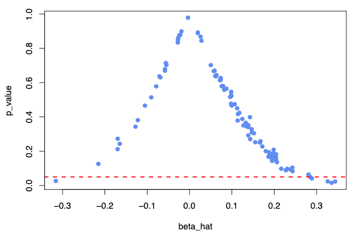

# Hypothesis Testing

## Objective

Hypothesis testing involves testing the following question

> Is the estimated value sufficiently close to stated value?

## Hypothesis

- Simple Hypothesis
    - Single Tailed
    - $\beta_2 > 0.3$
- Composite Hypothesis
    - 2 Tailed
    - Bi-Directional
    - Useful when not sure about the direction
    - $\beta_2 \ne 0.3$

## IDK


#### Null Hypothesis $(H_0)$

Your initial statement

#### Alternative Hypothesis $(H_1)$

[Usually] complement of your initial statement

Also called as **Maintained Hypothesis**. It acts as the fallback in case null hypothesis is proven to be false.

Then the value of $y$ is taken to be the value obtained from the sample

#### Number of Hypotheses

If $n =$ no of independent variables, the number of hypothesis is $2n + 1$

$+1$ is due to intercept(constant)

### Steps

1. Formula hypotheses

2. Determine if one/two tailed test

3. Construct a $100(1-\alpha) \ \%$ confidence interval for $\beta_2$

4. Determine critical values

5. Determine rules to accept/reject null hypothesis

6. Compare estimate-value with critical region

7. Conclusion

     - If it lies within critical region, accept null hypothesis
     - If it lies outside critical region, reject null hypothesis
     - accept alternate hypothesis
     - $\beta_2$ will take the sample value

### Confidence Interval

$$
\begin{aligned}
(1-\alpha)
&= P(- t_{\alpha/2} \le
\textcolor{hotpink}{t}
\le +t_{\alpha/2}) \\
\textcolor{hotpink}{t}
&= \frac{\hat \beta_2 - \beta_2}{\sigma(\hat \beta_2)}
\end{aligned}
$$

$$
(1-\alpha) =
P(\hat \beta_2  t)
$$

- $\alpha =$ level of significance
- $(1-\alpha) =$ Confidence coefficient

Construct the confidence interval for $t$ distribution, with $(n-2)$ degrees of freedom.
This is because we have 2 unknowns.

{ loading=lazy }

### Level of Significance

Tolerance level for error

This is

- probability of committing type 1 error
- probability of rejecting null hypothesis, and then getting sample value as the actual value just by chance

| Field           | Conventional $\alpha$ | Conventional $(1 - \alpha) \%$ |
| --------------- | --------------------: | -----------------------------: |
| Pure Sciences   |                  0.01 |                            99% |
| Social Sciences |                  0.05 |                            95% |
| Psychology      |                  0.10 |                            90% |

### Normal Distribution

- $95 \%$ values lies within 1 standard deviation on each side from the center
- $2.5 \%$ values lies outside 1 standard deviation on left side
- $2.5 \%$ values lies outside 1 standard deviation on right side

### Errors

|              | Type 1                                                       | Type 2                              |
| ------------ | ------------------------------------------------------------ | ----------------------------------- |
| Error of     | Rejecting correct null hypothesis                            | Accepting incorrect null hypothesis |
| Meaning      | False Negative                                               | False Positive                      |
| Measured by  | $\alpha$<br />([Level of Significance](#Level-of-Significance)) |                                     |
| Happens when | Sample is not a good representation of population            |                                     |

### Statistical Equivalence

0.5 can be statistically = 0, or not; depends on the context

$$
\begin{aligned}
P(\text{rejecting } H_0)
&\propto |t| \\
&\propto \text{Deviation of sample value from true value}
\end{aligned}
$$

$$
t = 0 \implies \hat \beta_2 = \beta_2
$$

### p-Value

Observed level of significance

==$\text{p value} \le \alpha \implies$ Reject null hypothesis==

### $t=2$ Rule

For degree of freedom $\ge 20$

#### 2 Tailed
$H_0: \beta_2 = 0, H_0: \beta_2 \ne 0$ 

If $|t| > 2 \implies p \le 0.05 \implies$ reject $H_0$

#### 1 Tailed

$H_0: \beta_2 = 0, H_0: \beta_2 > 0$ or $H_0: \beta_2 = 0, H_0: \beta_2 < 0$ 

If $|t| > 1.73 \implies p \le 0.05 \implies$ reject $H_0$

### Why $t$ distribution?

$t$ distribution is a variant of $z$ distribution

- For small samples, we use $t$ dist
- For large sample, we use $z$ dist

## IDK

$\alpha$

- level of significance
- size of critical region

Confidence level = $(1-\alpha) \times 100 \%$

The entire distribution is divided into 2 regions

1. Critical Region
   Region of **rejection** of $H_0$
   it is decided based on $H_1$
2. Acceptance Region
   Region of **acceptance** of $H_0$


$$
\begin{aligned}
& H_0: \beta_j = 0 \\
& {\tiny \text{ that includes other all predictors and nothing else}} \\ \\
& H_1: \text{o.w}
\end{aligned}
$$

- Rejection of $H_0 \centernot \implies \beta$  significantly different from 0. Therefore, to assess magnitude of $\beta$, confidence intervals are more useful than $p$-values
- Rejection of $H_0$ does not mean that $x$ has a significant causal effect on $y$. Statistical significance $\centernot \implies$ scientific, real-world significance. The most important variables are not those with the smallest p-values.
- The t−test can be thought of as checking whether adding $x_j$ really improves predictions in a model that contains other specified predictors
- 95% CI = $\text{LL}, \text{UL} \centernot \implies \text{Pr}(\beta \in [\text{LL, UL}]) = 0.95$
  - Correct interpretation: a 95% CI for $\beta$ means that if
    we estimate our model on many independent random samples drawn
    from the same population and construct $\text{CI}_m = [\text{LL}_m, \text{UL}_m]$ on each sample, then 95% of these $\{ CI_m \}$ will contain $\beta$

$$
L(H1, \hat H_1) = \begin{cases}
0, & H_1 = \hat H_1 \\
95, & H_1 = 0, \hat H_1 = 1 \\
5, & H_1 = 1, \hat H_1 = 0
\end{cases}
$$

## P-Value

P-value is not the conditional probability of $H_0$. It is actually the probability of $H_0$ being true based only on the observed data set (without incorporating prior knowledge)
$$
\begin{aligned}
p \text{-value}
&\ne P(H_0 = \text{True} \vert D) \\
p \text{-value}
&= P(D \vert H_0 = \text{True} )\\
&= \text{Pr}(\vert t \vert \ge \vert t(\hat \beta) \ \vert H_0)
\end{aligned}
$$

$$
\begin{aligned}
\text{What actually} & \text { needed}\\
P(H_0
= \text{True} \vert D)
&= \dfrac{P(D \vert H_0) \cdot P(H_0)}{P(D)} \\
&= \dfrac{p \cdot P(H_0)}{P(D)} \\
&= \dfrac{p \cdot P(H_0)}{p \cdot P(H_0) + (1-p) \cdot P(H_1)}
\end{aligned}
$$

where $D$ is the data

When $P(H_1) < 0.1$, we may need the p−value to be much smaller than the conventional threshold of $\alpha = 0.05$ in order to “confidently” reject $H_0$

- For example, concluding that a coin is biased would require a significant number of one-sided results 

Hypothesis tests are only valid for large sample size, as they are based on the asymptotic properties of test statistics.  Hence, Bootstrapping can be used to obtain more accurate p−value estimates


## Population Mean

$$
\begin{aligned}
H_0: \mu &= \mu_0 & &\text{(Null Hypothesis)} \\
H_1: \mu &< \mu_0, \mu \ne \mu_0, \mu > \mu_0 & &\text{(Alternative Hypothesis)} \\
\end{aligned}
$$

| $\sigma^2$ |   $n$    |    Test Statistic/Probability Distribution     |
| :--------: | :------: | :--------------------------------------------: |
|   known    |   any    | $z_c = \frac{\bar x - \mu_0}{\sigma/\sqrt n}$ |
|  unknown   |  $>30$   |  $z_c = \frac{\bar x - \mu_0}{s/ \sqrt n}$   |
|  unknown   | $\le 30$ |  $t_c = \frac{\bar x - \mu_0}{s / \sqrt n}$  |

### Critical Region

|         |                         Left-Tailed                          |                          Two-Tailed                          |                         Right-Tailed                         |
| :-----: | :----------------------------------------------------------: | :----------------------------------------------------------: | :----------------------------------------------------------: |
|  $H_1$  |                        $\mu < \mu_0$                         |                       $\mu \ne \mu_0$                        |                        $\mu > \mu_0$                         |
| p-value |              $F(z_c)$ <br /> $\alpha(t-\text{dist})$               |           $2[ F(-z_c) ]$ <br /> $2 \alpha(t-\text{dist})$           |              $F(-z_c)$ <br /> $\alpha(t-\text{dist})$              |
|  Cases  | Accept $H_1$ if <br />$\begin{aligned} z_c & \le -z_\alpha \\ t_c &\le -t_{(n-1), \alpha} \\ p &\le \alpha \end{aligned}$<br /><br />else accept $H_0$ | Accept $H_1$ if <br />$\begin{aligned} z_c \le -z_{\alpha/2} &\text{ or } z_c \ge +z_{\alpha/2}\\ t_c \le -t_{(n-1), (\alpha/2)} &\text{ or } t_c \ge +t_{(n-1), (\alpha/2)} \\ p &\le \alpha \end{aligned}$<br /><br />else accept $H_0$ | Accept $H_1$ if <br />$\begin{aligned} z_c &\ge +z_\alpha \\ t_c &\ge +t_{(n-1), \alpha} \\ p &\le \alpha \end{aligned}$<br /><br />else accept $H_0$ |

## Proportion

$$
\begin{aligned}
H_0: p &= p_0 & &\text{(Null Hypothesis)} \\
H_1: p &< p_0, p \ne p_0, p > p_0 & &\text{(Alternative Hypothesis)} \\
z_c &= \frac{\hat p - p_0}{
	\sqrt{ \frac{p_0(1-p_0)}{n} }
} & & \hat p = \frac x n = \text{Estimated value of } p\\
\end{aligned}
$$

### Critical Region

|         |                         Left-Tailed                          |                          Two-Tailed                          |                         Right-Tailed                         |
| :-----: | :----------------------------------------------------------: | :----------------------------------------------------------: | :----------------------------------------------------------: |
|  $H_1$  |                          $p < p_0$                           |                         $p \ne p_0$                          |                          $p > p_0$                           |
| p-value |                           $F(z_c)$                           |                        $2[ F(-z_c) ]$                        |                          $F(-z_c)$                           |
|  Cases  | Accept $H_1$ if <br />$\begin{aligned}z_c &\le -z_\alpha \\ p &\le \alpha \end{aligned}$<br /><br />else accept $H_0$ | Accept $H_1$ if <br />$\begin{aligned} z_c \le -z_{\alpha/2} &\text{ or } z_c \ge +z_{\alpha/2} \\ p &\le \alpha \end{aligned}$<br /><br />else accept $H_0$ | Accept $H_1$ if <br />$\begin{aligned} z_c &\ge +z_\alpha \\ p &\le \alpha \end{aligned}$<br /><br />else accept $H_0$ |

## Variance/SD

$$
\begin{aligned}
H_0: \sigma^2 &= \sigma^2_0 & &\text{(Null Hypothesis)} \\
H_1: \sigma^2 &< \sigma^2_0, \sigma^2 \ne \sigma^2_0, \sigma^2 > \sigma^2_0 & &\text{(Alternative Hypothesis)} \\
\chi_c^2 &= (n-1) \frac{s^2}{\sigma_0^2}
\end{aligned}
$$

### Critical Region

|         |                         Left-Tailed                          |                          Two-Tailed                          |                         Right-Tailed                         |
| :-----: | :----------------------------------------------------------: | :----------------------------------------------------------: | :----------------------------------------------------------: |
|  $H_1$  |                          $p < p_0$                           |                         $p \ne p_0$                          |                          $p > p_0$                           |
| p-value |                     1 - $\alpha$(table)                      |                     1 - $\alpha$(table)                      |                     1 - $\alpha$(table)                      |
|  Cases  | Accept $H_1$ if <br />$\begin{aligned}\chi_c^2 &\le \chi^2_{(n-1), (1-\alpha)}  \\ p &\le \alpha \end{aligned}$<br /><br />else accept $H_0$ | Accept $H_1$ if <br />$\begin{aligned}\chi_c^2 \le \chi^2_{(n-1), (1-\alpha/2)} &\text{ or } \chi_c^2 \ge \chi^2_{(n-1), (\alpha/2)} \\ p &\le \alpha \end{aligned}$<br /><br />else accept $H_0$ | Accept $H_1$ if <br />$\begin{aligned}\chi_c^2 &\ge \chi^2_{(n-1), \alpha}  \\ p &\le \alpha \end{aligned}$<br /><br />else accept $H_0$ |

## Errors

|              | $H_0$ is true           | $H_0$ is false         | $H_0$ is incorrect                                   |
| ------------ | ----------------------- | ---------------------- | ---------------------------------------------------- |
| Reject $H_0$ | Type 1 Error = $\alpha$ | Correct                | Type 3 Error<br />Right answer to the wrong question |
| Accept $H_0$ | Correct                 | Type 2 Error = $\beta$ |                                                      |

Type 1 error is alright, but Type 2 error is dangerous

- $\alpha$ = P(reject $H_0$ | $H_0$ is true)
- $\beta$ = P(accept $H_0$ | $H_0$ is false)

## Power of Test

$$
\text{Power of Test} = 1 - \beta
$$

Greater the power of test, the better
means that we can more accurately detect when $H_0$ is false

## Information Content of Statistical (Non)Significance

Statistical result is informative only when it has the potential to substantially change our beliefs. The discrepancy between a prior and a posterior distribution thus provides a basic measure of the informativeness of a statistical result.

Using this measure, non-significant results are often more informative than significant results in scenarios common in empirical economics.

Hence, null need not always be $H_0: \beta = 0$. It can be what is prior known. This can be implemented in ridge regression by using a prior known value

- Beliefs on the causal effect of a policy intervention are usually better described by a continuous distribution rather than a distribution with significant probability mass at point zero.

When $P(H_0)$ is low, statistical significance often carries little information; non-significance is highly informative, because in this case, non-significance is more “surprising” and induces a larger change in the posterior belief
$$
\underbrace{1 - \dfrac{p(\beta \vert R=0)}{p(\beta)}}_\text{INS} \\
= \dfrac{P(R=1)}{P(R=0)} \times \underbrace{1 - \dfrac{p(\beta \vert R=1)}{p(\beta)}}_\text{IS}
$$
where

- $R=H_0 \text{ rejected}$ at given significance level
- $P(R = 1)$ is the prior probability of rejection of the null
  - $P(R = 1) = \int P(R = 1 \vert \beta)  \cdot p(\beta) \cdot d\theta$
- $\text{INS}$ = Informativeness of non-significance
- $\text{IS}$ = Informativeness of significance

#### Takeaways

- Non-significance is more informative than significance as long as
  $P(R = 1) > 0.5$
- As $n$ inc and $p(\beta=0)$ dec, $p(R=1)$ increases
  - Thus, as datasets get larger, and because there are rarely reasons to put significant priors on $\theta=0$, non-significant results will be more informative in empirical studies in economics
  - When $n$ is very large, without prior probability mass at the point null, significance carries no information

## Statistical Significance Filter

Publication Bias

Only the extreme significant cases of the study make it through to the publication, and hence are not a representative sample of all empirical findings.



$$
E[\hat \beta \vert \text{significant} >> \beta]
$$

The power of test is low; The null hypothesis is false, but fails to be rejected $(1-\alpha \% )$ of the time

Lower power leads to high exaggeration ratios, ie if the estimate is statistically significant, it must be at least $a$ times higher than the true effect size

Type $S$ error probability: if the error is statistically-significant, but has the wrong sign

## Multiple Testing

Multiple comparisons

If you perform multiple hypothesis tests, the probability of at least one producing a statistically-significant result at the significance level $\alpha$ due to chance, is necessarily greater than $\alpha$

Multiple hypothesis fallacy: "Strategy" in rolling dice that maximizes the number

When testing $m$ hypotheses

|                                                         | Meaning                                                            | Preferred for                                                                                 | Formula            |
| ------------------------------------------------------- | ------------------------------------------------------------------ | --------------------------------------------------------------------------------------------- | ------------------ |
| FWER (Family-wise Error Rate)<br>Joint Type 1 Error     | Probability of $\ge 1$ False Positives among all tested hypotheses | Decision of single choice<br>- only one car produced<br>- only one investment strategy chosen | $1 - (1-\alpha)^m$ |
| FPR (False Positive Rate)<br>FDR (False Discovery Rate) | Expected proportion of FP among accepted hypotheses                | FDR is preferred for large quantity decision: many cars produced                              |                    |

### FWER

$$
\begin{aligned}
\text{FWER}
&= P(\ge 1 \text{ FP}) \\
&= 1 - P(0 \text{ FP}) \\
&= 1 - P(\text{not falsely rejecting any null hypothesis}) \\
&= 1 - P(\cap_{j=1}^m \text{not falsely rejecting } H_{0j})
\end{aligned}
$$
where $m$ is the number of tests conducted (ie model specifications tested)

Assuming tests are independent
$$
\begin{aligned}
\text{FWER}
& \approx 1 - \prod_{j=1}^m P (\text{not falsely rejecting } H_{0j}) \\
& \approx 1 - \prod_{j=1}^m (1-\alpha) \\
& \approx 1 - (1-\alpha)^m
\end{aligned}
$$


### Corrections


|      | Correction          | $p_{k, \text{adjusted}} = \text{Correction Factor} \times p_{k, }$<br>Correction Factor | Disadvantages                                                          |
| ---- | ------------------- | --------------------------------------------------------------------------------------- | ---------------------------------------------------------------------- |
| FWER | Bonferroni          | $m$                                                                                     | Very strict in avoiding False Positives<br>May lead to False Negatives |
|      | Holm                | $m - (k-1)$                                                                             | Very strict in avoiding False Positives<br>May lead to False Negatives |
| FDR  | Benjamini-Hochberg  | $m \times \dfrac{1}{k}$                                                                 |                                                                        |
|      | Benjamini-Yekutieli | $m \times \dfrac{1}{k} \times \sum\limits_{i=1}^m \left(\dfrac{1}{j}\right)$            |                                                                        |

$k=$ index in sorted list

### Bonferroni Correction

Bounds the FWER at below $\alpha$ by setting the significance threshold for each individual test as $\alpha/m$

$$
1 - \left(1 - \dfrac{\alpha}{m} \right)^m \le \alpha
$$
It is conservative, as it is assumes independent tests.

For large $m$, it leads to a significant loss of power, ie higher probability of false negative

### Holm Correction

1. Compute $p$-values $p_1, p_2, \dots, p_m$ for the $m$ null hypotheses $H_{01}, H_{02}, \dots, H_{0m}$
2. Order the $m$ $p$-values in ascending order of magnitude to obtain $p = \{ p_{(1)}, p_{(2)}, \dots, p_{(m)} \}$ such that $p_{(1)} \le p_{(2)} \le \dots \le p_{(m)}$
3. Adjust $p$ values where $k=$ index in sorted list
4. Reject $H_{0k} \ \forall k$ that satisfy $p_{k, \text{adjusted}} \le \alpha$

```python
from statsmodels.stats.multitest import multipletests

method = "holm" # "bonferroni", "fdr_bh", "fdr_by"
multipletests(p_values, method = method).pvals_corrected
```
