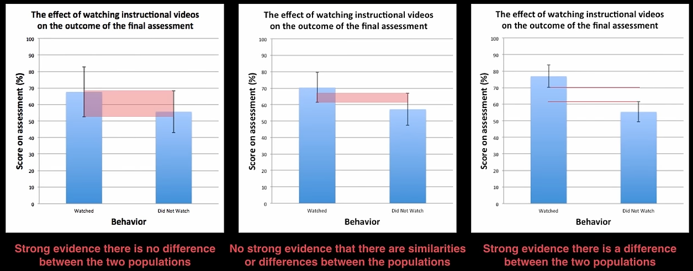

# Comparing Samples

## $t$ Distribution DOF

$$
\text{DOF}
=
\dfrac{
\Big[ \sum_{i=1}^2 (s_i^2/n_i) \Big]^2
}{
\sum_{i=1}^2 \dfrac{(s_i/n_i)^2}{n_i - 1}
}
$$

## Comparing Means

Using central-limit theorem, sampling distribution’s mean is normally-distributed, else t-distributed

### $\hat \sigma_1 \ne \hat \sigma_2$

Given

- $(\bar x_1, s_1)$
- $(\bar x_2, s_2)$

$$
\begin{aligned}
z \text{ or } t
&= \dfrac{(\bar x_1 - \bar x_2) - E[(\bar x_1 - \bar x_2)]}{\sigma^2(\bar x_1 - \bar x_2)}
\\
&= \dfrac{
	(\bar x_1 - \bar x_2) - (\hat \mu_1 - \hat \mu_2)
}{
\sqrt{
	\sum_{i=1}^2 \dfrac{s_i^2}{n_i} + 2 \rho_{12} s_1 s_2
}
}
\end{aligned}
$$

Simplification: Is $\mu_1$ and $\mu_2$ statistically different? $\implies (\hat \mu_1 - \hat \mu_2)=0$

### $\hat \sigma_1 = \hat \sigma_2$

Pooled samples: If we are confident that the population variance are same, we can pool all data to make one estimate of the population variance

$$
\begin{aligned}
s^2_{12}
&= \dfrac{
(n_1-1) s^2_1 + (n_2-1) s^2_2
}{
(n_1-1) + (n_2-1)
}
\end{aligned}
$$

### Pairing

Matched Samples

Compare samples before and after treatment
$$
d_i = y_{i, T=1} - y_{i, T=0}
$$
$T=$ treatment variable
$$
\begin{aligned}
z
&= \dfrac{
\bar d - \hat \mu_d
}{
s_d/\sqrt{n}
}
\end{aligned}
$$

### Inference

- If $z$ or $t$ within 95% 2-sided confidence interval centered around 0, then both series are similar
- Else, dissimilar

## Comparing Variances

Assumes that the population distribution is Normal

There is no central-limit theorem that can be applied here
$$
\begin{aligned}
F
&= \dfrac{s^2_1/\sigma^2_1}{s^2_2/\sigma^2_2}
\\
& \sim F(n_1-1, n_2-1) 
\end{aligned}
$$

## Correct Sampling

- Random sampling: When evaluating treatment, every subject must have equal probability of receiving treatment
  - Equal sample sizes fore each treatment products optimal test
- Pairing can be used eliminate effect of uncontrolled variable

## Standard error of mean

| Error bars overlap | Error bars contain both the sample means | Inference                                                    |
| ------------------ | ---------------------------------------- | ------------------------------------------------------------ |
| ✅                  | ✅                                        | Strong evidence that populations are **not** different       |
| ✅                  | ❌                                        | **No** strong evidence that populations are **not** different |
| ❌                  | ❌                                        | Strong evidence that populations are different               |

