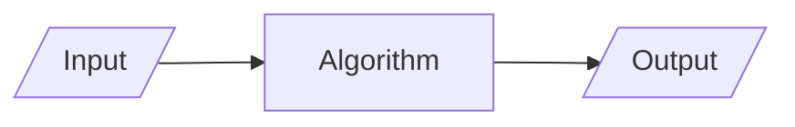

## Definitions

| Word           | Definition                                               |
| -------------- | -------------------------------------------------------- |
| Algorithm      | step-by-step procedure to solve a problem in finite time |
| Program        | implementation of algorithm in a programming language    |
| Data Structure | Organization of data needed to solve the problem         |

## Algorithms



Algorithmic outputs always depend on the input.

For example, binary search requires a **sorted** list as input.

## Efficiency of Algorithm

### Complexity

Determined by

1. Space complexity (Space used)
2. Time complexity (Running Time)
   
   This is more important

Both of the above are defined as a function of input size

### Cases

- Worst
- Average
- Best
- Amortized (Sequence opertions applied to input size $n$ averaged over time)

## Experimental/Emperical Analysis

1. Write the program for the algorithm
2. Run the program with different input sizes
3. Measure running time
   
   For eg, in Java we can use `System.currentTimeMillis()`
4. Plot the result

### Limitations

1. We need to implement and test
2. Same programming language must be used to compare 2 algorithms
   
   Because our interpretation of the efficiency may vary with different programming languages
3. Only limited set of input is possible
4. Same h/w & s/w should be used to compare 2 algorithms

## Theoretical/Mathematical Analysis

1. Use [pseudocode](#Pseudocode)
2. Determine the primitive operations
   
   We assume that each primitive operation takes 1 unit of time.
3. Define running time as a function of input size $n$

```pseudocode
Algorithm arrayMax(a, n)
	Input array A of n integers
	Output maximum element of A
	
	currentMax <- A[0]
	for i<-1 to (n-1) do
		if A[i] > currentMax then
			currentMax <-A[i]
			
	return currentMax
```

|                               | Primitive Operations                                |
| ----------------------------- | --------------------------------------------------- |
| currentMax <- A[0]            | 2<br />- getting A[0] from memory<br />- assignment |
| for i $\leftarrow$ 1 to (n-1) | $n+1$<br />comparison                               |
| A[i] > currentMax             | $2(n-1)$                                            |
| currentMax <-A[i]             | $2(n-1)$                                            |
| {increment counter i}         | $2(n-1)$<br />1. add<br />2. assign                 |
| return currentMax             | 1                                                   |
|                               |                                                     |
| Total                         | $7n-2$                                              |

### Advantage

- acknowledges all possible inputs
- evaluate speed of algorithm independent of hardware/software used

## Pseudocode

Simple representation of your program

- High-level description of algorithm
- more structured than english, but less detailed than a program
- hides program design issues

All mathematical formatting like $n^2$ (subscript) is allowed

| Notation                                      | Meaning            |
| --------------------------------------------- | ------------------ |
| if … then … [else …]                          | Control Flow       |
| while … do                                    |                    |
|                                               |                    |
| (more are there, please complete this Thahir) |                    |
|                                               |                    |
| $\leftarrow$                                  | Assignment         |
| =                                             | Equality (like ==) |
| >, <, …                                       | Comparison         |

eg

```pseudocode
Algorithm arrayMax(A, n)
	Input array A of n integers
	Output maximum element of A
	
	currentMax <- A[0]
	for i<-1 to (n-1) do
		if A[i] > currentMax then
			currentMax <-A[i]
	
	return currentMax
```

## Notations

==All notations take the worst-case scenario==

Let $f(n)$ be the algorithm for which we are finding the notation

|      Notation       |       Purpose        |                                    Condition |
| :-----------------: | :------------------: | -------------------------------------------: |
|   $O(\ g(n) \ )$    |     Upper Bound      |                      $f(n) \le c \cdot g(n)$ |
|   $o(\ g(n) \ )$    |  Strict Upper Bound  |                        $f(n) < c \cdot g(n)$ |
| $\Omega(\ g(n) \ )$ |     Lower Bound      |                      $f(n) \ge c \cdot g(n)$ |
| $\omega(\ g(n) \ )$ |  Strict Lower Bound  |                        $f(n) > c \cdot g(n)$ |
| $\Theta(\ g(n) \ )$ | Tight 2-Sided Bounds | $c_1 \cdot g(n) \le f(n) \le c_2 \cdot g(n)$ |

### Big Oh notation

Most commonly-used notation

we neglect the constant factors

**examples:**

$$
O(1) < O(\log n) < O(n) < O(n \log n) < O(n^2 \log n) < O(n^2) < \dots < O(2^n), O(e^n)
$$

```java
// O(n)
for(int i = 0; i<n; i++)

for(int i = 0; i<n; i--)

// O(n^2)
for(int i = 0; i<n; i++)
  for(int i = 0; i<n; j++)
    
// O( n(n+1)/2 ) = O(n^2)
for(int i = 0; i<n; i++)
  for(int j = 0; j<i; j++)
    
// O(log_2 n)
for(int i = 1; i<n; i*=2)

for(int i = 1; i<n; i/=2)
  
// O(log_b n)
for(int i = 1; i<n; i*=b)

for(int i = 1; i<n; i/=b)
  
// O(n log_2 n)
for(int i = 0; i<n; i++)
	for(int i = 0; i<n; i/=2)
```

## Math Required

1. Summations

2. Log formulae
   
$$
\begin{aligned}
\log xy  &= \log x + \log y \\   \log \left( \frac{x}{y} \right) &= \log x - \log y \\   \log x^n &= n \log x
\end{aligned}
$$
   
3. Proof Techniques

4. Basic Probability
