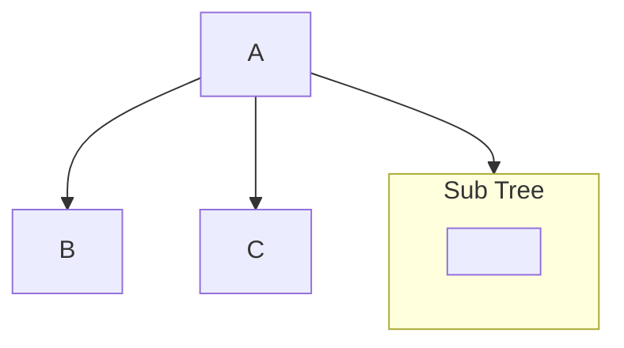

Hierarchical data structure

Very useful for organization of data

Used for computing spaced used by a directory’s files and sub-directories.

## Properties

Refer to [05 Trees](../Discrete_Structures/05_Trees.md) 

## Subtrees

Tree consisting of a node, and maybe even descendants



## Height

maxDepth + 1

## Tree ADT

### Tree using Linked List

### BST using Linked List

### BST using Arrays

```pseudocode
Algo
```

