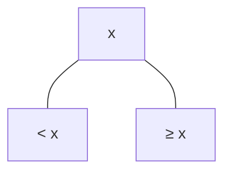

## Indexing

We are trying to improve searching performance

## B+ Tree Indexing

Internal nodes contain indices

Leaf nodes contain values

### Advantage

1. Dynamic
2. Faster than other forms of indexing

### Structure

{ loading=lazy }

### Formulae

| IDK                         |                        Formula                        |
| --------------------------- | :---------------------------------------------------: |
| Order                       |                          $n$                          |
| Min No of Children/Pointers |       $\left \lceil \dfrac{n}{2} \right \rceil$       |
| Max No of Children/Pointers |                          $n$                          |
| Min No of Keys              |     $\left \lceil \dfrac{n}{2} \right \rceil - 1$     |
| Max No of Keys              |                         $n-1$                         |
| Middle element              | $\left \lceil \dfrac{n}{2} \right \rceil$^th^ element |

### Insertion

If there are 2 middle elements, we push the bigger one to the top.

### Deletion

Minimum element of the right subtree will go up; basically the element next to the deleted element in the bottom linked list

If the key goes less than the minimum key, then we have to ***borrow*** the

- maximum element of the left side, or
- minimum element of the right side

if that’s not possible, merge upward

## Hashing

Technique to store values in a more accessible form.

| Hashing Type | Technique | Using       |
| ------------ | --------- | ----------- |
| **Open**     | Chaining  | Linked List |
| **Closed**   | Linear    |             |
|              | Quadratic |             |

### Load Factor

$$
\text{LF} = \frac{R}{}
$$

where $R$ means Records

## Linear Hashing

## Extendible Hashing

This technique is used to minimize the re-hashing costs in normal hashing, which arise due to collisions.

| Component     | Meaning                                                    | Memory           |
| ------------- | ---------------------------------------------------------- | ---------------- |
| Hash Function |                                                            |                  |
| Hash Table    |                                                            | Main             |
| Bucket        | Bins that are formatted similar to B+ Tree Leaves          | Disk (Secondary) |
| Bucket Size   | max number of elements in the buckets (will be given) |                  |
| Depth         | Number of **MSB** bits required to differentiate           | Buckets          |

If local depth of filled page $\ge$ global depth

1. double the hash table size
2. allocate space for an additional bin
3. re-distribute filled page indices

|       Case       | Action                                                       |
| :--------------: | ------------------------------------------------------------ |
| Local $<$ Global |                                                              |
| Local $=$ Global | double the hash table size                                   |
| Local $>$ Global | 1. allocate space for an additional bin 2. re-distribute filled page indices |

{ loading=lazy }

The number of combinations that will be connected to each bucket will be the remaining combination of the unused bits. For eg, $01$ bucket will have 2 unused bits, so there will be 4 combinations

## Bitmap

Very easy bro

The no of records will be the number of bits.

### Limitations

For large database, we need a lot of bits.
