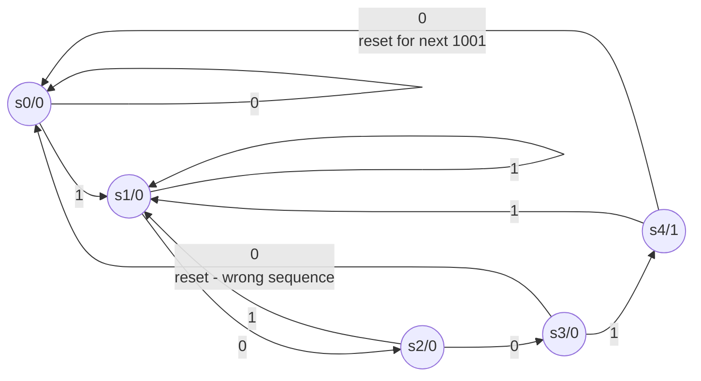
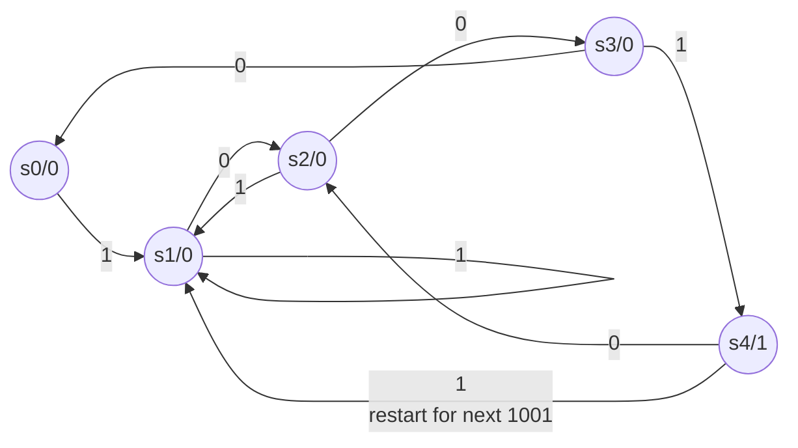
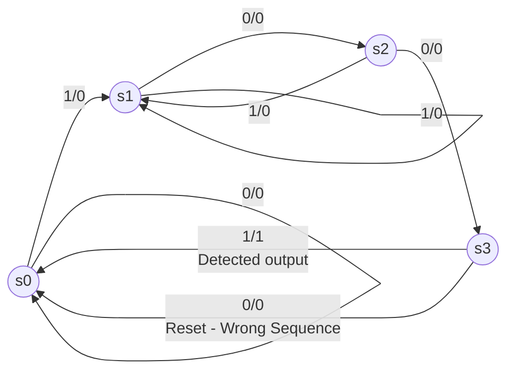
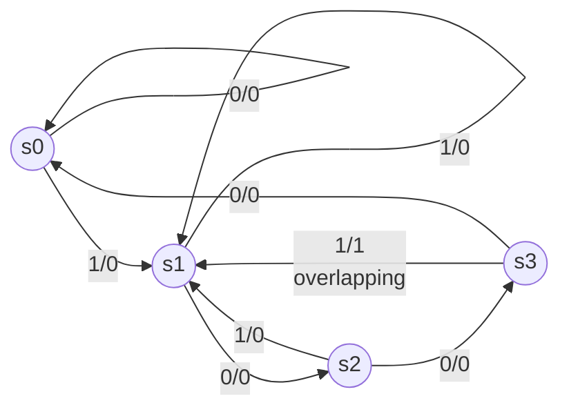

## Finite State Machine (FSM)

### State

Condition of a sequential circuit based on state variables

Flip flop acts as state register, used to store values of states

### Types

|                                | Moore Model | Mealy Model       |
| ------------------------------ | ----------- | ----------------- |
| Output is F of                 | states only | inputs and states |
| i/p affects o/p?               | N           | may affect        |
| states required to implement F | ==more==    | fewer             |
| Synchronisation with clock     | Y           | N                 |

## State Equations

set of equations that describe the next state as a function of present state and inputs
$NS = f(PS, ip)$

### Variables

inputs, outputs, state vars are functions of time

- inputs/outputs (only small)
    - NS $x(t), y(t)$
    - PS $x(t+1), y(t+1)$
- flip-flop outputs (capital or small)
    - NS $A(t), B(t),  a(t), b(t)$
    - PS $A(t+1), B(t+1), a(t+1), b(t+1)$

## Characteristic Equations

equation for the input and outputs of flipflops

| Flip Flop Type | $Q(t+1)$     |
| -------------- | ------------ |
| D              | D            |
| JK             | $jQ’ + k’Q$  |
| T              | $T \oplus Q$ |

## State Table

is the listing of next states and outputs(not necessary) for all combinations of input and present state

total no of combinations = $2^{m+n}$, where

- $m =$ no of state vars
- $n =$ no of input vars

| PS   | Input | NS   | Output |
| ---- | ----- | ---- | ------ |

## State Diagram

has circles representing all possible states

==do this last in the exam, if possible==

|            | Moore          | Mealy         |
| ---------- | -------------- | ------------- |
| circle has | states, output | states        |
| arrow has  | input          | input, output |

## State Reduction

Designing of SC from a given state diagram

It is possible to obtain the same input-output relation with another state diagram with fewer states. Reduction has many advantages

1. fewer flipflops
2. cost is minimized
3. easier maintainance

In design specification, the states will be represented as alphabets. It is necessary to assign binary codes for practical implication

## State Assignment Techniques

There are different ways of assigning codes into the states

1. Binary code
2. Grey code
3. One-hot code
   1. In $n$ bit code, only one bit is 1 and the remaining are 0s
   2. basically decoder output is fed in for assigning

unused states will be X (don’t care condition)

## Design

Sequential circuit can be designed using any flip flop

the design starts with specification, which includes a word description, inputs and outputs of the circuit

### Steps

1. state diagram
2. state table
3. if necessary, reduce the no of states and obtain the new state table
4. assign codes to the states
5. binary coded state table
6. choose type of flip flop
7. simplify flipflop input-output equation using kmap
8. logic diagram

design using 

- d FF
  next state can be obtained directly from the state table from the knowledge of present state and input
- jk or t FF
  excitation table is formed to determine the inputs of FF for the next state output

## Sequence Detector

There’s 2 types:

1. Overlapping
2. non-overlapping

eg: 1001 sequence detector

### Moore non-overlapping

### Moore Overlapping

### Mealy non-overlapping

### Mealy Overlapping

