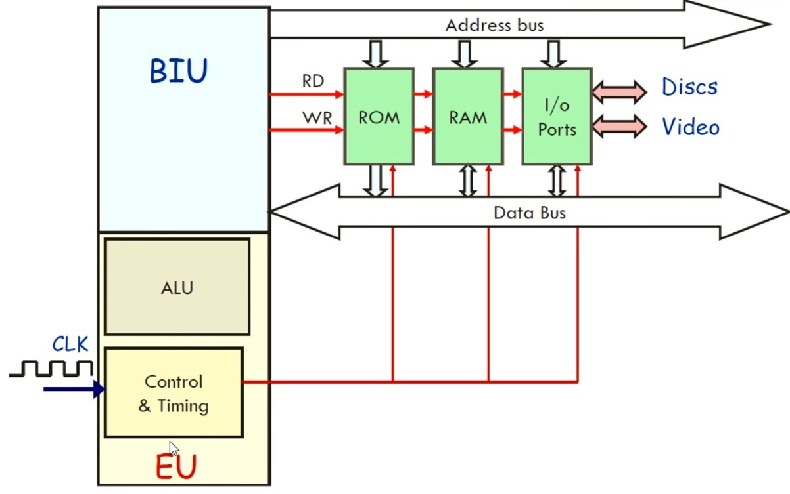
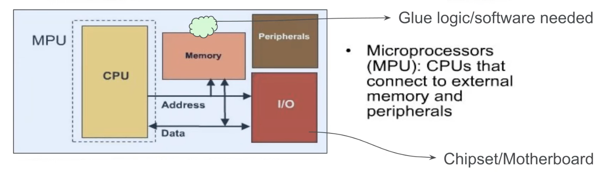
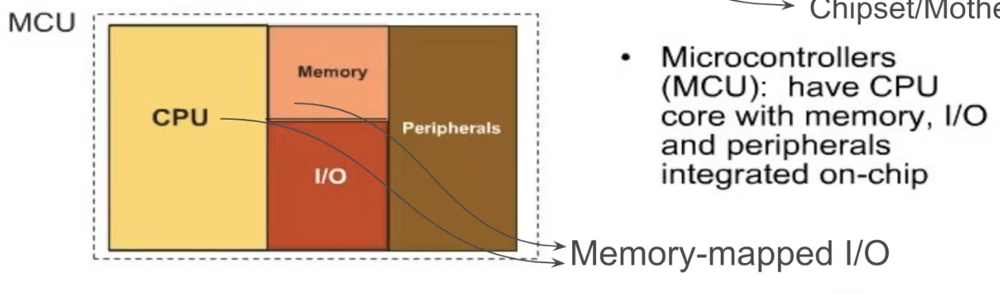
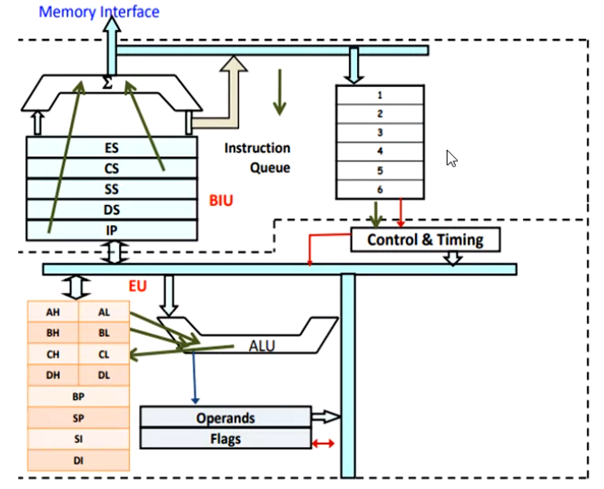
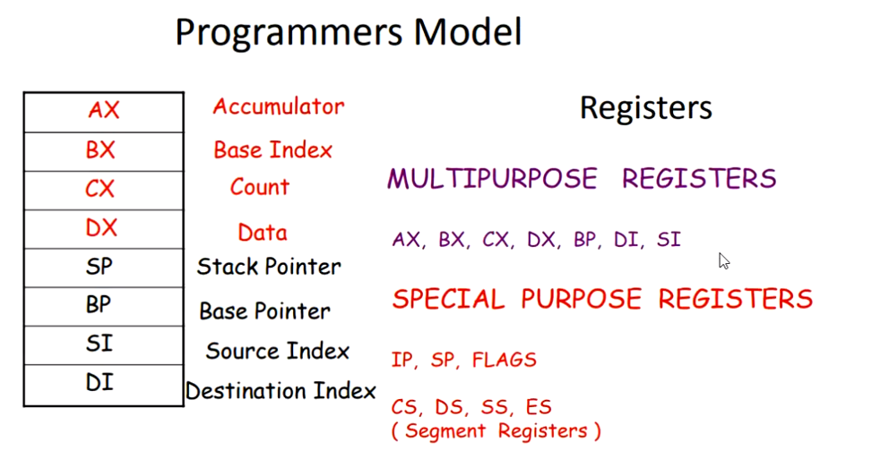

## What happens when we switch on computer

1. BIOS(Basic Input Output System) loaded **from** the ROM(Read-Only Memory)
2. BIOS loads OS **into** the RAM
   RAM should atleast be the size of the OS
3. OS loads programs from disk to RAM
   Program: set of instructions executed by $\mu p$

## What is an instruction?

Tells the MP what actions to perform

- operations
    - logic
    - arithmetic
- read data from input device
- write to memory
- reset
- stop

Assembly program gives these instructions. Each microprocessor understands these instructions in different ways.

High-level program use statements which get compiled/interpreted into machine language. Allows programmer focus on the logic, rather than worrying about how it will understood by the MP.

## Microprocessor

has both sequential and combinational circuits

- Control unit has sequential circuits
- ALU has combinational circuits

Size of the processor = size of ALU

## Instruction-Handling

Instructions is a set of command, used by the mp to perform to certain taks

1. **Fetch Instruction**
   Instruction taken from the memory and stored in instruction register
2. **Decode Instruction**
3. **Fetch Operand(s)**
3. **Execute Cycle**
   actions are performed
5. **Store result**

Make this into block diagram

- BIU - Bus Interface Unit
- ALU - Arithmetic Logic Unit
- Execution Unit

### Overview

Microcontrollers like Arduino have the memory also embedded to the processor

{ loading=lazy }

### Detailed

{ loading=lazy }

## Architectures

### Instruction Set Architecture

This is the design/theory

1. Execution Model
2. Processor Register
3. Address and Data Formats

### Microarchitecture

This is the hardware components

1. Interconnections between elements
2. ALU
3. Data Path
4. Control Path

## MPU vs MCU

|                               | MPU MicroProcessor Unit       | MCU MicroController Unit                                         |
| ----------------------------- | -------------------------------- | ------------------------------------------------------------------- |
| CPU Clock rate                | > 1 GHz                          | 1 MHz - 0.4 GHz                                                     |
| Memory location               | External                         | Internal                                                            |
| Memory capacity               | > 0.5 GB                         | 2 KB - 512 KB                                                       |
| Storage location              | External                         | Internal                                                            |
| Storage capacity              | > 64 GB                          | 32 KB - 2 MB                                                        |
| I/O                           | External                         | Internal                                                            |
| Peripherals                   | External                         | Internal                                                            |
| No glue logic/software needed | ❌                                | ✅                                                                   |
| Power Consumption             | Higher > 30W                  | Lower $\rm{150 \micro W - 23.5 mW}$                              |
| Size                          | Large                            | Small                                                               |
| Design flexibility            | ✅                                | ❌                                                                   |
| Use                           | Computer system                  | Embedded system                                                     |
| Other names                   |                                  | SOC (System on a chip) Embedded controller Computer on a chip |
|                               |  |                                    |

## Types of Microprocessors

|                                          | RISC                              | CISC                              |
| ---------------------------------------- | --------------------------------- | --------------------------------- |
| Full Form                                | Reduced Instruction Set Computing | Complex Instruction Set Computing |
| Gives importance to                      | Hardware                          | Software                          |
| Can access memory directly?              | ✅                                 | ❌ (requires registers)       |
| Amount of Instructions                   | Small                             | Large                             |
| Coding Instructions complexity           | Complex                           | Simple                            |
| Machine Instructions complexity          | Simple                            | Complex                           |
| Decoder                                  | Reduced Instruction Decoder       | Complex Instruction Decoder       |
| Architecture                             | Register only                     | Register-Memory                   |
| Speed                                    | Fast                              |                                   |
| Clock cyles for executing an instruction | $\ge 1$                           | $1$                               |
| Usage                                    | Real-Time Operations              |                                   |
| Complexity lies in                       | Microprogram                      | Compiler                          |
| Application                              | IOT (Internet of Things)          |                                   |
| Examples                                 | ARM                               | x86 processors like 8086          |

## x86 Family

- CISC
- Instructions are broken into $\micro$ operations

8086 has 1MB capacity

|       | Bits | Address Lines |
| ----- | ---- | ------------- |
| 8086  | 16   |               |
| 80286 | 16   |               |
| 80386 |      |               |
| 80486 |      |               |

## 8086 (Tut)

|                              |          |                  |
| ---------------------------- | -------- | ---------------- |
| Lines                        | 20       | $A_0 \to A_{19}$ |
| Data bus                     | 16       | $A_0 \to A_{15}$ |
| memory locations             | $2^{20}$ |                  |
| Size of each memory location | 1 byte   | 8 bits           |
| total memory                 | 2 MB     |                  |

Byte-organised

We represent the address of each location in 5bit hex $00000H \to FFFFFH$

If we need to store 16bits of data

- we need 2 bytes
- so we will require 2 contigious memory locations

### Memory Addressing

Each range of addresses is allocated for different **segments **of registers

- Code segment
- Data segment
- Stack segment
- Extra segment
- Instruction pointer

If CS = 10000 and offet = 0002, then DS = 10002

{ loading=lazy }

## Internal Cache

a small and fast SRAM memory attached to the processor, for pre-fetching data

## Registers

{ loading=lazy }

{ loading=lazy }

## IDK

The reason we're left-shifting by 1 digit is because

- **Address** is to be 20 bits (5hex digits)
- **Pointer** we want to hold 16bits (4 hex digits)
  because the blocks in x86 architecture

