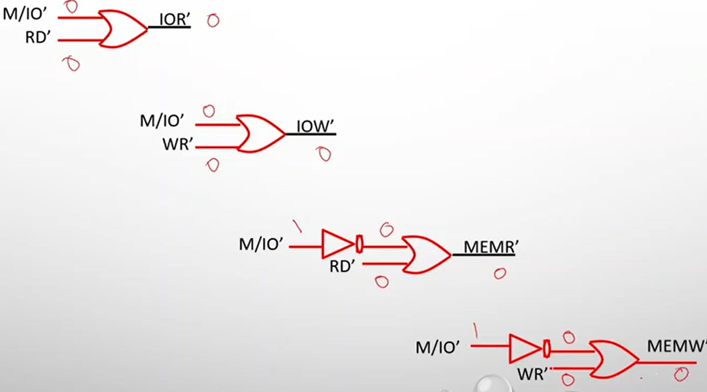

## Data Bus

{ loading=lazy }

## Pins

### $M/\overline{IO}$

Differentiate between memory and IO access.

When high, memory reference instructions.

When low, IO instructions.

### $\overline{RD}$

When it is low, read operation takes place.

It is an ouput signal.

### $\overline{WR}$

When it is low, write operation takes place.

It is an ouput signal.

| $M/\overline{IO}$ | $\overline{RD}$ | $\overline{WR}$ | Bus Cycle          |
| ----------------- | --------------- | --------------- | ------------------ |
| 1                 | 0               | 1;              | Memory Read        |
| 1                 | 1               | 0               | Memory Write       |
| 0                 | 0               | 1               | Input/Output Read  |
| 0                 | 1               | 0               | Input/Output Write |

{ loading=lazy }

### $\overline{DEN}$

Data Enable

Whenever data is available on $AD0- AD15$, this signal becomes low, to signal that data is coming.

Connected to [$\bar E$](#$\bar E$)

### $DT/\overline{R}$

Data Transmit/Receive

Controls the direction of data transfer from/to data transceivers, such as [Bi-Directional Buffer](#Bi-Directional Buffer).

When high, data transmitted by processor

When low, data received by processor

Connected to [DIR](#DIR)

## Bi-Directional Buffer

{ loading=lazy }

We are using ==LS245== as the octal buffer.

Bus A = MP, Bus B = Data Bus

Data can move from Bus A $\to$ B, or vice-versa.

### $\bar E$

Connected to [$\overline{DEN}$]($\overline{DEN}$)

### DIR

Connected to [$DT/\overline{R}$]($DT/\overline{R}$)

