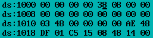
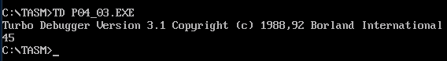
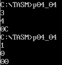

## Program 1

Write a program to convert 4-digit BCD number to HEXADECIMAL number and store the result in memory.

```assembly
.MODEL SMALL
.STACK 20

.DATA ; Data segment start here
ORG 1000H ; Memory address initialization
BCD DW 1234H ; 4-digit BCD number is 1234H, here BCD is a variable
HEX DW 0 ; HEX is a variable to store the results

.CODE ; Code start here
START:
MOV AX, @DATA ; Initializing DS: segment register
MOV DS, AX

MOV BX, 0001H ; Weight for LSD, storing 0001H into BX register (once position)
CALL BCD2BIN ; calling BCD2BIN procedure. See the written procedure in the

MOV BX, 000AH ; Weight for 2nd digit, Storing 000AH in to BX register (10th Position)
CALL BCD2BIN ; calling BCD2BIN procedure. See the written procedure in the last lines

MOV BX, 0064H ; Weight for 3rd digit, Storing 0064H in to BX register (100th Position)
CALL BCD2BIN ; calling BCD2BIN procedure. See the written procedure in the last lines

MOV BX,03E8H ; Weight for MSD, Storing 03E8H in th BX register (1000th Position)
CALL BCD2BIN ; calling BCD2BIN procedure. See the written procedure in the last lines

INT 3 ; Breakpoint interrupt

BCD2BIN PROC NEAR ; BCD2BIN is a procedure called 4 times in the main program
MOV AX, BCD ; Subroutine multiplies digits with respective weights and adds the partial
; product to get equivalent HEX moving the desired digit LSD position

AND AX, 000FH ; ANDing operation with BCD value i.e 1234
MUL BX ; multiplies BX with AX
ADD HEX, AX ; add AX value with Hex variable, initially Hex variable have 0
MOV CL, 04 ; moving 04 to CL
ROR BCD, CL ; Rotate Right
RET ; RET instruction stands for return, used at the end of the procedures
BCD2BIN ENDP ; end the procedure

END START
```

{ loading=lazy }

## Program 2

Write a program to convert the given HEXADECIMAL digit to ASCII byte and store the result in memory.

```assembly
.MODEL SMALL
.STACK 20

.DATA ; Data segment start here
ORG 1000H ; Memory address initialization
Hex_Digit DB 38H ; Given Hex value is 38H, Hex_Digit is a variable
ASCII DB ? ; ASCII is the variable to store the ASCII equivalent Hex of 38H

.CODE ; Code start here
START:
MOV AX, @DATA ; Initializing DS: segment register
MOV DS, AX

MOV AL, Hex_Digit ; Moving Hex_Digit value 38H to AL register
CMP AL, 3AH ; compare 38 with 3A, To see whether it is between 30H to 39H

; or 41H to 46H

JC SUB30 ; if carry generated then jump to location SUB30
SUB AL, 07H ; if no carry then subtract 07H with AL value
SUB30: ; User defined location name
SUB AL,30H ; subtract 30H with AL
MOV ASCII, AL ; Store the AL value into Hex_Digit variable

INT 3 ; Breakpoint interrupt
END START
code ends
```

{ loading=lazy }

## Program 3

Write a program to display the hexadecimal byte 45H on the screen using DOS interrupts.

### Easy Version

```assembly
.model small
.stack 20

.code
start:

mov ah, 02h

mov dl, 34h
int 21h

mov dl, 35h
int 21h
mov ah, 4ch
int 21h

int 3
end start
code ends
```

```assembly
.MODEL SMALL
.STACK 20

.CODE
START: ; here no data segment, using DOS interrupts

MOV AL, 45H ; Number to be Display on screen, store the 45H in AL
MOV BL, AL ; Moving 45H to BL

AND AL, 0F0H ; Get upper digit (nibble), AND operation to 45
ROR AL, 4 ; Rotate to Right

CALL HEXASC ; Convert from hex to ASCII
MOV DL, AL ; moving AL to DL
MOV AH, 02 ; Function code to display single character
INT 21H ; DOS interrupt 21H

MOV AL, BL ; Moving BL to AL
AND AL, 0FH ; Get lower digit by ANDing AL
CALL HEXASC ; call HEXASC Procedure

MOV DL, AL ; move AL to DL
MOV AH, 02 ; 02 to AH to Display second digit
INT 21H ; DOS interrupt 21H

MOV AH, 4CH ; causes the process to terminate
INT 21H ; DOS interrupt 21H

HEXASC: ; HEX TO ASCII procedure start
CMP AL,0AH ; compare 38 with 3A ,To see whether it is between 30H to 39H
; or 41H to 46H,
JB NUM ; Jump if Carry
ADD AL,07 ; For A-F, add 37H
NUM: ; jump address reference
ADD AL,30H ; For 0-9, add 30H
RET ; RET stands for return, used at the end of the procedures

END START
```

{ loading=lazy }

## Program 4

Write a program to input two single-digit hex numbers from keyboard and display their product on the screen.

```assembly
.MODEL SMALL
.STACK 20
.CODE
START:
CALL READKB ; Read Keyboard Procedure Call
MOV BL,AL ; move AL to BL
CALL NXTLINE ; Nextline procedure call
CALL READKB ; Read Keyboard Procedure Call
MUL BL ; Multiply BL with AL
MOV BL, AL ; move AL to BL
CALL NXTLINE ; Nextline procedure call
CALL DISP ; Call DISP procedure
MOV AH, 4CH ; causes the process to terminate
INT 21H ; DOS interrupt 21H

READKB PROC NEAR ; Read Keyboard Procedure Start here
MOV AH,01 ; Accepting number from keyboard
INT 21H ; DOS interrupt 21H
CALL ASCHEX ; Procedure to Ascii to Hex
RET ; RET used at the end of the procedures
READKB ENDP ; Read Keyboard Procedure ends here

ASCHEX PROC NEAR ; ASCII to Hex procedure start here
CMP AL, 3AH ; compare AL value with 3AH
JC SUB30 ; jump if carry, Sub30 is address
SUB AL, 07H ; no carry the subtract 07H with AL
SUB30: ; In compare carry generates, SUB30: start executes
SUB AL,30H ; ASCII to hex conversion
AND AL,0FH ; AND operation with 0Fh with AL value
RET ; RET used at the end of the procedures
ASCHEX ENDP ; Ascii to Hex procedure ends here

NXTLINE PROC NEAR ; NEXTLINE procedure start here
MOV AH, 2 ;
MOV DL, 0AH ; Line feed
INT 21H ; DOS interrupt 21H
MOV DL,0DH ; Carriage return
INT 21H ; DOS interrupt 21H
RET ; RET used at the end of the procedures
NXTLINE ENDP ; NEXTLINE Procedure ends here

DISP PROC NEAR ; DISP procedure start here
MOV AL, BL ; Moving BL to AL
AND AL, 0F0H ; AND operation of AL and 0F0h
ROR AL, 4 ; rotate right AL, 4 times
CALL HEXASC
MOV DL, AL ; Moving AL contents to DL
MOV AH, 02 ;
INT 21H ; DOS interrupt 21H
MOV AL, BL ; Moving BL contents to AL
AND AL, 0FH ; AND operation of AL and 0Fh
CALL HEXASC
MOV DL, AL ; Moving AL contents to DL
MOV AH, 02 ;
INT 21H ; DOS interrupt 21H
RET ; RET used at the end of the procedures
DISP ENDP ; DISP procedure ends here

HEXASC PROC NEAR ; HEXASC, Hex to Ascii procedure start here
CMP AL, 0AH ; compare AL with 0AH
JB NUM ; i
ADD AL, 07 ; add 07 to AL
NUM:
ADD AL, 30H ; Add 30h to AL
RET ; RET instruction used at the end of the procedures
HEXASC ENDP ; HEXASC procedure ends here

END START
```

{ loading=lazy }

## Assignment

Write a program to accept a character from keyboard and display its ASCII equivalent value on the screen.

```assembly
.model small
.stack 20
.code
start:
call readkb
mov bl, al
call nxtline
call disp
mov ah, 4ch
int 21h

readkb proc near
mov ah, 01
int 21h
ret
readkb endp

nxtline proc near
mov ah, 2
mov dl, 0Ah
int 21h
mov dl, 0dh
int 21h
ret
nxtline endp

disp proc near
mov al, bl
and al, 0F0h
ror al, 4
call hexasc
mov dl, al
mov ah, 02
int 21h
mov al, bl
and al, 0Fh
call hexasc
mov dl, al
mov ah, 02
int 21h
ret
disp endp

hexasc proc near
cmp al, 0Ah
jb num
add al, 07
num:
add al, 30h
ret
hexasc endp

end start
```

{ loading=lazy }

