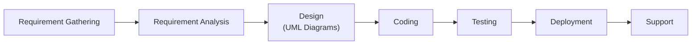
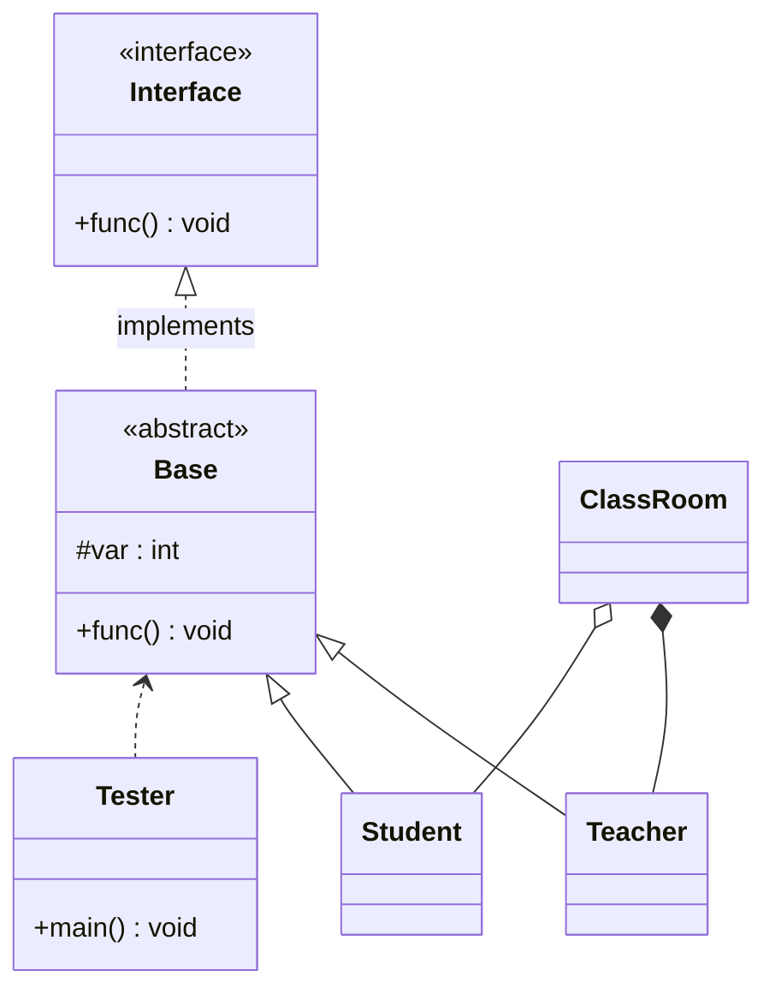
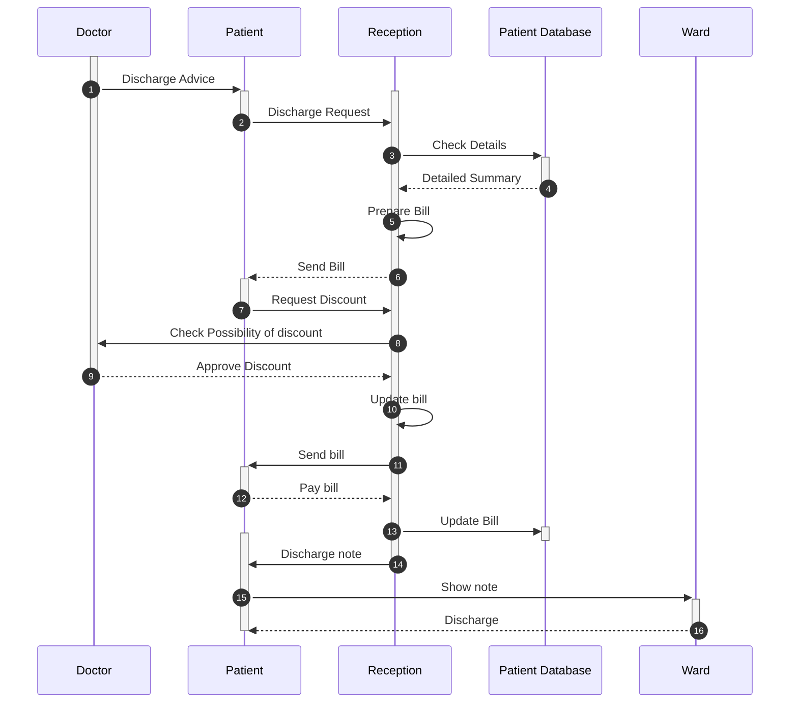
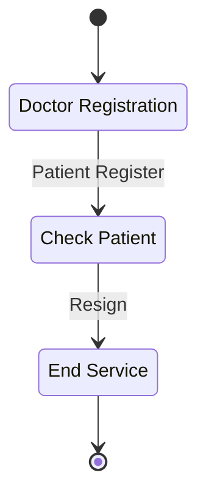

## Phases of Software Engineering

## UML

Unified Modeling Language

## Use Case Diagram

### Actors

classes

could be

1. users of the system
2. external system
3. physical environment

Properties

1. unique name
2. description (optional)

### Use Cases

basically like functions

properties

1. unique name
2. participating actors
3. entry conditions
4. exit conditions
5. event flow
6. exceptional cases

### `<<extends>>`

for exceptions/showing use cases that are rarely used

The direction of a `<<extends>>` relationship is to the extended use case

### `<<includes>>`

for use cases that require/depend on another use case

The direction of a `<<includes>>` relationship is to the using use case (unlike `<<extends>>` relationships).

{ loading=lazy }

## Class Diagram

### Access Specifiers

- (nothing) default
- `-` private
- `+` public
- `#` protected

### Connections

- association
    - can be 1-way or 2-way
    - can be one-one or many-many
    $1-1, \quad 5\ldots* - *, \quad *- 3\ldots *, \quad * - *$
    - arrow from a towards b, means that a depends on b
  
- aggregation
- composition (strong aggregation)
- inheritance
    - class inheritance
    - interface inheritance
### Example

## Sequence Diagram

Shows the interactions bw the classes/objects

calls are solid, returns are dashed

## State Diagrams

