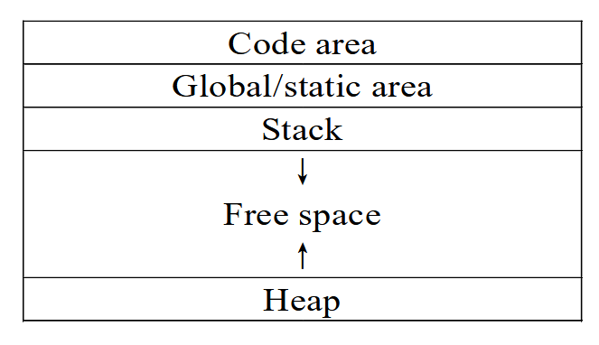
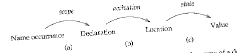

Named block of code. When the name is called, the body is executed.

## Types of Procedures

|                                | **Function<br />Procedures** | **Proper<br />Procedures**|
|---                                 | ---                          | ---|
|**Extend built-in<br />__ of language** | Operators                    | Actions/statements|
|**Return**                              | single value                 | -|
|                                    |                              | Set variables/perform output|
| Placement | Within-Expression            | Atomic Statements|
|  | `r * sin(angle)` | `read(ch)` |
| Called by<br />function | ✅ | ❌ |
| Called by<br />procedure | ✅ | ✅ |
| PL | C/C++ | Pascal |

## Procedure Definition

- Procedure Name
- Code body
- Formal Parameters
- Return type

```pascal
function square(x:integer):integer
begin
	square := x*x
end
```

```c
int square(int x)
{
  return x*x;
}
```

### Note

C does not allows procedure bodies to be nested, so uses control links only. So calling a procedure means that procedure will be

- Within same procedure
  (or)
- Outside all procedures

## Procedure Calls

```c
procedure_name(parameters)
```

## Procedure Activation

Execution of procedure body

Layout of activation is known at run-time

Frame is put on the stack and storage within is accessed relative to the frame pointer.

The values of variables in an activation are accessed as

- Frame Pointer + Displacement (or offset)
- Displacement is calculated at run-time

## Benefits of Procedures

- Procedure Abstraction
- Hides implementation details
- Program Legibility
- Better maintainence
- Better modularity
- Code re-usability (user-defined and from libraries)

## Parameter Passing Methods

|                                                              | Call by value                | Call by reference    |
| ------------------------------------------------------------ | ---------------------------- | -------------------- |
| Passed                                                       | Absolute value<br />Variable | Address<br />Pointer |
| Changes to formal parameter in the function affects the actual parameter? | ❌                            | ✅                    |
| Same memory location for Formal and actual parameter         | ❌                            | ✅                    |
| Default in PL                                                | C                            | Pascal               |

## Scope

### Scope of Variable

Part of program where use of variable refers to its declaration

|                                       | Static/Lexical                                               | Dynamic                                                      |
| ------------------------------------- | ------------------------------------------------------------ | ------------------------------------------------------------ |
| **Binding occurs during**             | Compilation                                                  | Execution                                                    |
| **Programmer<br />Comprehensibility** | Easy                                                         | Difficult                                                    |
| **Example**                           | C<br />Pascal<br />Java<br />Pearl (`my`)                    | Python<br />LISP<br />Pearl (`local`)                        |
| **Rules**                             | A variable always refers to its top-level environment        |                                                              |
|                                       | Variable declared within a block are not in the scope outside the block | Global identifier refers to the identifier associated with the most recent environment |
|                                       | Variables outside the block are visible unless overridden    | The occurrence of a identifier is searched in the most recent binding |
|                                       | Binding of variable can be determined by program text, independent of run-time function call stack | Each time a new function is executed, a new scope is pushed onto the stack. |
|                                       | Compiler first searches in the current block, then in global variables | The compiler first searches the current block and then successively all the calling functions. |
### Scope Rules

Visibility rules for names in a PL; names could denote procedures, types, constants, variables

## Macros

- Procedure body is substituted at every point of call
- Actual parameters are substituted for the formals
  ==Different from call by value/reference==

Dynamic scoping

```c
#define pi 3.14
```

Every occurance of `pi` is replace with $3.14$ by the compiler.

```c
#define product(x, y) x*y
```

Every call of `product(x, y)` is replaced with `x*y`

## Runtime Memory Model

Layout of executable file

| Segment | Stores                                                       |                                                              |
| ------- | ------------------------------------------------------------ | ------------------------------------------------------------ |
| Code    | Machine code of program                                      |                                                              |
| Static  | Data live throughout program execution<br />- Global vars<br />- Constants |                                                              |
| Stack   | Local variables of procedure<br />Procedure activation records (C, Pascal) | Space reclaimed when procedure terminates<br />Relative Address of variable are same |
| Heap    | Dynamic memory allocation<br />Procedure activation records  | Activation records stay here as long as they are needed      |



## Procedure Activations

I didn't understand this



## Activation Record

Activation records on stack are called as stack frame

### Sections


| Link    | Type    |                                                 | Represents ___ environment of procedure |
| ------- | ------- | ----------------------------------------------- | --------------------------------------- |
| Access  | Static  | Points to activation record for run-time caller | defining                                |
| Control | Dynamic | implement statically-scope languages            | calling                                 |

## Special Registers

| Register | Full-Form        | Pointer to                                                  |
| -------- | ---------------- | ----------------------------------------------------------- |
| PC       | Program Counter  | Next instruction to be executed                             |
| SP       | Stack Pointer    | Last location allocated on call stack                       |
| FP       | Frame Pointer    | Current activation record to allow access to local variable |
| AP       | Argument Pointer | Current argument/parameter                                  |

## Variables

Storage is allocated at compile time

Languages without recursive procedure treat all variables as static.

|                                    | Static         | Local                                                 |
| ---------------------------------- | -------------- | ----------------------------------------------------- |
| Lifetime                           | Entire program | Within procedure activation                           |
| Retain values between activations? | ✅              | ❌<br />(Bound to distinct storage in each activation) |

Example for Static variable declaration in C
```c
static int count = 0;
int count = 0; // variables declared outside main() are static by default
```

## Activation Tree

Tree representing procedure activations of program

For eg: Trees for merge sort, quicksort in DSA

## Garbage Collection

Technique to reclaim storage that is no longer needed

## Recursion

Also called as multiple activation

Recursive procedure is one that can be activated by its own body.

|                                                           | Traditional Recursion                                        | Tailed Recursion                                             |
| --------------------------------------------------------- | ------------------------------------------------------------ | ------------------------------------------------------------ |
|                                                           |                                                              | Nothing to do after the function returns, except return its value |
|                                                           |                                                              | Compiler replaces caller with callee                         |
| Last statement in the body of procedure is recursive call | ❌                                                            | ✅                                                            |
| Steps                                                     | - Perform recursive calls first<br />- Take the return value of the recursive call<br />- Calculate the result | - Perform your calculations first<br />- Execute the recursive call<br />- Passing results of current step to next |
| Result of calculation obtained                            | only after returning from every recursive call               |                                                              |
| Re-use<br />Stack Frame                                   | ❌<br />(Nested Stack Frames)                                 | ✅                                                            |
| Efficient                                                 | ❌                                                            | ✅                                                            |

```c
// Traditional
factorial(n) {
	if (n == 0)
    return 1;
  
  return n * factorial(n - 1);
}

// Tailed
factorial1(n, accumulator)
{
  if (n == 0)
    return accumulator;
  
  return factorial1(n - 1, n * accumulator);
}

factorial(n)
{
  return factorial1(n, 1);
}
```

Converting a tailed-recursion logic into an equivalent control-flow logic is called as Tail-recursion elimination. This can be done using `goto`

