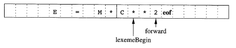
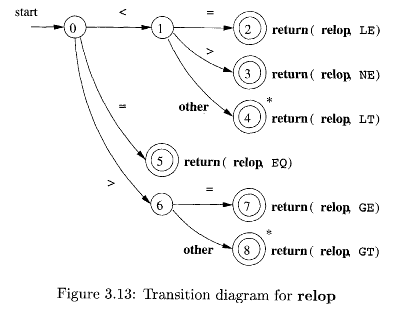
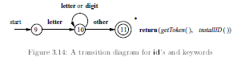
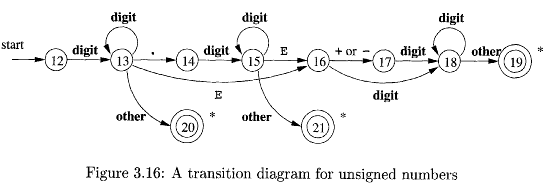
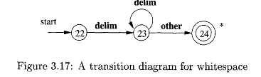

Also called as **scanning**

We specify tokens using Regular Expressions - sequence of characters specifying search pattern in input

We use NFA/DFA

## Parts

|               | Meaning                                                      | Example                                                 |
| ------------- | ------------------------------------------------------------ | ------------------------------------------------------- |
| Tokens        | Pair containing `token_name` and `attribute`<br />`token_name` is a symbol representing a ‘lexical unit’, which is processed by parser | `<id, pointer_to_symbol_table_entry>`                   |
| Lexical Units | Identifiers, Keywords, Operators, Constants (numeric/string) |                                                         |
| Pattern       | Rule describing the format of the lexemes of a token         | For keywords it’s the sequence of characters itself     |
| Lexeme        | Sequence of characters that matches that pattern for a token |                                                         |
| Sentinals     | Special characters that cannot be part of the source program | eof character can be used to denote the end of a buffer |

## Example

```
e = m * c ** 2
```

```
<id, pointer_to_symbol_table_entry_for_e>
<assign_op>
<id, pointer_to_symbol_table_entry_for_m>
<mult_op>
<id, pointer_to_symbol_table_entry_for_c>
<exp_op>
<number, 2>
```

## Input Buffering

In Fortran, spaces are ignored. So, `he l lo` is the `hello`. This is because, there may exist blank instances in the magnetic tape.

We can’t tell if the statement `do 5 i = 1.25` is to be treated as

```c
do {i=1}
// or  
do51 = 1.52
```

until we reach the `.`

### Fortran Loops

```fortran
do index_variable = start, end, step
	statements
end do

// or

do n index_variable = start, end, step
	statements
n continue
```

### Lookahead

Lookahead of atleast one/more characters beyond the next lexeme before we can be sure that we have the right lexeme.

Helps speed up reading source program

We usually use 2 buffer scheme lookahead, which are alternatively-reloaded; each buffer is of the same size $n$, where $n$ is size of a disk block

#### Advantages

- Using one system read command we can read $n$ characters into a buffer, rather than using one system call per character
- A special character, represented by eof (character different from any possible character of source code), marks the end of the source file

### 2 Buffer Scheme

| Pointer        | Purpose                                                      |
| -------------- | ------------------------------------------------------------ |
| `lexeme_begin` | marks the beginning of the current lexeme, whose extent we are attempting to determine |
| `forward`      | scans ahead until a pattern match is found                   |

When the next lexeme is determined, the following steps are taken:

- `forward` is set to the character at its right end
- Record the lexeme as the attribute of the token
- `lexemeBegin` is set to the character immediately after the lexeme just found



Advancing forward requires checking if end of a buffer is reached. 

|                             |                                      |
| --------------------------- | ------------------------------------ |
| `forward` is at end of buffer | - Reload other buffer from input<br />- Move `forward` to beginning of newly loaded buffer |
| `eof` character at the middle of buffer | - marks the end of the input<br />- terminate lexical analysis |

## Recovery Strategies

Recovery strategies are used when no pattern for tokens matches any prefix of remaining input, preventing lexical analyzer from proceeding

Goal: Transform prefix of remaining input into valid lexeme

Possible error-recovery actions are:

- Panic Mode Recovery: Delete successive characters from the remaining input, until the lexical analyzer can find a well-formed token at the beginning of what input is left
- Insert a missing character into the remaining input
- Replace a character by another character
- Transpose two adjacent characters

## Parts of String

| Term             | Meaning                                                      | Example<br />$s =$ banana                     |
| ---------------- | ------------------------------------------------------------ | --------------------------------------------- |
| Prefix           | Starting character(s)                                        | $\epsilon$, b, ba, ban, bana, banan, banana   |
| Suffix           | Trailing character(s)                                        | $\epsilon$, a, an, ana, nana, anana, banana   |
| Substring        | Middle character(s)                                          | prefix_set $\cup$ suffix_set                  |
| Proper Prefix    | Non-empty prefix $\ne$ original string                       | b, ba, ban, bana, banan                       |
| Proper Suffix    | Non-empty suffix $\ne$ original string                       | a, an, ana, nana, anana                       |
| Proper Substring | Non-empty substring $\ne$ original string                    | proper_prefix_set $\cup$ proper_suffix_set    |
| Subsequence      | Collection of characters of string<br />(not necessarily contiguous, but left $\to$ right) | baaa<br />(too many combinations to list out) |

## Operations

In order of precedence

|           | Operation      | Operator                   |
| --------- | -------------- | -------------------------- |
| Strings   | Exponentiation | $s^i$                      |
|           | Concatenation  | $s_1 \cdot s_2$            |
| Languages | Kleene closure | $L^*$                      |
|           | Posive closure | $L^+$                      |
|           | Concatenation  | $L_1 \cdot L_2$            |
|           | Union          | $L_1$ \| $L_2$<br />$L_1 \cup L_2$ |

## Regular Definitions

Helps to give names to regular expressions and use those names in subsequent expressions

```
d1 -> r1
d2 -> r2
...
dn -> rn
```

where 

- $d_i$ is a new symbol, such that
  - $d_i \not \in \epsilon$
  - $d_i \ne d_j$
- $r_i$ is a RE over alphabet $\epsilon \cup \{d_1, \dots, d_{i-1} \}$

## Lex

Language that allows us to create our own lexical analyzer, without having handcode

It represents everything in terms of a Finite State Machine, and then generates the code

## Lex Symbols

| Symbol      | Meaning                                               | Example                              |
| ----------- | ----------------------------------------------------- | ------------------------------------ |
| c           | non-operator character c                              |                                      |
| \c          | character $c$ literally                               |                                      |
| “s”         | string $s$ literally                                  |                                      |
| .           | any ==character== **except `\n`**                     | hello<br />$\implies 5 \ .$          |
| ^           | beginning of line                                     | ^abc                                 |
| $           | end of line                                           | abc$                                 |
| [s]         | any character in $s$                                  | $[abcde]$<br />$a|b|c|d|e$           |
| [^s]        | any character not in $s$                              | $[\wedge abcde]$<br />$(a|b|c|d|e)'$ |
| r*          | 0/more strings matching $r$                           | (something)*                         |
| r+          | 1/more strings matching $r$                           | (something)+                         |
| r?          | 0/1 strings matching $r$                              | (something)?                         |
| r{m,n}      | $\text{count} \in [m, n]$ strings matching $r$        | (something){1, 5}                    |
| $r_1r_2$    | $r_1$ followed by $r_2$<br />(select $r_1$ and $r_2$) |                                      |
| $r_1/r_2$   | $r_1$ followed by $r_2$<br />(select only $r_1$)      |                                      |
| $r_1 | r_2$ | $r_1$ or $r_2$                                        |                                      |
| $(r)$       | Same as $r$                                           | $(a|b)$                              |

## Transition/State Diagrams

Reg Exprs are translated into transition diagrams (representing Finite State Machines), which are then translated into program code for lexical analyzer

### Relational Operators



### Reserved Words/Identifiers



### Unsigned Numbers



### Whitespace



## Conflict Resolution

- **Longer** prefix preferred
- If there are multiple matches for longest prefix, **first** pattern in lex program is preffered

```
a		{printf (“1A”);}
aa	{printf (“2A”);}

Input : aaa
Output: 2A1A
```

```
%%
letter(letter|digit)*	{ printf (“ID”); }
if										{ printf (“IF”); }

Input : if
Output: ID
```

