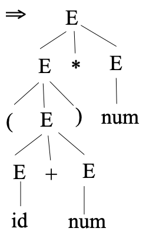
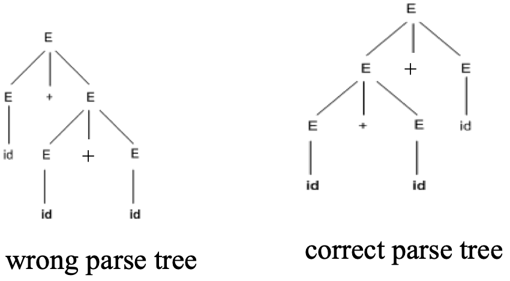
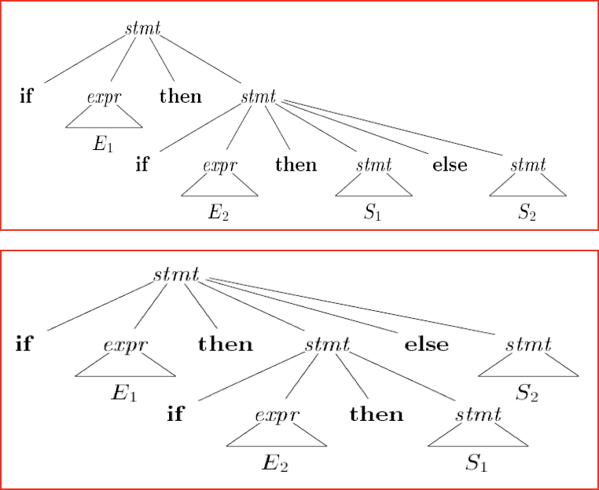
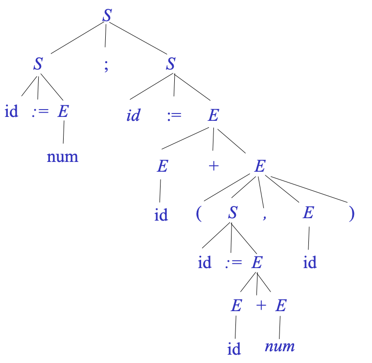
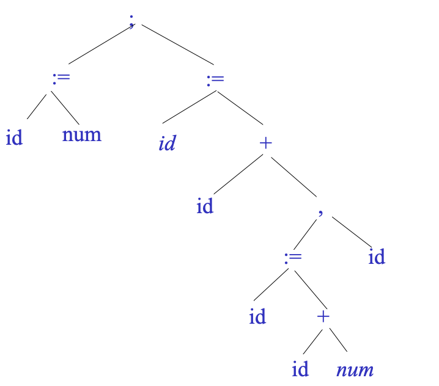
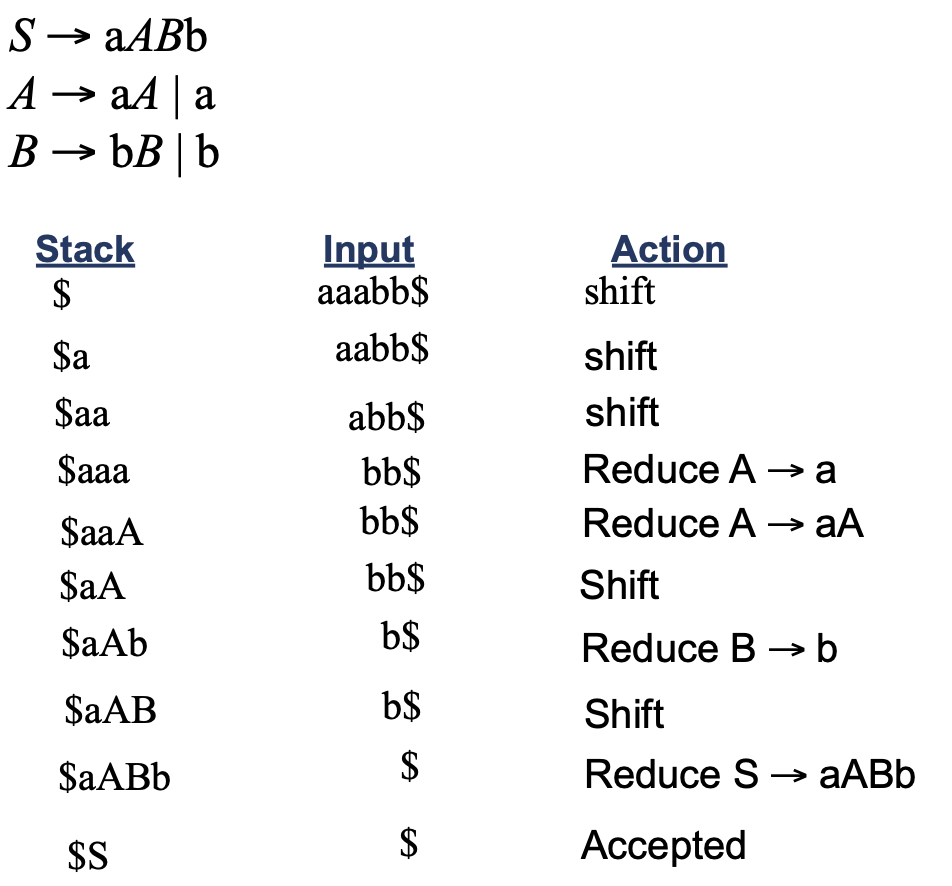
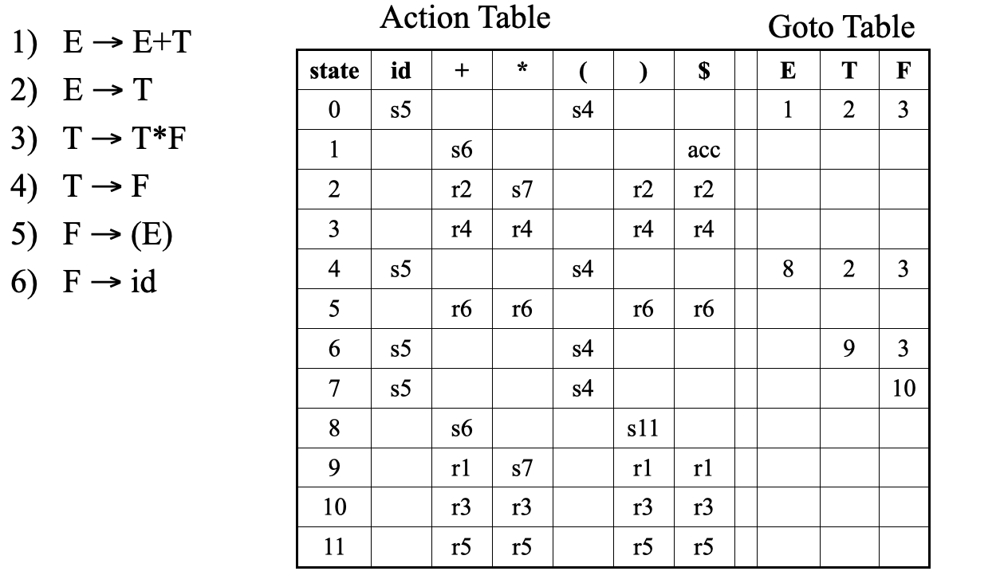
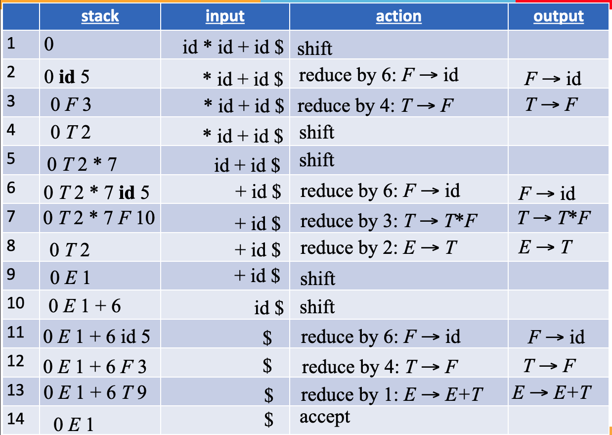

Also called as **Parsing**

Regular expressions cannot be used, due to nested structure.

Hence, we need a context-free grammar and PDA

## Syntax/Parse Tree

Each interior node represents an operation and the children of the node represent the arguments of the operation. It shows the order of operations.

## Yacc

Yet another compiler compiler

This is covered in [practicals](./practicals/)

## CFG

Context-Free Grammar

- Set of terminals $T$
- Set of non-terminals $N$
- Start symbol $S$ (non-terminal)
- Set of productions

$$
X \to Y_1 Y_2 \dots Y_n
$$

where

- $X \in N$
- $Y_i \in T \cup N \cup \{ \epsilon \}$

LHS of any production/rule can only be a single non-terminal

If $S$ is the start symbol and $L(G)$ is the language of $G$, then $L(G)$ is the set of strings that can be derived from $S$

$$
(a_1 \dots a_n) | S \overset{*}{\implies} a_1 \dots a_n , \forall a_i \in T
$$

## Derivation

A derivation defines a parse tree. One parse tree may have multiple derivations.

We have 2 different derivation types, which allows for different parser implementations.

### Types

| Type      | Parser Implementation | Single-step Derivation                                       |
| --------- | --------------------- | ------------------------------------------------------------ |
| Leftmost  | Top-Down              | Leftmost non-terminal replaced with corr RHS of non-terminal |
| Rightmost | Bottom-Up             | Rightmost non-terminal replaced with corr RHS of non-terminal |

### Example

```
G: E → E+E | E∗E | (E) | id | num
Input: (a + 23) * 12
Tokens: LP ID PLUS NUM RP MUL NUM
```

```
Leftmost

E
⇒  E * E
⇒  (E) * E
⇒  (E+E) * E
⇒  (id+E) * E
⇒  (id+num) * E
⇒  (id+num) * num

Rightmost

E
⇒  E * E
⇒  E * num
⇒  (E) * num
⇒  (E+E) * num
⇒  (E+num) * num
⇒  (id+num) * num
```

Parse tree is same for both



## Grammar

### Types

| Type            | Production Form | Parser                   |
| --------------- | --------------- | ------------------------ |
| Left-Recursive  | $X \to Xa$      | Bottom-Up                |
| Right-Recursive | $X \to aX$      | Bottom-Up/<br />Top-Down |

where

- $X$ is a non-terminal
- $a$ is a string of terminals, it is called left recursive production

==**Top-down parser cannot work with Left recursive grammar**==, but both parsing works with right recursive grammar

```
G1: X →  Xa | a // left recursive
G2: X →  XA | a // right recursive
```

```c
// left recursive
X()
{  
  X();
  match('a');
}

// right recursive
X()
{  
  match('a');
  X();
}
```

## Ambiguous Grammar

Grammar where the same string has multiple

- parse trees
- leftmost derivations
- rightmost derivations

It gives incorrect results.

### Example

```
Grammar G: E → E+E | E*E | (E) | id | num
Input String s: id+id+id
```

In this case, leftmost derivation is incorrect, as `+` is left-associative, and should be treated as such.

```
// leftmost approach 1
E
→ E+E
→ id + E
→ id + E + E
→ id + id + E
→ id + id + id

// leftmost approach 2
E
→ E + E
→ E + E + E
→ id + E + E
→ id + id + E
→ id + id + id
```



### `if` statement

```
stmt → if expr then stmt
     | if expr then stmt else stmt
     | other
```

This has two leftmost derivations for

```
if E1 then if E2 then S1 else S2
```



## Disambiguation

It is not possible to automatically convert ambiguous grammar into an unambiguous one. Hence, we need to use one of the following to eliminate ambiguity

### Rewrite Grammar

```
E → E + E | E * E | (E) | id

can be converted to

E → E + T | T
T → T * F | F
F → (E) | id
```

```
if grammar previously

can be converted to

stmt 		→ m_stmt
     		| o_stmt
     		| other
m_stmt	→ if expr then m_stmt else m_stmt
      	| other
o_stmt 	→ if expr then stmt
      	| if expr then m_stmt else o_stmt
```

where

- matched statement: with `else`
- open statement: without `else`

### Tool-Provided Disambiguation

Yacc provides disambiguation declarations

```c
%left + - * /
%right = ^
```

This is covered in detail in [practicals](./practicals/)

## Example Grammar for prog lang

Consider a language consisting of semicolon (;) separated list of statements (except the last statement), where

- A statement can be
  - id := expr 
  - print(expression list)
- expr can be expr + expr/num/id/ ( statement list, expr)
- expression list is comma-separated list of expressions

```
S → S ; S | id := E | print (L)
E → E + E | num | id | ( S , E )
L → L,E  | E
```

## Trees

|                  |                          Parse Tree                          |                         Syntax Tree                          |
| :--------------: | :----------------------------------------------------------: | :----------------------------------------------------------: |
|  Alternate Name  |                     Concrete Syntax Tree                     |                     Abstract Syntax Tree                     |
| Grammar symbols? |                              ✅                               |                   ❌<br />(only terminals)                    |
|     Example      |  |  |

## Parsing

Parser decides

- which production rule is to be used, when required
- what is the next token
  - Reserved word `if`, open paranthesis
- what is the structure to be built
  - `if` statement, expression
- 

## Types of Parsers

|                              | Bottom-Up                                       | Top-Down                                        |
| ---------------------------- | ----------------------------------------------- | ----------------------------------------------- |
| Alternate Names              | LR<br />Shift-Reduction                         | LL<br />Derivation                              |
|                              | ==Finds rightmost derivation in reverse order== |                                                 |
| Parse tree<br />construction | leaves $\to$ root                               | root $\to$ leaves                               |
| Start                        | Input string                                    | Start symbol                                    |
| End                          | Start symbol                                    | Input string                                    |
| Steps                        | Shift & Reduction                               | Replace leftmost nonterminal w/ production rule |
|                              | Automatic Tools                                 | Handwritten parsers<br />Predictive parsers     |
| Size of<br />Grammar class   | Larger                                          | Smaller                                         |

## Handle

Substring matching right side of a production rule, which gets reduced in a manner that is reverse of rightmost derivation

Not every substring that matches the right side of a production rule is a handle; only the one that gets chosen for reduction

## Sentential Form

Any string derivable from the start symbol

A derivation is a series of rewrite steps

$$
S \implies \gamma_0 \implies \gamma_1 \implies \dots \implies \gamma_n ⇒ \text{Sentence}
$$

| Non-terminals in $\gamma_i$ | $\gamma_i$ is      |
| --------------------------: | ------------------ |
|                         $0$ | Sentence in $L(G)$ |
|                     $\ge 1$ | Sentential Form    |

Right sentential form occurs in rightmost derivation. If the grammar is unambiguous, then every right-sentential form of the grammar has exactly one handle

## Handle Pruning

A right-most derivation in reverse can be obtained by handle-pruning.

1. Start from $\gamma_n$, find a handle $A_n \to \beta_n$ in $\gamma_n$
2. Replace $\beta_n$ by $A_n$ to get $\gamma_{n-1}$
3. Repeat the same until we reach $S$

## Shift-Reduce Parsing

- Initial stack only  contains end-marker `$`
- End of input string is marked by end-marker `$`

Shift input symbols into stack until reduction can be applied

Parser has to find the right [handles](#handle)

If a shift-reduce parser cannot be used for a grammar, that grammar is called as non-LR(k) grammar; ambiguous grammar can never be LR grammar.

### Steps

| Step      | Action                                                       |
| --------- | ------------------------------------------------------------ |
| Shift     | New input symbol pushed to stack                             |
| Reduction | Replace handle at top of stack by non-terminal               |
| Accept    | Successful completion of parsing                             |
| Error     | Syntax error discovered<br />Parser calls error recovery routine |

### Types

1. Operator-Precedence Parser

2. LR Parser

   There are 3 sub-types; only their parsing tables are different

   - Simple LR
   - LookAhead LR (intermediate)
   - Canonical LR (most general)

==**Yacc creates LALR**==


### Conflicts

| Type          |                                                              |
| ------------- | ------------------------------------------------------------ |
| Shift-Reduce  | - Associativity & precedence not ensured<br/>- Default action: prefer shift |
| Reduce-Reduce |                                                              |

### Resolving conflicts

|                                                       | Easy? |
| ----------------------------------------------------- | ----- |
| Rewrite grammar                                       | ❌     |
| [Yacc_Directives.md](Practical/06_Yacc_Directives.md) | ✅     |

### Solving stack questions

| Stack | Input     | Action |
| ----- | --------- | ------ |
| `$`   | somethign |        |



## LR($k$) Parsing

Meaning

- Left-right scanning
- Rightmost derivation
- Lookahead of $k$ i/p symbols at each step; if $k$ not mentioned, $k=1$

Class of grammars parsable by LR is proper superset of class of grammars parsable with predictive parsers

$$
\text{LL(1) Grammars} \subset \text{LR(1) Grammars}
$$

Can detect syntactic error as soon it performs left-to-right scan of input

### Why?

It is the most __ shift-reducing parser

- Efficient
- General
- Non-backtacking

## LR Parsing Algorithm

| Stack                       | Remaining Input            |
| --------------------------- | -------------------------- |
| $S_0 X_1 S_1 \dots X_m S_m$ | $a_i a_{i+1} \dots a_n \$$ |

where

- $X_i$ is a terminal/non-terminal
- $S_i$ is a state

The parser action is determined by $S_m$, $a_i$, and parsing action table

### Actions

|          action[$S_m, a_i$]          | Meaning                                                      |
| :----------------------------------: | ------------------------------------------------------------ |
|               Shift s                | Shift new input symbol and next state $s_i$ into stack       |
| Reduce<br />$A \to \beta$ (or) $r_j$ | 1. Reduce by production no $j$<br />2. Pop 2 $\vert \beta \vert$ items from stack (grammar symbol & state symbol)<br />3. Use goto table<br />4. Push $A$ and $s$ where $s=\text{goto} [s_{m-r}, A]$<br /><br />(current input symbol not affected) |
|                 acc                  | Accept                                                       |
|                blank                 | Error                                                        |

### Example

Parse `id*id+id$` using





