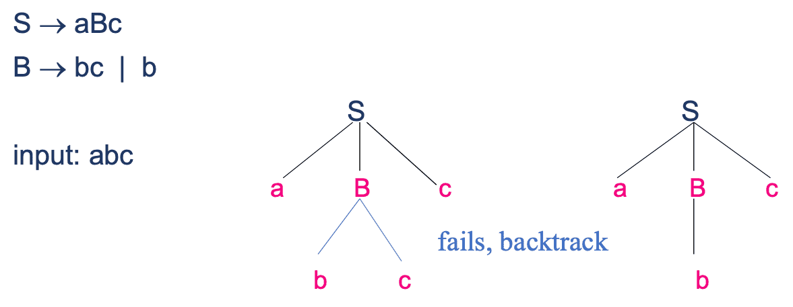
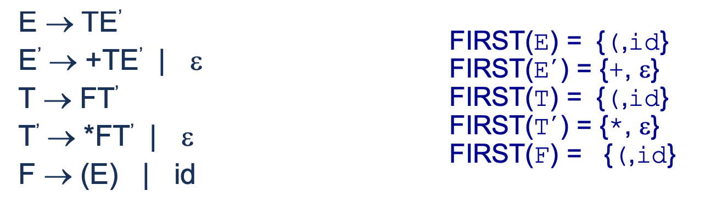
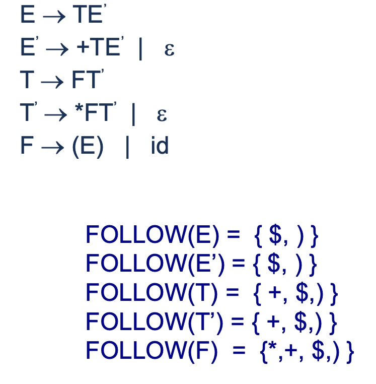

## Top-Down Parsing

|               |  Recursive Descent  | Predictive Parsing |
| ------------- | :-----------------: | :----------------: |
| Method        |    Backtracking     |    Table-Driven    |
| Widely-used?  |          ❌          |         ✅          |
| Efficient?    |          ❌          |         ✅          |
| Grammar       |       General       |   LL(1) Grammar    |
| Tries to find | Leftmost derivation |                    |

- Recursive predictive parsing is a type of Recursive Descent, without backtracking
- Non-recusive predictive parser is also known as LL(1) parser

### Recursive Descent Parsing

## Computations

I would recommend just drawing the tree, and finding the corresponding set of terminals.

### First(X)

The first symbol accessible;

| X =          | $\exist$ X $\to$ |                                           | First(X) $\supset$ |
| ------------ | ---------------- | ----------------------------------------- | ------------------ |
| $\epsilon$   |                  |                                           | $\{\epsilon\}$     |
| Terminal     |                  |                                           | $\{X\}$            |
| Non-Terminal | $\epsilon$       |                                           | $\{\epsilon\}$     |
| Non-Terminal | $Y_1 Y_2 Y_n$    | $Y_i \to a; Y_{1, \dots, i-1} = \epsilon$ | $\{a\}$            |
| Non-Terminal | $Y_1 Y_2 Y_n$    | $Y_i \to \epsilon,  \forall i$            | $\{\epsilon\}$     |

### Follow(Non-Terminal)

| Non-Terminal                                                 |                                               |
| ------------------------------------------------------------ | --------------------------------------------- |
| Start Symbol $S$                                             | Follow(S) $\supset \{\$\}$                    |
| $A \to \alpha B \beta$                                       | Follow(B) $=$ First($\beta$) - $\{\epsilon\}$ |
| $A \to \alpha B$ $A \to \alpha B \beta$, and $\epsilon \in$ First($\beta$) | Follow(B) $\supset$ Follow(A)                 |

## LL(1) Grammar

No multiple-defined entries in parsing table

- Left-right scanning
- Leftmost derivation
- Lookahead of one i/p symbol at each step

## LL(1) Parser

### Components

|               |                                                              |
| ------------- | ------------------------------------------------------------ |
| Input Buffer  | String to be parsed, ending with `$`                         |
| Output        | Producting rule representing step of leftmost derivation sequence of string in input buffer |
| Stack         | Contains grammar symbols `$` signifies bottom of stack Initially, stack contains `$S` Only `$` in stack signfies parsing complete |
| Parsing Table | 2 dimensional array $M[A, a]$ Each row is a non-terminal symbol Each column is `$`/terminal symbol Each entry holds production rule |

### Construction of Parser

|                                                              |                                                              | Replace with                                                 |
| ------------------------------------------------------------ | ------------------------------------------------------------ | ------------------------------------------------------------ |
| **Elimination of left recursion**                            | $A \to A \alpha | \beta$                                     | $A \to \beta A'$ $A' \to \alpha A' | \epsilon$          |
| **Elimination of left factoring**                            | $A \to \alpha \beta_1 | \alpha \beta_2 | \gamma_1 | \gamma_2$ | $A \to \alpha A' | \gamma_1|\gamma_2$ $A' \to \beta_1 | \beta_2$ |
| **Calculate FIRST & FOLLOW**                                 |                                                              |                                                              |
| **Construction of parsing table** For each $A \to \alpha$ |                                                              |                                                              |
| For each terminal a in FIRST($\alpha$)                       |                                                              |                                                              |
|                                                              |                                                              |                                                              |
| **Check if input string is accepted/not**                    |                                                              |                                                              |

This part is Incomplete