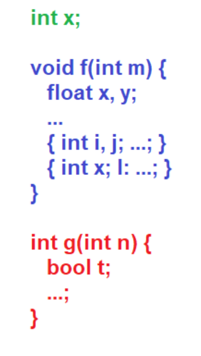
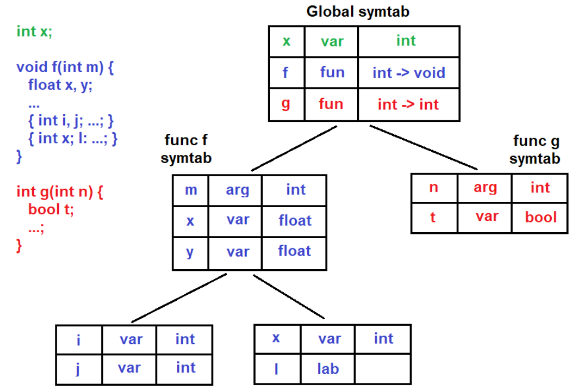

## Block Structure Languages

Basic units are blocks, which can be nested upto any depth

## Scope of Identifier

Refers to portion of program where the identifier is accessible

Related concepts are function overriding, overloading, multiple variable declaration

In C and similar languages, `{ ... }` marks the start and end of scope.

## Example Problem

```c
{ int x; char y; { bool y; x; y; } x; y; }
```

```c
{ { x:int; y:bool; } x:int; y:char; }
```

(Draw stack for this; couldn’t draw cuz no time cuz of exam prep … sorry junior!)

## Scoping Algorithm

| When encountering               |                                                              |
| ------------------------------- | ------------------------------------------------------------ |
| `{`                             | Push new stack node (with empty symbol table within)         |
| Variable declaration/definition | Update top’s symbol table                                    |
| Variable invokation             | Check if element in top’s symbol table<br />Else, check `top-1`'s symbol table and so on |
| `}`                             | Pop top stack node                                           |

### `push`

```pseudocode
temp = new SymbolTable Node
temp.prev = top
top = N
```

### `pop`

```pseudocode
temp = top
top = temp.prev
temp.prev = null
delete temp
```

## Symbol Table Tree Representation





