## Attribute

May hold almost any thing: a string, a number, a memory location, a complex record.

## Semantic Rules

Semantic rules set up dependencies between attributes which can
be represented by a dependency graph. This dependency graph determines the evaluation order of these
semantic rules. 

Evaluation of a semantic rule defines the value of an attribute. But a semantic rule may also have some side effects such as printing a value.

## SDD

SDD (Syntax Directed Definition) is a CFG with semantic rules, where each

- Grammar symbol is associated with a set of attributes
- Production rule is associated with a set of semantic rules (will be provided)

If $X$ is a symbol and $a$ is one of its attribute, then $X.a$ denotes value at $X$

This set of attributes for a grammar symbol is partitioned into two subsets called **synthesized** and **inherited** attributes of that grammar symbol.

### Properties

- give high-level specifications for translations
- hide many implementation details such as order of evaluation of semantic actions.
- We associate a production rule with a set of semantic actions, and we do not say when they will be evaluated

### IDK

Each production $A \to \alpha$ is associated with a set of semantic rules of the form

$b=f(c_1,c_2, \dots ,c_n)$ where $f$ is a function, and $b$ can be one of the following

- $b$ is a synthesized attribute of A and $c_1, c_2, ... ,c_n$ are attributes of the grammar symbols in the production $A \to \alpha$
- $b$ is an inherited attribute one of the grammar symbols in $\alpha$, and $c_1,c_2, \dots, c_n$ are attributes of the grammar symbols in the production $A \to \alpha$

## Types of Attributes

Consider

```
A → BCD (A is parent; B,C,D are children)
```

|    | Synthesized                     | Inherited|
|---     | ---                             | ---|
|Meaning | Node takes values from children | Node takes values from parent/sibling|
|Example | `A.s = B.s`<br />`A.s = C.s`<br />`A.s = D.s` | `C.i = A.i`<br />`C.i = B.i`<br />`C.i = D.i` |

## Types of SDD

| Type                                                         |                                                              |
| ------------------------------------------------------------ | ------------------------------------------------------------ |
| S-Attributed Definitions/<br />S-Attributed SDD/<br />S-Attributed Grammar | Only synthesis                                               |
| L-Attributed Definitions/<br />L-Attributed SDD/<br />L-Attributed Grammar | - Synthesis<br />- Inheritance from parent/left-siblings<br />(from previous example: C.S = A.S, C.S=B.S, not C.S = D.S) |

Unlike regular SDD, these attribute grammars cannot have side effects (such as printing values); they can only evaluate values of attributes.

## Translation Schemes

Indicate the order of evaluation of semantic actions associated with a production rule

Compared to SDD, they give some information about implementation details

## Annotated Parse Tree

Parse tree showing the values of attributes at each node

Process of computing attributes values at nodes is called annotating/decorating

Order of these computations depends on the dependency graph induced by the semantic rules

### Example: $5+3*4$

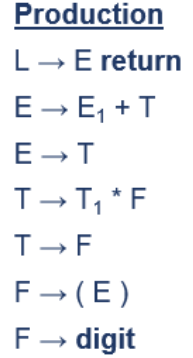

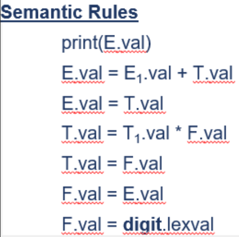

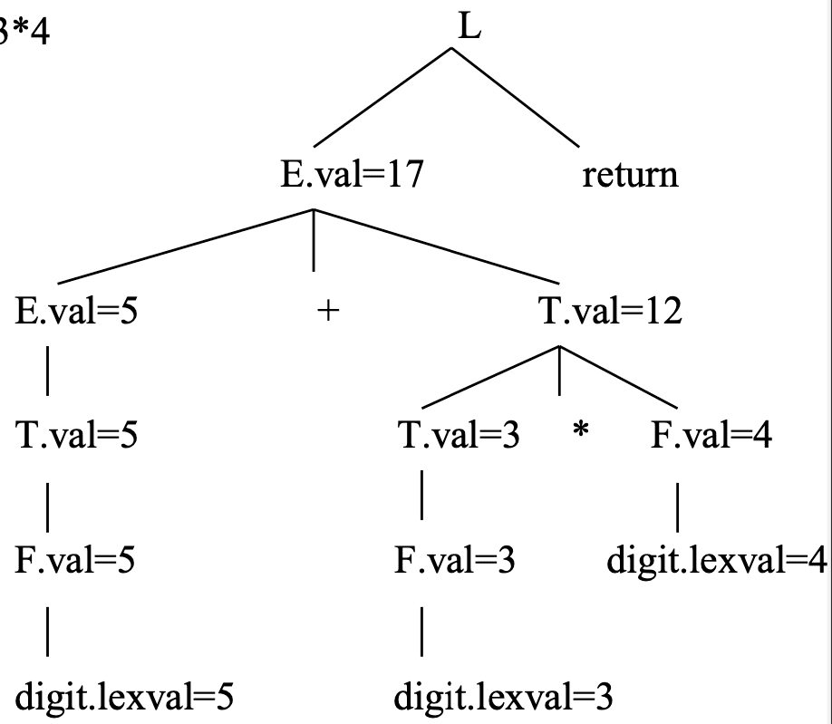

#### Dependency Graph

All updward arrows, since this S-Attributed: all parents inherit from child(ren).

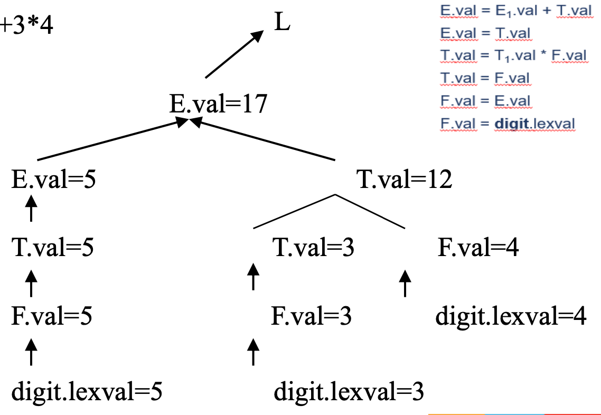

### Example: `real p, q`

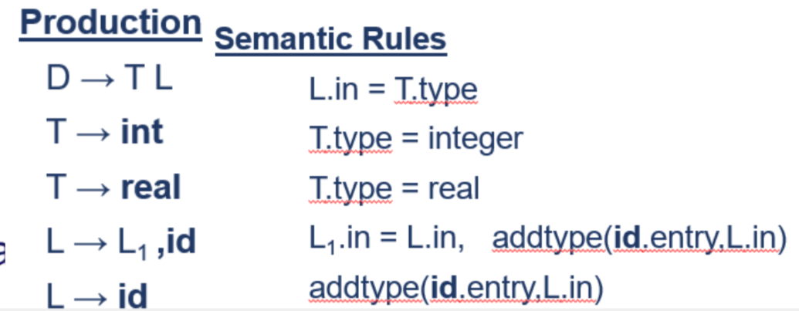

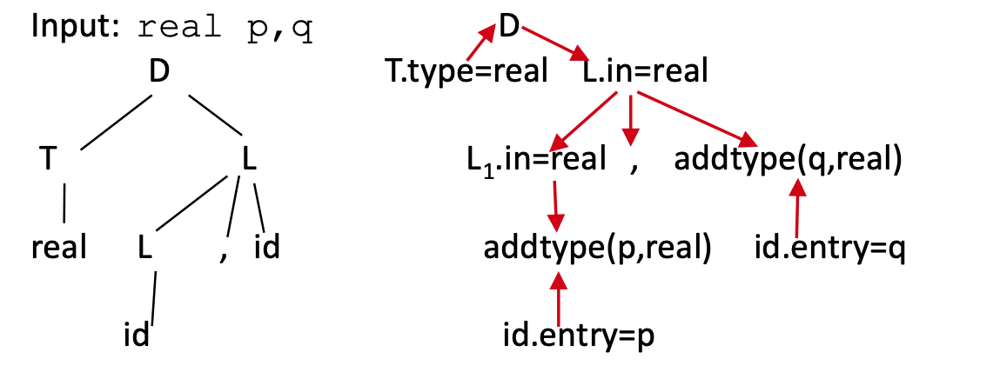

### Example: $3*5$

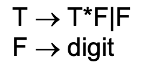

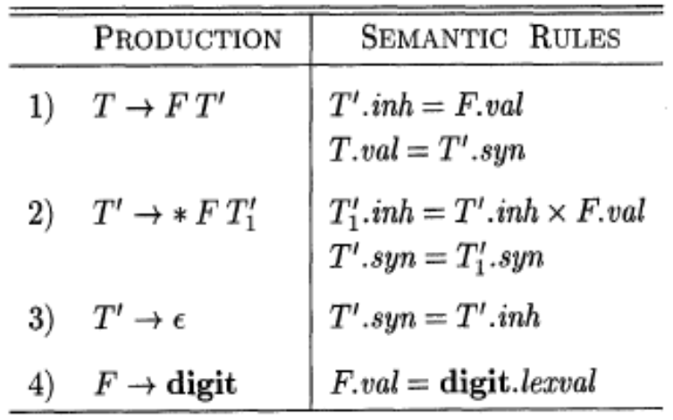

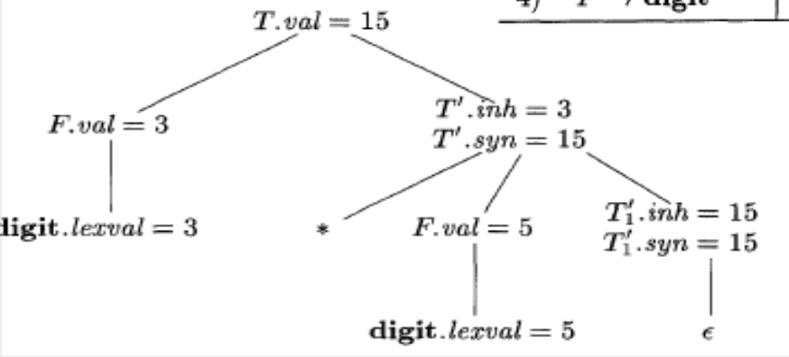

## Syntax-Dericted Translation

Combination of CFG, Semantic Rules, and Semantic Actions denoted in `{}` can be placed anywhere in RHS

### Eg: Conversion of infix to postfix:  $2+3*4$

```
E → E+T {print(‘+’);}
E → T
T → T*F {print(‘*’);}
T → F
F → num {print num.val;}
```

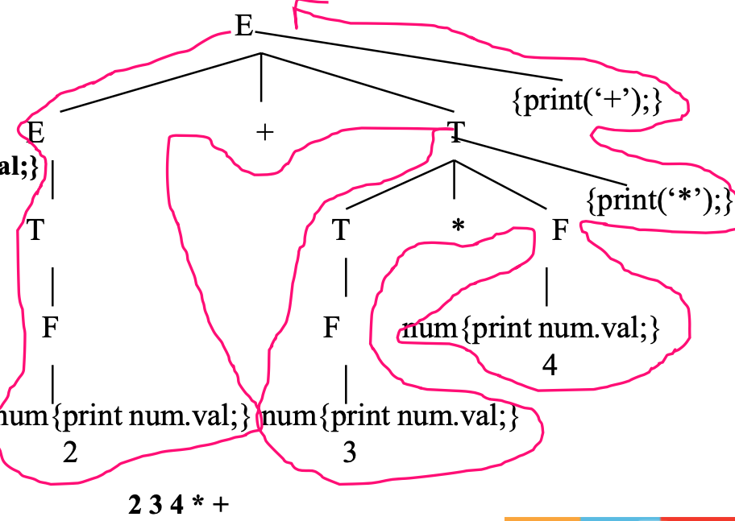

### Eg: Conversion of infix to postfix:  $1+2$

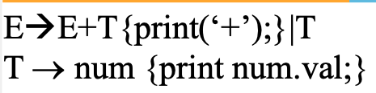

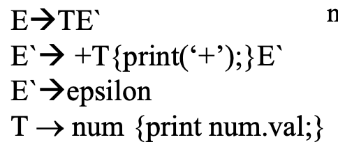

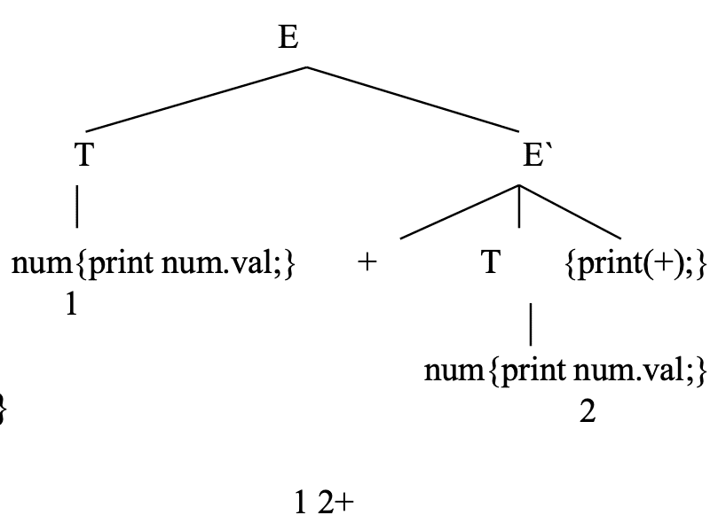

## Coercions

Binary arithmetic operator may be applied to either a pair of integers or to a pair of floating-point numbers.

If an operation involves a float and an integer, the compiler may convert/coerce the integer into a float

## Type Checking

