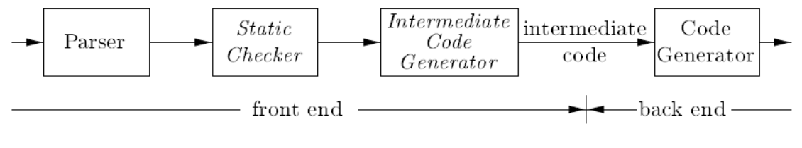
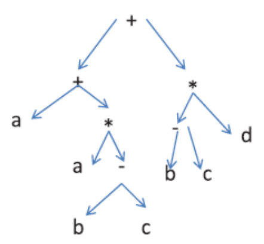
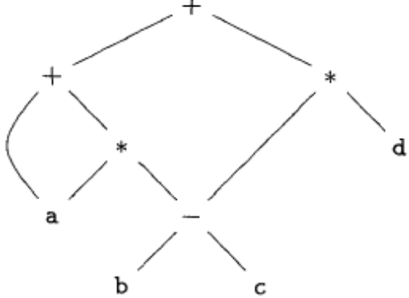
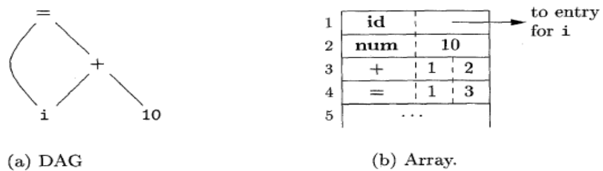
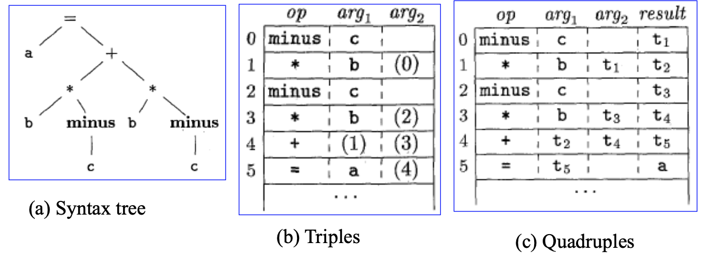
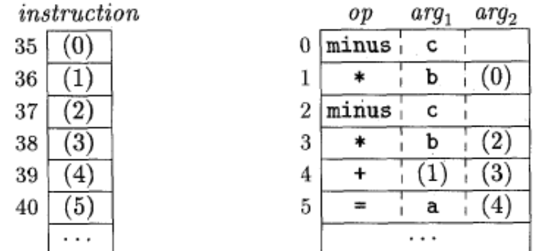
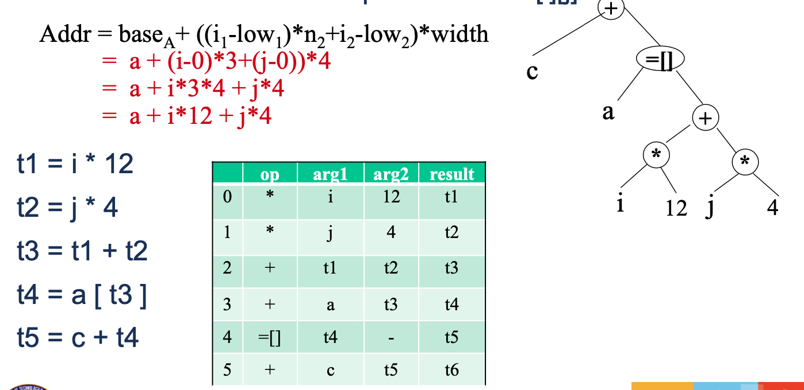
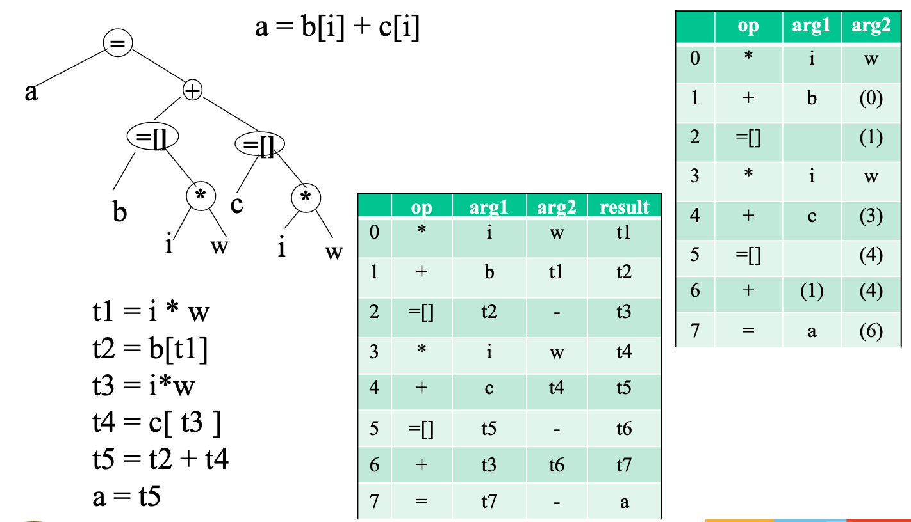
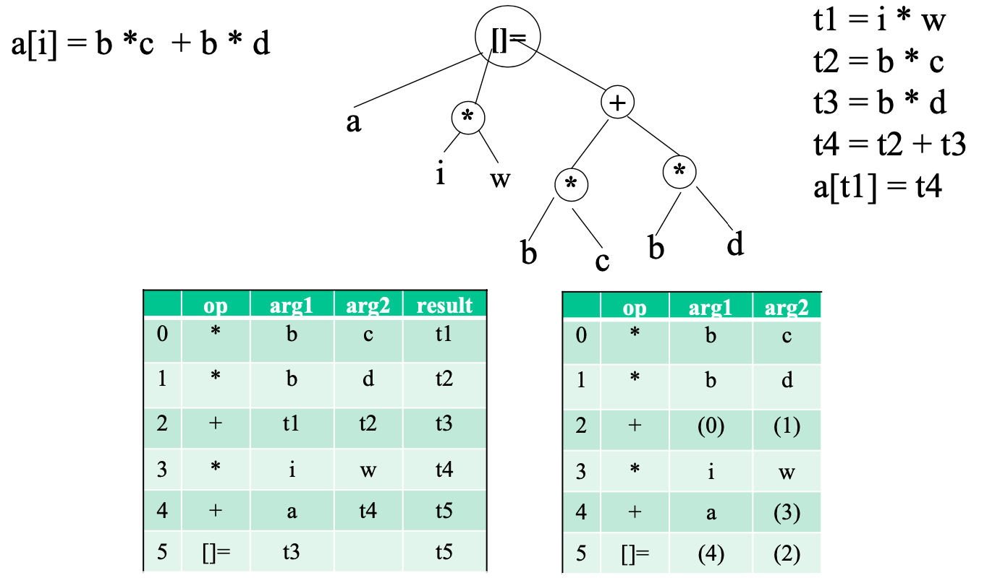
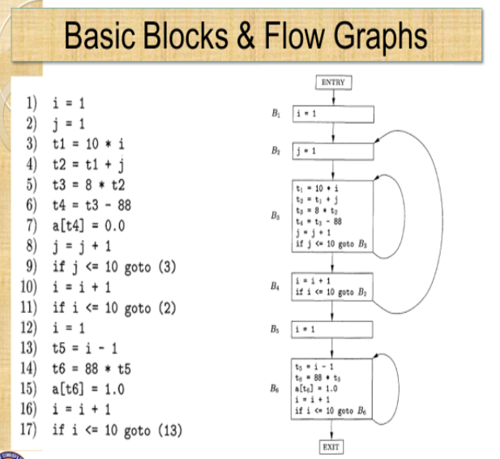

Ideally the details of source language are confined to the front end and the details of target machines to the back end.



## Why IC?

Rather than creating a compiler for every language to translate code for
every machine arch, we create a compiler for every language to translate code to IC; this IC is then translated for the machine arch.

This reduces complexity from $(m \times n) \to (m+n)$, where $m$ and $n$ are number of prog languages and machine arch respectively.

## Properties of IC

- easy to produce 

- easy to translate into target machine code

- Three-address code (TAC)

  consisting of sequence of assembly-like three-operand instructions of the form $x = y \text{ op } z$

- Postfix notation

## Abstract Syntax Tree

Binary tree where

- Leaves represent operands
- Non-terminals represent operators

### Eg: $a+a*(b-c) +(b-c)*d$



## Directed Acyclic Graph (DAG)

AST where all subexpressions of an expression (even repeated subexpressions) occur only once.

This helps the compiler generate more efficient code.

### Eg: $a+a*(b-c)+(b-c)*d$



### Eg: $i=i+10$



### Steps for tree representation

1. Check whether an identical
node already exists
2. If yes, the existing node is
returned
3. If no, create a new node and
return it

```pseudocode
// for a+a*(b-c)+(b-c)*d

p1  = Leaf (id, entry-a)
p2  = Leaf (id, entry-a) = p1
p3  = Leaf (id, entry- b)
p4  = Leaf (id, entry-c)
P5  = Node ('-', p3, p4)
p6  = Node ('*', p1, p5)
p7  = Node ( '+' p1, p6 )
p8  = Leaf (id, entry-b) = p3
p9  = Leaf (id, entry-c) = p4
p10 = Node ('-', p3, p4) = p5
p11 = Leaf (id, entry-d)
p12 = Node ('*', p5 ,p11)
p13 = Node ('+',p7,p12)
```

### Steps for array representation

- Search the array for a node M with label op, left child l , and right
child r.
- If there is such a node, return the value number of M.
- If not, create in the array a new node N with label op, left child l, and right child r, and return its value number.

We refer to nodes by giving the integer index/value number of the record for
that node within the array.

## Three Address Code

Linearized representation of syntax tree/DAG in which explicit names correspond to internal nodes of the graph

### Features

#### Arithmetic Expressions

- 1 operand on LHS
- `=` if required
- $\le 1$ operation on RHS
- $\le 2$ operands on RHS

#### Jumps

- `goto L`
- `if x goto L`
- `if x <relop> y goto L`

#### Functions

- `param x`
- `call p`
- `y = call p`
- `return y`

#### Pointers

- `x = y[i]`
- `x[i] = y`
- `x = &y`
- `x = *y`
- `*x = y`

### eg: $x+y*z$

```
t1 = y * z
t2 = x + t1
```

### eg: idk

```pseudocode
double a[10];
do i = i+1;
while (a[i] < v);
```

```
// using symbolic labels
L:	t1 = i + 1
		i = t1
		t2 = i * 8
		t3 = a[t2]
		if t3 < v goto L

// or

// using position numbers

100: t1 = i+1
101: i  = t1
102: t2 = i*8
103: t3 = a[t2]
104: if t3<v goto 100
```

## Types of Three Address Codes

|                  | Fields                                | Notes                                                        |
| ---------------- | ------------------------------------- | ------------------------------------------------------------ |
| Quadruples       | op, arg1, arg2, result                | unary operators don’t have arg2<br />for assignment, op is `=`<br />param does not have args2 and result<br />Jumps put target label in result |
| Triples          | op, arg1, arg2                        | We assume that result is stored in the corresponding index   |
| Indirect Triples | Triples + List of pointers to triples |                                                              |

A benefit of quadruples and indirect triples over triples can be seen in an optimizing compiler, where instructions are often moved around.

### $a=b*-c+b*-c$





## Translations: Arrays

Let

|       |                      |
| :---: | -------------------- |
|  BA   | Base Address         |
|   W   | Size of Element      |
|  $R$  | Total number of rows |
|  $C$  | Total number of cols |
| $L_r$ | Row starting index   |
| $L_c$ | Col starting index   |
|  $i$  | Row index            |
|  $j$  | Col index            |

|      |                                       |
| ---- | ------------------------------------- |
| 1D   | $\text{BA} + W*(i-L_r)$               |
| 2D   | $\text{BA} + W*[(i-L_r)*C + (j-L_c)]$ |
| …    |                                       |

### `c + a[i][j]` for `int a[4][3];`



### `a = b[i] + c[i]`



Correction: Row 6 for triple should be `+ (2) (5)`

### `a[i] = b * c + b * d`



## Flow Control

The translation of statements such as if-else- statements and while-statements is tied to the translation of boolean expressions

Boolean expressions

- alter flow of control
- compute logical values

### Example

```c
while(a<b) {
  c=a+b;
  a=a+1;
}
```

```pseudocode
L1:
	ifFalse a < b L2 t1 = a + b
	c = t1
	t2 = a + 1
	a = t2
	goto L1
L2:
```

|      | **op**              | **arg1** | **arg2** | **result** |
| ---- | ------------------- | -------- | -------- | ---------- |
| 0    | LABEL               | L1       |          |            |
| 1    | <                   | a        | b        | t1         |
| 2    | iff<br />(if false) | t1       | -        | L2         |
| 3    | +                   | a        | b        | t2         |
| 4    | =                   | t2       | -        | c          |
| 5    | +                   | a        | 1        | t3         |
| 6    | =                   | t3       |          | a          |
| 7    | goto                |          |          | L1         |
| 8    | LABEL               | L2       |          |            |

### Example

```pseudocode
sum = 0
for(i=0; i< n; i++)
{
	sum = sum + i;
}
```

```pseudocode
sum = 0
i = 0
L1:
  ifFalse i < n L2
  t1 = sum + i
  sum = t1
  i=i+1
goto L1 L2:
```

|      | **op** | **arg1** | **arg2** | **Result** |
| ---- | ------ | -------- | -------- | ---------- |
| 0    | =      | 0        |          | sum        |
| 1    | =      | 0        |          | i          |
| 2    | LABEL  | L1       |          |            |
| 3    | <      | i        | n        | t1         |
| 4    | iff    | t1       | -        | L2         |
| 5    | +      | sum      | i        | t2         |
| 6    | =      | t2       |          | sum        |
| 7    | goto   |          |          | L1         |
| 8    | LABEL  | L2       |          |            |

## Basic Blows & Flow Graphs


