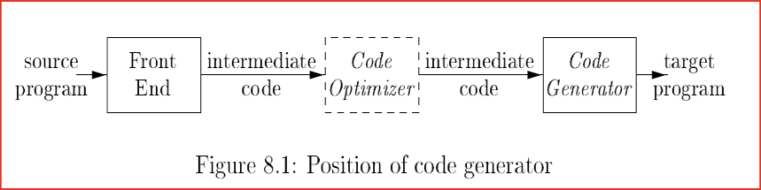
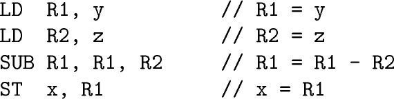
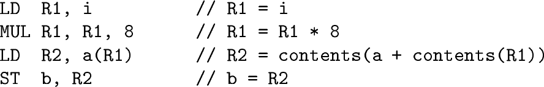
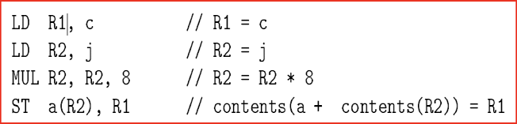
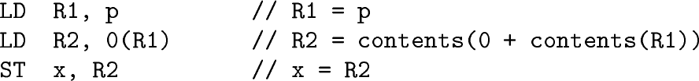
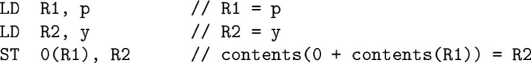
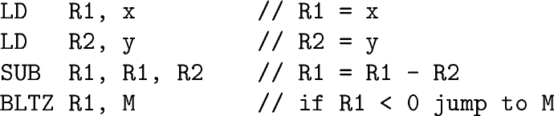
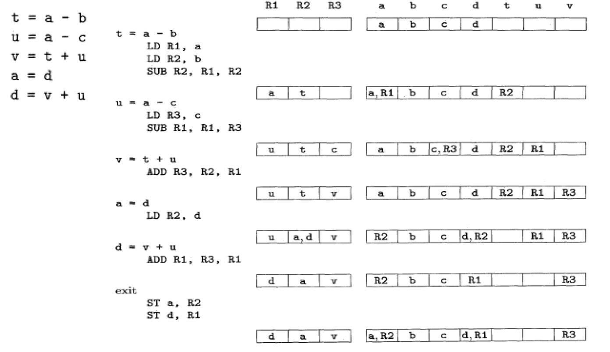
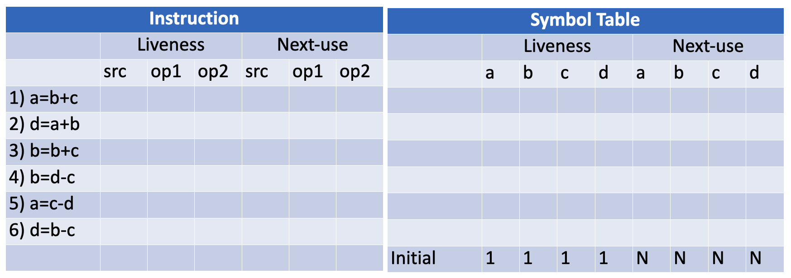
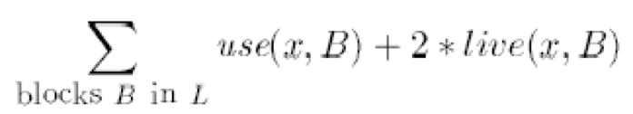

The problem is undecidable and most of  those subproblems, intractable ($\not \exists$ efficient algorithms to solve them)

## Requirements

- Maintain semantic meaning
- Must generate efficient code and makes maximum use of  available resources
- Code generator itself must be efficient

## Characteristics

- Target Machine has $n$ registers $R_0, \dots, R_{n-1}$
- All operands are integers

## Instruction Format

|                    |                                                              |
| ------------------ | ------------------------------------------------------------ |
| load data          | `ld dest, src`                                               |
| store data         | `st dest, src`                                               |
| Arithmetic         | `add dest, src1, src2`<br />`sub dest, src1, src2`<br />`mul dest, src1, src2` |
| Unconditional jump | `br L`                                                       |
| Conditional jump   | `bltz r, l`<br />`bgtz r, l`<br />`blez r, l`<br />`bgez r, l`<br />`bz r, l`<br />`bnz r, l` |

## Adressing Modes

| Mode      | Example         | Meaning                                     |
| --------- | --------------- | ------------------------------------------- |
| Indexed1  | ld r1, a(r2)    | `r1 = contents(a+contents(r2))`             |
| Indexed2  | ld r1, 100(r2)  | `r1 = contents(100+contents(r2))`           |
| Indirect  | ld r1, *100(r2) | `r1 = contents(contents(100+contents(r2)))` |
| Immediate | add r1, r2, 100 | `r1 = contents(r1) + 100`                   |

### Examples

```
x = y - z
```



```
b = a[i]
```



```
a[j] = c
```



```
x = *p
```



```
*p = y
```



```
if x < y goto M
```



```
y = *q
q = q  + 4
*p = y
p = p + 4
```

```
LD R1, q     // R1 = q
LD R2, 0(R1) // R2 = contents(0+con(R1))
ST y, R2     // y = R2
ADD R1, R1, #4 //R1 = R1 + 4
ST q, R1       // q = R1
LD R3, p       // R3 = p
ST 0(R3), R2   // contents(0+con(R3)) = R2
ADD R3, R3, #4  // R3 = R3 + 4
ST p, R3        // p = R3
```

```
    s = 0
    i = 0
L1: if i > n goto L2
    s = s + i
    i = i + 1
    goto L1
L2:
```

```
    SUB R1, R1, R1
    ST s, R1
    ST i, R1
L1: LD R1, i
    LD R2, n
    SUB R1, R1, R2  // R1 =i - n
    BGTZ R1, L2
    LD  R1, s
    LD  R2, i
    ADD R1, R1, R2
    ST  s, R1
    ADD R2, R2, #1
    ST i, R2
    BR L1
```

## Memory Representation



## Liveness

IC has representation with infinite no of temporaries. This program should be able to run on a machine with limited registers.

2 temporaries $t_1$ and $t_2$ can be mapped to the same register, if $t_1$ and $t_2$ are never used at the same time

A variable is live if its current value is used in the future, without any intermediary step changing the value

Two Data structures

- Symbol table
- metadata associated with current instruction

## Liveness Analysis

Assume the symbol table shows all non-temporary variables as live on exit and “no next use”



Input: Basic block B of three-address statements

Output: At each statement i: `x = y op z`, we attach to i the liveliness and next-uses of x, y and z, founding using the symbol table

We start at the last statement of B and scan backwards

1. In the symbol table, set x to “not live” and “no next use”
2. In the symbol table, set y and z to “live”, and next-uses of y and z to i

## Run Time Memory Models

POPL

## Registers Allocation & Assignment

### Usage counts



- use(x, B) is 1 if x is used in block B prior to any definition of x
- use (x, B) is 0 otherwise
- live(x, B) is 1 if x is live on exit from B and is assigned a value in B
- live(x, B) is 0 otherwise
