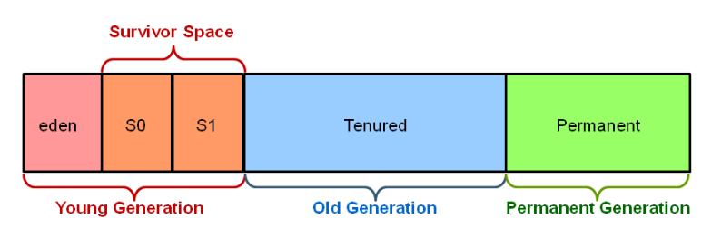

Note: Optimization may consume time (eg. Optimizing compilers)

Code optimization can be done at the following 

|                             | After IC generation | After code generation |
| --------------------------- | ------------------- | --------------------- |
| Code Optimization Type | M/C independent     | M/C dependent         |
| Performed on                | IC                  | Target Code           |

## Classification

| Classification Type           | Category                  | Meaning                                   |
| ----------------------------- | ------------------------- | ----------------------------------------- |
| By Scope                      | Local                     | Within a single basic block               |
|                               | Peephole                  | On window of instructions (usually local) |
|                               | Loop-Level                | On 1/more loops or loop nests             |
|                               | Global                    | Entire procedure                          |
|                               | Inter-Procedural          | Across multiple procedures/entire program |
| By Machine Information used   | Machine Independent       |                                           |
|                               | Machine Dependent         |                                           |
| By effecton program structure | Algebraic Transformations |                                           |
|                               | Reordering transformation |                                           |

## Forms of Optimizations

| Optimizations                                        |                                                              | Before Optim                             | After Optim                                                  |
| ---------------------------------------------------- | ------------------------------------------------------------ | ---------------------------------------- | ------------------------------------------------------------ |
| Algebraic Simplification/ Reduction in strength | Simplify operations for machine                              | `x*2 + x*1024	`                       | `x+x+(x<<10)`                                                |
| Common subexpression elimination                     | Subexpression/Duplicate code are repeated expressions Try to avoid subexpressions, by creating temporaries | `A[I+10] = B[I+10]`                      | `t=I+10` `A[t]=B[t]`                                    |
| Copy propagation                                     | After `x=y`, try to use `y` as much as possible              | `t=I*4` `s=t` `a[s] = a[s]+4`  | `t=I*4` `s=t` `a[t] = a[t]+4`                      |
| Constant propagation                                 | Replace constant variables with constant value               | `a=10` `b=20` `c=a+b`          | `a=10` `b=20` `c=10+20`                            |
| Constant folding                                     | Evaluate expression with constants, and replace with the result | `c=64+2`                                 | `c=66`                                                       |
| Dead-code elimination                                | Remove code that will never be used                          | `if (3>7) then { … }	`                | (nothing)                                                    |
| Loop Transformations/ Loop Unrolling            | Change `for(i=0;i<n;i++)` to `for(i=0;i<n-s+1;i+=s)` replicate the loop body s times (changing also i as needed to i+1, i+2, etc…). Will need an ‘epilogue’ if s does not divide n. Creates larger basic blocks and facilitates instruction scheduling. | `for (i=0; i<n; i++){ a[i]=b[i]*c[i]; }` | `for (i=0; i<n-s+1; i+=s) { a[I]=b[i]*c[i]; a[I+1]=b[i+1]*c[i+1]; … (the loop body repeated s times, from i to i+s-1) }` `for (j=i; j<n; j++) {a[j]=b[j]*c[j];}` |
| Code Motion                                          | Move loop-invariant calculation outside loop (loop-invariant = expression having same value regardless of how many times loop is run) | `while (i<=limit-2)`                     | `t = limit-2` `while (i<=t)`                            |

## Automatic Garbage Collection

1. Marking: Identify which pieces of memory are in use (very expensive process)
2. Normal deletion: remove unreferenced objects
   - Compacting: Reduce fragmentation by putting allocated memory next to each other

## Generational Garbage Collection

Generations

- Young generation
  - When the young generation fills up, this causes a minor garbage collection. Minor collections can be optimized assuming a high object mortality rate. A young generation full of dead objects is collected very quickly. Some surviving objects are aged and eventually move to the old generation
  - All minor garbage collections are "Stop the World" events. This means that all application threads are stopped until the operation completes
- Old Generation
  - Used to store long surviving objects. Typically, a threshold is set for young generation object and when that age is met, the object gets moved to the old generation. Eventually the old generation needs to be collected. This event is called a major garbage collection.
  - Major garbage collection are also Stop the World events. Often a major collection is much slower because it involves all live objects. So for Responsive applications, major garbage collections should be minimized. Also note, that the length of the Stop the World event for a major garbage collection is affected by the kind of garbage collector that is used for the old generation space.
- Permanent Generation
  - contains metadata required by the JVM to describe the classes and methods used in the application. The permanent generation is populated by the JVM at runtime based on classes in use by the application. In addition, Java SE library classes and methods may be stored here.
  - Classes may get collected (unloaded) if the JVM finds they are no longer needed and space may be needed for other classes.
  - The permanent generation is included in a full garbage collection.

### Steps

1. New objects are allocated to the eden space. Both survivor spaces start out empty
2. When the eden space fills up, a minor garbage collection is triggered
3. Referenced objects are moved to the first survivor space. Unreferenced objects are deleted when the eden space is cleared
4. At the next minor GC, the same thing happens for the eden space. Unreferenced objects are deleted and referenced objects are moved to a survivor space. However, in this case, they are moved to the second survivor space (S1). In addition, objects from the last minor GC on the first survivor space (S0) have their age incremented and get moved to S1. Once all surviving objects have been moved to S1, both S0 and eden are cleared. Notice we now have differently aged object in the survivor space.
5. At the next minor GC, the same process repeats. However this time the survivor spaces switch. Referenced objects are moved to S0. Surviving objects are aged. Eden and S1 are cleared.
6. After a minor GC, when aged objects reach a certain age threshold, they are promoted from young generation to old generation
7. As minor GCs continue to occure objects will continue to be promoted to the old generation space
8. Eventually, a major GC will be performed on the old generation which cleans up and compacts that space
