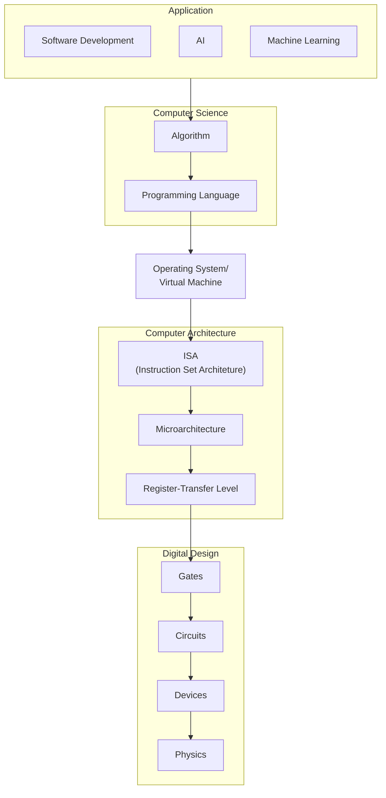
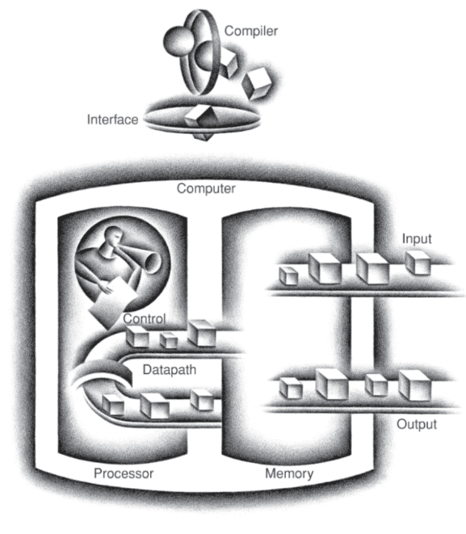

## Overall View of Computer Engineering

## MIPS

Microprocessors without Interlocked Pipelined Stages

|                             | Architecture                                      | Organization                                                 |
| --------------------------- | ------------------------------------------------- | ------------------------------------------------------------ |
| Describes ___ computer does | what                                              | how                                                          |
| Role                        | Interface b/w hardware & software                 | Way comuper components are connected in a system             |
| Programmer’s View           | Instructions Addressing Modes Registers | Realization of architecture (Circuit Design, signals, peripherals) |

### Microprogram

It is a microinstruction program that controls the functions of a central processing unit or peripheral controller of a computer

Microcode is low-level code that defines how a microprocessor should function when it executes machine-language instructions. 

Typically, one machine-language instruction translates into several microcode instructions

## Class of Computers

| Computer Class | Purpose                                                      | Characteristic                                            | Size                |
| -------------- | ------------------------------------------------------------ | --------------------------------------------------------- | ------------------- |
| Personal       | General                                                      | Cost/Performance Tradeoff                                 | Small               |
| Server         | Network Based                                                | High Capacity High Performance High Reliability | Small-Building Size |
| Super          | Scientific calculations (weather forecasting, oil exploration) | Highest capacity                                          |                     |
| Embedded       | Embedded within systems (Digital TVs, cameras) Specific application | Stringent power/performance/cost constraints              | Small               |
| Datacenters    | Storage and retrieval of data                                | High performance                                          |                     |

## Levels of Computing System

{ loading=lazy }

| Level                |                                            |
| -------------------- | ------------------------------------------ |
| Application Software | Written in High Level Language             |
| System Software      | Compiler OS                           |
| Hardware             | Processor Memory I/O Controllers |

## Levels of Program Code

- Machine Language
- Assembly
- High-Level

## Components of Computer

{ loading=lazy }

| Component |                                                              |
| --------- | ------------------------------------------------------------ |
| Input     | Write data to memory (from user)                        |
| Output    | Read data from memory (to user)                         |
| Registers |                                                              |
| Cache     | Small fast SRAM                                              |
| Datapath  | Performs data operations                                     |
| Control   | sends signals that determine operations of datapath, memory, I/O |

## ISA

Instruction Set Architecture

Interface between hardware and lowest level of software

Includes information necessary (instructions, registers, memory access, I/O, and so on) to write a machine language program that will
run correctly

### ABI

Application Binary Interface

Combination of the basic instruction set and the operating system interface

