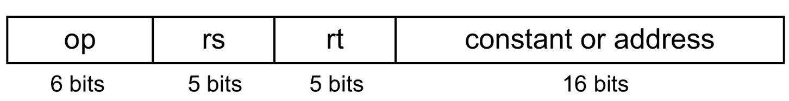

- [MIPS_Instruction_Set.pdf](assets/MIPS_Instruction_Set.pdf)
- [MIPS_Instruction_Format.pdf](assets/MIPS_Instruction_Format.pdf) 

## Starter Program

```assembly
.data
a: .byte 10
b: .word 10

array .word 10, 20

char .ascii 'H'
string .asciiz "Hello world"

.text
main:
	## your code
end main
```

## Design Principles

### Simplicity favours regularity

- keeping all instructions a single size
- always requiring three register operands in arithmetic instructions
- keeping the register fields in the same place in each instruction format

#### Advantages

- Regularity makes implementation simpler
- Simplicity enables higher performance at lower cost

### Smaller is Faster

### Make the common case fast

Small constants are common

Immediate operand avoids a load instruction

## Operands

### Register

- MIPS has a $32 \times 32$-bit register file
- Used for frequently accessed data
- Numbered 0 to 31

32-bit data is called a ‘word’

#### Assembler Names

- `$t0, $t1, …, $t9` for temporary values
- `$s0, $s1, …, $s7` for saved variables

#### Preserved on Call

- `$s0-$s7`
- `$sp`
- `$fp`
- `$ra`

### Memory

Main memory used for composite data (arrays, structures, dynamic data)

To apply arithmetic operations

- Load values from memory into registers
- Store result from register to memory

Memory is byte-addressed

- Each address identifies 8-bits
- Words are aligned in memory
    - Address must be a multiple of 4
- MIPS is Big/Little Endian
    - In our course, we are taking ==little endian==

#### Load/Store

|                                                              |                                                 |
| ------------------------------------------------------------ | ----------------------------------------------- |
| `lw rt, offset(rs)`<br />`lh rt, offset(rs)`<br />`lb rt, offset(rs)` | Load word<br />Load half-word<br />Load byte    |
| `sw rt, offset(rs)`<br />`sh rt, offset(rs)`<br />`sb rt, offset(rs)` | Store word<br />Store half-word<br />Store byte |
| `li $t0, immediate_value`                                    | load immediate                                  |
| `la $t0, variable_name`                                      | load address                                    |

```c
a[12] = h + a[8];
```

$8 \text{ word locations} \implies 8 \times 4$

- each word occupies 4 memory locations

```assembly
la $s0, a
lw $t0, 32($s0)
add $s2, $s1, $t0
sw $s2, 48($s0)
```

### Immediate

```assembly
addi $t0, $t0, 1
addi $t0, $t0, -1
```

## Zero

```assembly
## Initialize variable as 0
add $t0, $zero, $zero

## Copy value
add $t1, $t0, $zero
```

## Registers vs Memory

Registers are faster to access than memory

Operating on memory data requires loads and stores $\to$ More instructions to be executed

Compiler must use registers for variables as much as possible. Only spill to memory for less frequently-used variables

## Instructions

Encoded as ==**32-bit**== instruction words

Register numbers

- `$t0 – $t7` are reg’s 8 – 15
- `$t8 – $t9` are reg’s 24 – 25
- `$s0 – $s7` are reg’s 16 – 23

## R-Format

{ loading=lazy }

|       |                                |
| ----- | ------------------------------ |
| op    | operation code (opcode)        |
| rs    | first source register number   |
| rt    | second source register number  |
| rd    | destination register number    |
| shamt | shift amount (00000 for now)   |
| funct | function code (extends opcode) |

## Number Formats

- Unsigned
- 2’s complement

## Sign Extension

Representing a number using more bits, while preserving numeric value

- `addi`: extend immediate value
- `lb`, `lh`: extend loaded byte/halfword
- `beq`, `bne`: extend the displacement

## Bitwise Operations

Useful for inserting/extracting groups of bits from a word

| Operation           |                   |                                                              |                                             |
| ------------------- | ----------------- | ------------------------------------------------------------ | ------------------------------------------- |
| Shift Left Logical  | `sll`             | `sll` by $i$ bits multiplies by $2^i$                        | `sll $t0, $t0, 2`                           |
| Shift Right Logical | `srl`             | `srl` by $i$ bits divides by $2^i$<br />(unsigned only)      | `srl $t0, $t0, 2`                           |
| Bitwise and         | `and`<br />`andi` | Useful to mask bits in a word<br/>Select some bits, clear others to 0 | `and $t0, $t1, $t2`<br />`andi $t0, $t1, 0` |
| Bitwise or          | `or`<br />`ori`   | Useful to include bits in a word<br/>Set some bits to 1, leave others unchanged | `or $t0, $t1, $t2`<br />`ori $t0, $t1, 1`   |
| Bitwise not         | `nor`             | Useful to invert bits in a word<br/>Change 0 to 1, and 1 to 0 | `nor $t0, $t1, $zero`                       |

## Jump Statements

```assembly
## unconditional
j exit

## Conditional
beq $t0, $t1, exit
bne $t0, $t1, exit

bgt $t0, $t1, exit
bge $t0, $t1, exit

blt $t0, $t1, exit
ble $t0, $t1, exit
```

### Alternate Approach

Using

- Set less than
- Set greater than

Faster than `bgt`, `bge`, `blt`, `ble`

- `bgt`, `bge`, `blt`, `ble` require combining logical operation with branch involves more work per instruction, requiring a slower clock

```assembly
## signed
slt $t0, $s1, $s2 ## if ($s1 < $s2)
sgt $t0, $s1, $s2 ## if ($s1 > $s2)

## signed immediate
slti $t0, $s1, 9 ## if ($s1 < 9)
sgti $t0, $s1, 9 ## if ($s1 < 9)

## unsigned
sltu $t0, $s1, $s2 ## if ($s1 < $s2)
sgtu $t0, $s1, $s2 ## if ($s1 < $s2)

## unsigned immediate
sltui $t0, $s1, 9 ## if ($s1 < 9)
sgtui $t0, $s1, 9 ## if ($s1 < 9)
## use with
beq $t0, $zero, exit
bne $t0, $zero, exit
```

## Loop

**Tip:** Doing the opposite conditional statement saves a clock cycle every time the loop runs

### `for`, `while`

```assembly
## initialization

loop:
	bne $s0, $s1, exit ## condition
	
	## statements
	
	addi $t0, $t1 ## updation
	j loop
	
exit:
	
```

### `do...while`

```
## initialization

loop:
	## statements
	
	addi $t0, $t1 ## updation
	
	bne $s0, $s1, exit ## condition
	
	j loop
	
exit:
	
```

## Registers

|                |                  |                                        |
| -------------- | ---------------- | -------------------------------------- |
| $a_0 \iff a_3$ | Argument         |                                        |
| $s_0 \iff s_7$ | Saved            | Need to be pushed/popped to/from stack |
| $t_0 \iff t_9$ | Temporary        |                                        |
| $v_0, v_1$     | Return variables |                                        |

## Procedure Calling

### Steps

1. Place parameters in registers
2. Transfer control to procedure
3. Acquire storage for procedure
4. Perform procedure’s operations
5. Place result in register for caller
6. Return to place of call

### Registers

- `$a0 – $a3`: arguments (reg’s 4 – 7)
- `$v0, $v1`: result values (reg’s 2 and 3)
- `$t0 – $t9`: temporaries
    - Can be overwritten by callee
- `$s0 – $s7`: saved
    - Must be saved/restored by callee
- `$gp`: global pointer for static data (reg 28)
- `$sp`: stack pointer (reg 29)
- `$fp`: frame pointer (reg 30)
- `$ra`: return address (reg 31)

### Instructions

```assembly
jal function_name
```

Procedure call: jump and link

- Address of following instruction put in `$ra`
- Jumps to target address

```assembly
jr $ra
```

Procedure return: jump register

- Copies $ra to program counter
- Can also be used for computed jumps
    - e.g., for case/switch statements

### Example

- Arguments $g, \dots, j$ in `$a0` $,\dots,$ `$a3`
- $f$ in `$s0` (hence, need to save `$s0` on stack)
- Result in `$v0`

```c
int leaf(int g, int h, int i, int j)
{
  int f = (g + h) - (i + j);
	return f;
}

void main()
{
  leaf();
}
```

For solving this question, we don’t need to use stack. However, we are using because it is asked to do so in the question

```assembly
.data

.text
main:
	addi $a0, $zero, 10
	addi $a1, $zero, 20
	addi $a2, $zero, 30
	addi $a3, $zero, 40
	
	jal leaf
end main

leaf:
  ## save $s0 on stack

  addi $sp, $sp, -4
  sw $s0, 0($sp)

  ## procedure body
  add $t0, $a0, $a1
  add $t1, $a2, $a3
  sub $s0, $t0, $t1

  ## result
  add $v0, $s0, $zero

  ## restore $s0
  lw $s0, 0($sp)
  addi $sp, $sp, 4

  ## return
  jr $ra
```

## Non-Leaf Procedures

Procedures that call other procedures

For nested call, caller needs to save on the stack

- its return address
- any arguments and temporaries needed after the call

Restore from the stack after the call

```c
int fact (int n)
{
	if (n < 1)
    return (1);
	else
    return n * fact(n - 1);
}
```

```assembly
fact:
  addi $sp, $sp, -8 ## adjust stack for 2 items
  sw $ra, 4($sp) ## save return address
  sw $a0, 0($sp) ## save argument
  
  slti $t0, $a0, 1 ## test for n < 1
  beq $t0, $zero, L1
  
  addi $v0, $zero, 1 ## if so, result is 1
  addi $sp, $sp, 8 ## pop 2 items from stack
  jr $ra ## and return

L1:
	addi $a0, $a0, -1 ## else decrement n
  jal fact ## recursive call
  
  lw $a0, 0($sp) ## restore original n
  lw $ra, 4($sp) ## and return address
  addi $sp, $sp, 8 ## pop 2 items from stack
  
  mul $v0, $a0, $v0 ## multiply to get result
  
  jr $ra ## and return
```

## Character Data

|         | Encoding Bits | Characters |                                                              |
| ------- | ------------- | ---------- | ------------------------------------------------------------ |
| ASCII   | 8             | 128        | 95 graphic, 33 control                                       |
| Latin-1 | 8             | 256        | ASCII + 96 more graphic characters                           |
| Unicode | 32            |            | Most of the world’s alphabets, symbols<br />Used in Java, C++ wide characters |
| UTF-8   | 8             |            | variable-length encodings                                    |
| UTF-16  | 16            |            | variable-length encodings                                    |

## Byte/Halfword Operations

```assembly
## Sign extend to 32 bits in rt
lb rt, offset(rs)
lh rt, offset(rs)

## Zero extend to 32 bits in rt
lbu rt, offset(rs)
lhu rt, offset(rs)

## Store just rightmost byte/halfword
sb rt, offset(rs)
sh rt, offset(rs)
```

### String Copy

```c
void strcpy (char x[], char y[])
{
  int i = 0;
  
	while ( (x[i]=y[i])!='\0' )
		i += 1;
}
```

```assembly
strcpy:
  addi $sp, $sp, -4 ## adjust stack for 1 item
  sw $s0, 0($sp) ## save $s0
  
  add $s0, $zero, $zero ## i = 0

loop:
  add $t1, $s0, $a1 ## addr of y[i] in $t1
  lbu $t2, 0($t1) ## $t2 = y[i]
  
  add $t3, $s0, $a0 ## addr of x[i] in $t3
  sb $t2, 0($t3) ## x[i] = y[i]

	beq $t2, $zero, exit ## exit loop if y[i] == 0
  
  addi $s0, $s0, 1 ## i = i + 1
  j loop ## next iteration of loop

exit:
  lw $s0, 0($sp) ## restore saved $s0
  addi $sp, $sp, 4 ## pop 1 item from stack
  
  jr $ra ## and return
```

## 32-bit Constants

16-bit immediate is the default in instructions

However, if we need to store 32-bit constant, use **load upper immediate**

```assembly
lui $s0, upper_16_bits
ori $s0, $s0, lower_16_bits
```

### `lui`

- Copies 16-bit constant to left 16 bits of `rt`
- Clears right 16 bits of `rt` to 0

Then we use `ori` to store the lower 16bits

## Branch Addressing

Branch instructions specify

- Opcode
- two registers
- target address

Most branch targets are near-branch (forward/backward)

{ loading=lazy }

**PC-relative addressing**

$$
\text{Target address} = \text{PC}_\text{new} + (\text{Offset} × 4)
$$

==**PC already incremented by 4 by this time**==

## Jump Addressing

Jump (`j` and `jal`) targets could be anywhere in text segment

Encode full address in instruction

{ loading=lazy }

**(Pseudo) Direct jump addressing**

$$
\text{Target address} = (\text{address} × 4)
$$

Why do we have 00 at the end of immediate when we calculate new instruction for branch/jump instructions? This is because

- Instructions are word-aligned, so their addresses always end with 00
- We aplways jump by a full instruction, which is 4 bytes, so we multiply the jump offset by 4, by shifting it left by 2 places
- We can jump further, if the offset is in multiple of 4 bytes instead of 1

## Branching Far Away

If branch target is too far to encode with 16-bit offset, assembler rewrites the code, using unconditional jump (as it has larger range)

Example

```assembly
beq $s0, $s1, L1

↓

bne $s0, $s1, L2
j L1
L2:
	…
```

## Addressing Summary

{ loading=lazy }

## Assembler Pseudoinstructions

Most assembler instructions represent machine instructions one-to-one

Pseudoinstructions: figments of the assembler’s imagination

```assembly
move $t0, $t1

↓

add $t0, $zero, $t1
```

```assembly
blt $t0, $t1, L

↓

slt $at, $t0, $t1
bne $at, $zero, L
```

`$at` (register 1): assembler temporary
