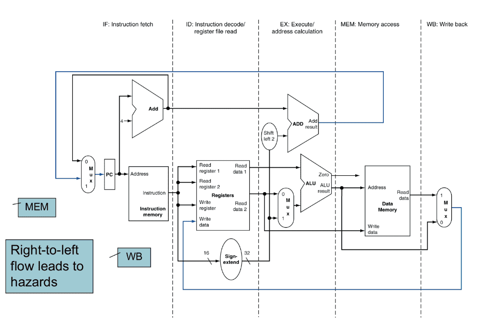
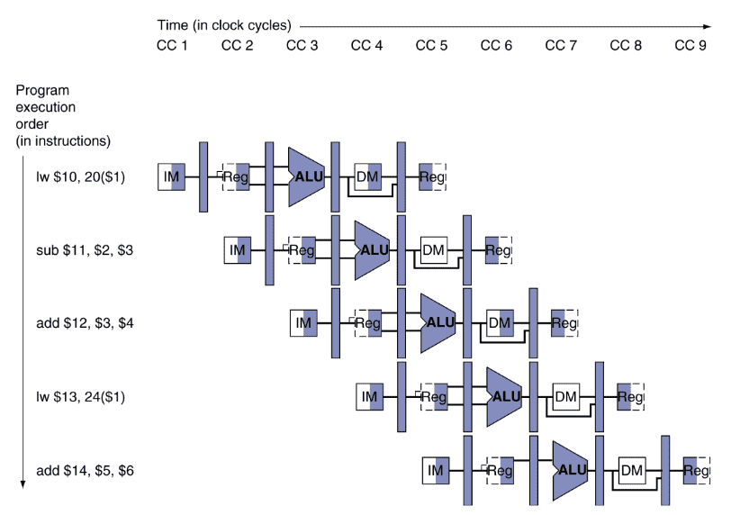
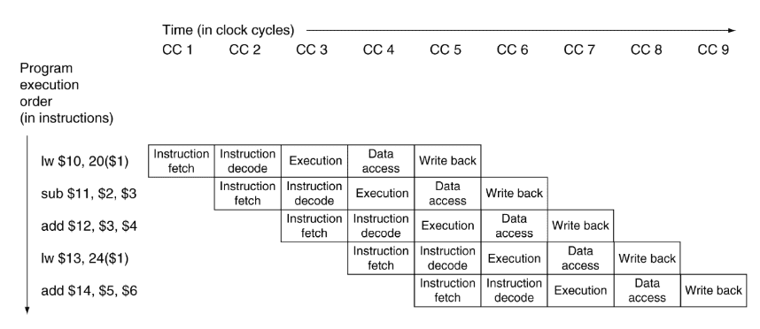
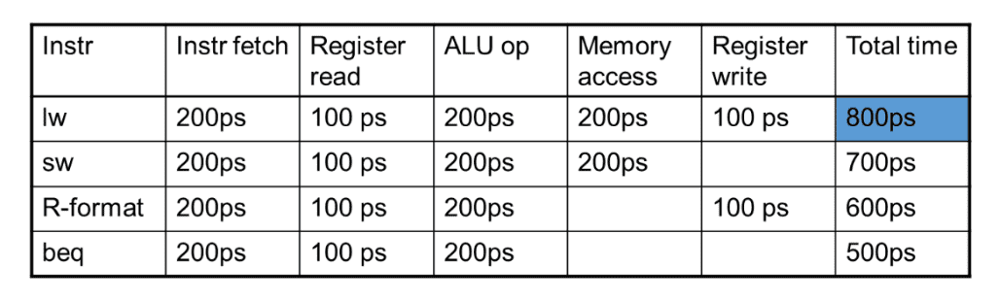

## Pipelining

Pipelining improves efficiency by executing multiple instructions simultaneously (through overlapped execution)

Pipelining produces [speedup](#speedup), while maintaining similar datapath

Assume time for stages is

- 100ps for register read or write
- 200ps for other stages

## MIPS Pipeline

Each of the 5 stages have their own step

## Diagram

### Resource Usage Form

### Traditional Form

## Time

$$
\begin{align}
\text{Time with pipeline}
&= \frac{\text{Time without pipeline}}{\text{No of stages}} \\&= \frac{800}{5} \\&= \cancel{160} \\&= 200
\end{align}
$$

**Why 200ps?**
The longest stage determines the clock cycle time of the pipeline

Let $n$ be the no of instructions

|                | Without | With             |
| -------------- | ------- | ---------------- |
| **Total Time** | $800 n$ | $800 + 200(n-1)$ |

## Speedup

Speedup is due to increased throughput (number of instructions per unit time), **not** reduced latency (time for each instruction remains same)

Assuming all stages are balanced/even (all stages take same time)

$$
\begin{align}
S_\text{ideal}
&= \text{No of Stages} \\&= 5
\end{align}
$$

If stages are unbalanced, speedup is less. Hence $\downarrow$

$$
\begin{align}
S_\text{actual}
&= \frac{\text{Time without Pipeline}}{\text{Time with Pipeline}} \\&= \frac{800}{200} \\&= 4
\end{align}
$$

Maximum speed up is achieved only when the no of instructions is very large.

## Convention of Reg Read/Write

It only takes half of a cycle to read or write to register file

Hence, whenever we are working with registers

- Write first half-cycle
- Read second half-cycle

This is to ensure that we always read the latest value

## Hazards

Situations that prevent executing the next instruction in the following (next) clock cycle

### Types

| Hazard Type        | Meaning                                                      | Example                                                      |
| ----------------------- | ------------------------------------------------------------ | ------------------------------------------------------------ |
| Structure               | Instruction cannot execute because a required resource (hardware) is busy | In a single-memory system, memory-read of instruction and fetch of instruction 2 happening simultaneously |
| Data                    | Instruction cannot execute because data required to execute instruction is not available Need to wait for data | `add $s0, $t0, $t1` `sub $t2, $s0, $t3`                 |
| Load-Use                | Specific form of Data Hazard Data being loaded by a load instruction is not available, which is needed by another instruction | `lw $s0, 20($t1)` `sub $t2, $s0, $t3`                    |
| Control/ Branching | Instruction cannot execute because the instruction that was fetched is not the one that is needed. |                                                              |

### Solutions

| Solution                      | Working                                                      | Advantage                                                    | Disadvantage                                                 |
| ----------------------------- | ------------------------------------------------------------ | ------------------------------------------------------------ | ------------------------------------------------------------ |
| 2 Memories                    | Separate instruction/data memories                           | Avoid structure hazard                                       |                                                              |
| **Bubbling** Stalling    | Delaying using dummy instructions Waste                 | Avoids hazard                                                | Wastes time                                                  |
| **Forwarding** Bypassing | Using internal buffer/latch Forwarding path valid only if destination stage is after source stage | We can save clock cycles (depends on the instruction) Reduces time taken | Not that useful when using `lw`; we have to introduce one bubble anyway |
| **Code-Rescheduling**         | Reorder serializable code to avoid use of load result in the next instruction, while ensuring there is no dependency  Similar to transactions like in DBMS  **Try to transfer all `lw()` to the top** |                                                              | Overhead for the compiler/assembler                          |
| **Branch Prediction**         | Make prediction and flush if incorrect  Static means assume branch not taken Dynamic can 1 bit/2bit |                                                              |                                                              |
| **Delayed Branching**         | Code Rescheduling for branching - From before - From below - From fall-through |                                                              |                                                              |

## I missed some parts

Check slides

Branch Prediction and all

## GPU

(not for exam)

Works on SIMD(Single Instruction Multiple Data) architecture

Works on matrix operations

The same operation is performed over multiple rows/columns

You have explicitly select GPU, hence this is **explicit parallelism**

