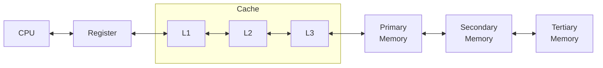

## Principle of Locality

Programs access a small proportion of its address space at any time. This exhibits locality.

|         | Spatial locality                                             | Temporal locality                                            |
| ------- | ------------------------------------------------------------ | ------------------------------------------------------------ |
| Meaning | Load clusters of related data into cache                     | Recently-used data                                           |
| Example | - Multiple elements in a loop - Sequential instruction access | - Global variables from global region of memory - Instructions of a loop |

==**Data can only move between 2 adjacent levels**==

Register is highest level; Tertiary memory is lowest memory

## Memory Performance

|                         |                                                              |
| ----------------------- | ------------------------------------------------------------ |
| Block (Cache Line) | Unit of copying Consists multiple words                 |
| Hit                     | Event of data requested by processor being present in upper level |
| Miss                    | Not a hit                                                    |
| Hit Rate/Ratio          | Fraction of memory found in upper level $\frac{\text{Hits}}{\text{Access}}$ |
| Miss Rate/Ratio         | $1 - \text{Hit Ratio}$                                       |
| Hit Time                | Time to access the upper level + time to determine if access is hit or miss |
| Miss Penalty            | Time to replace a block in upper level with the corresponding block from lover level |
| AMAT                    | Average Memory Access Time $T_\text{avg} = T_\text{cache} + (m*\text{Miss Penalty}) + (m*T_\text{memory})$ |

## Cache Memory

L1 cache can be located on CPU Chip

### Cache Operation

## Types of Access

- Regular access
- Irregular access

## Direct Mapped Cache

$$
\begin{aligned}
\text{Total no of bits}
&= 2^n \times \Big(
\text{Block size + Tag Size + Valid Field Size}
\Big) \\
\text{where } n
&= \text{No of bits to represent cache lines}
\end{aligned}
$$

### Cache Line Table

Let $s$ be address bus size (number of bits to represent ==main memory address==)

| Cache Line | Main memory blocks held       |
| ---------- | ----------------------------- |
| $0$        | $0, m, 2m, \dots, 2s-m$       |
| $1$        | $1, m+1, 2m+1, \dots, 2s-m+1$ |
| $\dots$    |                               |
| $m-1$      | $m-1, \dots,$                 |

### Memory Addressing

|         | Tag                                                          | Line number/Index                               | Line/Byte offset                                      |
| ------- | ------------------------------------------------------------ | ----------------------------------------------- | ----------------------------------------------------- |
| Purpose | Distinguish block from other blocks that can fit into a cache line | Specify one of the $m=2r$ blocks of main memory | Identify unique word/byte within line of cache memory |
| Bits    | Most significant $s-r-w$ bits                                | Next most significant $r$ bits                  | Least significant $w$ bits                            |

No of cache blocks $= 2^something$

$$
\begin{aligned}
&\text{No of index bits} \\&= \text{No of bits for Total Cache Size} - 
\text{No of bits for Offset}
\end{aligned}
$$

$$
\begin{aligned}
&\text{No of tag bits} \\&= \text{No of bits for Total Memory Size} \\& \ -\Big(
\text{No of bits for Index} +
\text{No of bits for Offset}
\Big)
\end{aligned}
$$

### Tags & Valid Bits

Initially valid bit = 0, when you boot up the computer

### Address Subdivision Diagram

Take from slides

### Reading from Cache

1. Search the index
2. Check validity
     - If valid, check the tag
     - If equal tag, mark as hit
     - If invalid, mark as miss

## Fully-Associative Cache

### Writing to Cache

[LRU Replacement](#LRU Replacement)

✅ No calculation happens, so it is efficient and faster

### Reading from Cache

❌ Comparison of all bits happens, so it is inefficient and slower

1. Check validity for all valid lines
   1. If valid, check the tag
   2. If invalid, add new element in first-come-first-serve order

## Set Associative Cache

Combination of [Direct Mapped Cache](#Direct Mapped Cache) and [Fully-Associative Cache](#Fully-Associative Cache)

Particular block address is mapped to a particular set

'$n$-way associated cache' means each set has $n$ blocks, where $n \in \{2, 4, 8, \dots \}$

$$
\begin{aligned}
\text{No of sets } N
&= \frac{\text{Total no of blocks}}{n} \\&= \frac{1}{n} \times \frac{\text{Cache Size in bytes}}{\text{Size of each block in bytes}}
\end{aligned}
$$

No of bits for set index = $2^N$

$$
\text{Mapped Set} = \text{Address } \% \ N
$$

[LRU Replacement](#LRU Replacement)

**Note**

- [Direct Mapped Cache](#Direct Mapped Cache) is basically one-way associative caching
- [Fully-Associative Cache](#Fully-Associative Cache) is basically associative caching with no of sets = total no of blocks

## Write

### Write-Through

### Write-Back

Dirty block something

### Write-Buffer

If the same data is accessed again, there is overhead of checking queue also, just in case

## LRU Replacement

Least Recently-Used

We have to implement a data structure to keep track

- doubly linked list
- hash map
