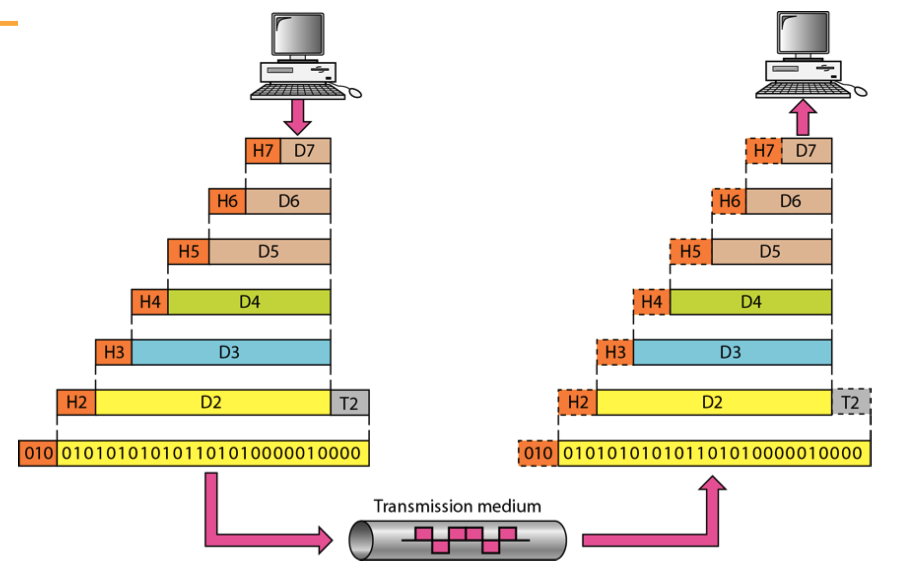

Task of moving information b/w computers over the network is divided into smaller and more manageable problems.

Each problem is considered as a different layer in the network, which reduces complexity.

Each layer

- provides service to layer above & belo
- communicates with the same layer’s software or hardware on other computer

There are 2 network standards

## ISO OSI Standard

Open System Interconnection

The upper 3 layers of the OSI model (application, presentation and session—Layers 7, 6 and 5) are orientated more toward services to the applications

Lower 4 layers (transport, network, data link and physical —Layers 4, 3, 2, and 1) are concerned with the flow of data from end to end through the network.

| Type     | Layer        | Description                                                  | [PDU](#PDU)              | Device/Example                         | Address                                | Delivery                                    | Protocols                                                    | Transmission Mode                    | Line Configuration       | Service Type                              |
| -------- | ------------ | ------------------------------------------------------------ | ------------------------ | -------------------------------------- | -------------------------------------- | ------------------------------------------- | ------------------------------------------------------------ | ----------------------------------------- | ----------------------------- | ---------------------------------------------- |
| Logical  | Application  | Provides  network-access services to user                    | Data/Page                | Whatsapp Browser Mail client |                                        |                                             | HTTP FTP SMTP SNMP DNS NFS Telnet DHCP |                                           |                               |                                                |
|          | Presentation | Data/File format Data Translation Protocol conversion Syntax & Semantics Compression/Decompression Encryption/Decryption | Data/Page                |                                        |                                        |                                             | SSL TLS                                                 |                                           |                               |                                                |
|          | Session      | Session creation, maintainence, termination Dialogue control & synchronization b/w 2 end systems Token Management Password Validation Logical connection request Synchronization & checkpointing of pages | Data/Page                |                                        |                                        |                                             | PPTP SIP SAP Net BIOS                    | Half-duplex Full-duplex              |                               |                                                |
|          | Transport    | Ensuring reliable data exchange mechanism Error control (only end-systems: source-dest) Flow control Connection control Service point addressing Segmentation/Re-assembly into/from a packet | Segment                  |                                        | Port (identifies process/service) | Process-to-Process                          | TCP UDP                                                 | Multiplex                                 |                               | Connectionless Connection-oriented        |
| Hardware | Network      | Inter-Networking Routing algo IP addressing Congestion handling Packetizing Fragmenting | Packet/ Datagram    | Router                                 | IP                                     | Host-to-Host                                | IPv4, IPv6 IPSec ICMP IGP EGP OGHP RARP ARP |                                           |                               |                                                |
|          | Data Link    | Ensuring reliable communication over physical layer ‘Framing’/Reassembling Error control (router & end-system: source-dest + each hop) Error correction/handling Corruption detection/correction Flow control (pacing b/w adjacent sending & receiving nodes) Access control LAN formation Physical addressing & matching | Frame                    | Bridges Switches                  | MAC                                    | [Hop-to-Hop Delivery](#Hop-to-Hop-Delivery) | ATM SLIP Frame Relay PPP                 | Simplex Half-Duplex Full-Duplex | Point-to-Point Broadcast |                                                |
|          | Physical     | Convert signal b/w digital & analog Encryption & decryption Representation of bits Data rate Synchronization of bits Encoding Modulation Line Configuration Transmission medium Transmission mode Topology | Bitstream/ Raw Data | Hub Repeater                      |                                        |                                             | USB Bluetooth                                           |                                           |                               | Connection-Oriented (most reliable layer) |

### PDU

Protocol data unit

PDU’s are used for peer-to-peer contact between corresponding layers

### Packet

| H3 (Header)                              | Data |
| --------------------------------------------- | ---- |
| Source IP address Destination IP address |      |

### Frame

| H2 (Header of layer 2)                                  | Data | T2 (Trailer of layer 2) |
| ------------------------------------------------------------ | ---- | ---------------------------- |
| Source MAC Address Destination MAC Address (found through Hop-to-Hop Delivery) |      | Usually a parity             |

## Analogy

*12 kids in Ann’s house sending letters to 12 kids in Bill’s house:*

- hosts = houses
- processes = kids
- app messages = letters in envelopes

transport protocol = Ann’ multiplexing and Bill’ demultiplexing to in-house siblings

network-layer protocol = postal service

## TCP/IP

Transmission Control Protocol with inter-networking protocol

- Application
- Transport
- Network
- Data Link
- Physical

## OSI vs TCP/IP

|                 | OSI                                 | TCP/IP                              |
| --------------- | ----------------------------------- | ----------------------------------- |
| No of Layers    | 7                                   | 5                                   |
| Transport Layer | Connection-oriented/Connection-less | Connection-oriented/Connection-less |
| Network layer   | Connection-oriented                 | Connection-less                     |
| Delivery model  | ‘Best’                              | ‘Best-effort’                       |

## Addresses

| Address                                                      |               Size (in Bits)               |  Denotion   |            Example             |              Separator              | Connect device in ___ network |         Set during         |                            Fixed                             | Administered by                                              |                    Portable                     |
| ------------------------------------------------------------ | :----------------------------------------: | :---------: | :----------------------------: | :---------------------------------: | :--------------------------------: | :------------------------: | :----------------------------------------------------------: | ------------------------------------------------------------ | :---------------------------------------------: |
| Specific                                                     |                                            |             |                                |                                     |                                    |                            |                                                              |                                                              |                                                 |
| Port                                                         |                     16                     |   Decimal   | 753 (0-1024 are reserved) |      (none; it is a single no)      |                                    |                            |                                                              |                                                              |                                                 |
| IP/Logical/Host                                              |                     32                     |   Decimal   |          192.168.22.5          |                 Dot                 |             different              | Connection to network |                              ❌                               |                                                              | ❌ (address depends on connected IP subnet) |
| MAC(Medium Access Control)/ Ethernet/ LAN/ Physical/ Link | 48 24 Vendor Code, 24 Serial No) | Hexadecimal |       AA.F0.C1.E2.77.51        | Colon (Linux) Hyphen (Windows) |                same                |  Device manufacture   | ✅ (usually burnt into NIC ROM; sometimes software-configurable) | IEEE (Manufacturer buys portion of MAC address space for uniqueness) |         ✅ (LAN card can be moved)          |

- MAC address is like Social Security Number
- IP address is like postal address

### idk

The physical addresses will change from hop to hop, but the logical and port addresses usually remain the same. Huh???

### IPv4

| Class | Byte 1 (Decimal) | Byte 1 (Binary) |
| ----- | ---------------- | --------------- |
| A     | 0-127            | 0…              |
| B     | 128-191          | 10…             |
| C     | 192-223          | 110…            |
| D     | 224-299          | 1110…           |
| E     | 240-255          | 1111…           |

Network ID is the first IP address, for eg: `10.0.0.0, 20.0.0.0`. This is used to refer to all devices in a network.

Only end-devices and routers require IP address, as they belong to network layer.

## Protocols

| Layer                                  | Protocol | Full Form                            | Details                                                      |
| -------------------------------------- | -------- | ------------------------------------ | ------------------------------------------------------------ |
| Network                                | IP       | Internet Protocol                    |                                                              |
| Network                                | ICMP     | Internet Control Message Protocol    | `ping` command uses this                                     |
| Network                                | IGMP     | Internet Group Message Protocol      |                                                              |
| Network + Data Link (Hybrid) | ARP      | Address resolution protocol          | Convert ip address to mac address                            |
| Network + Data Link (Hybrid) | RARP     | Reversed Address resolution protocol | Convert mac address to ip address (Only required when connecting to a network for the first time) |
