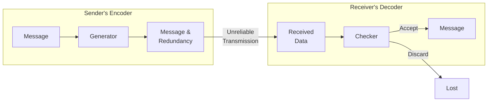
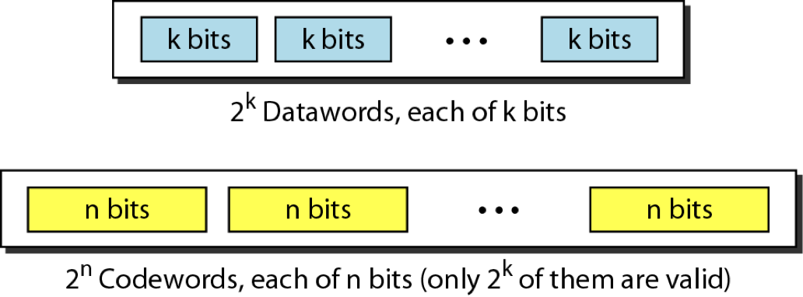
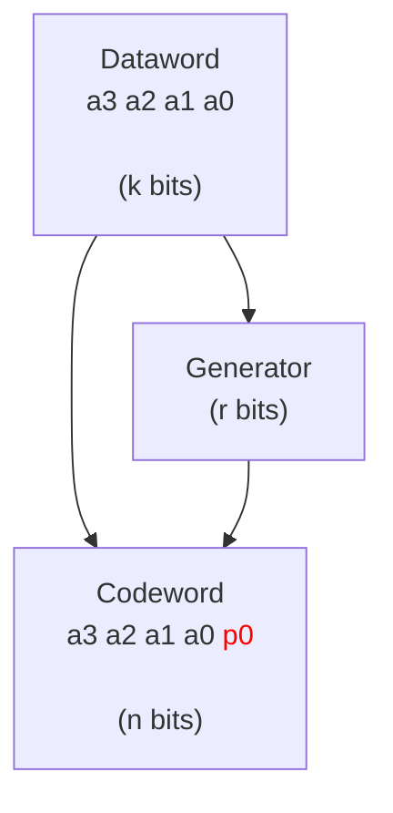
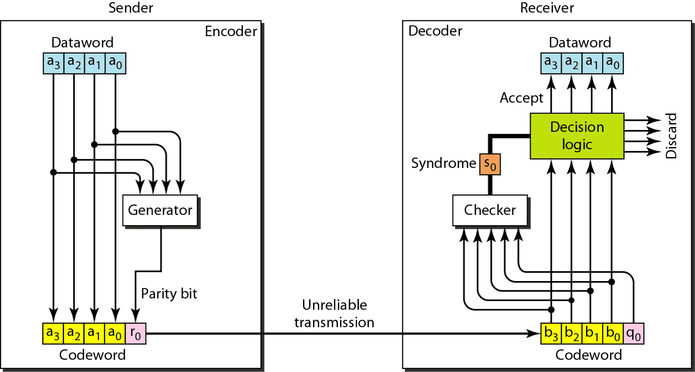
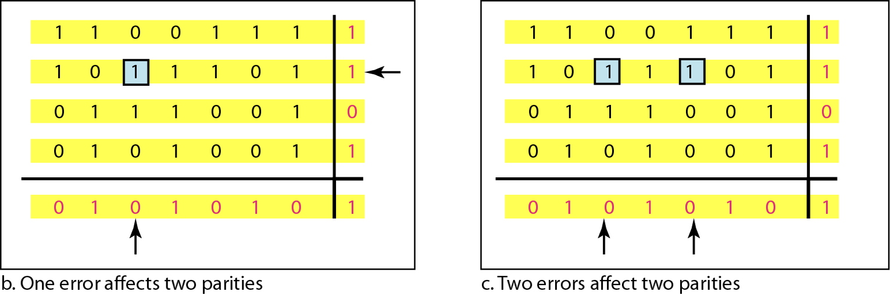
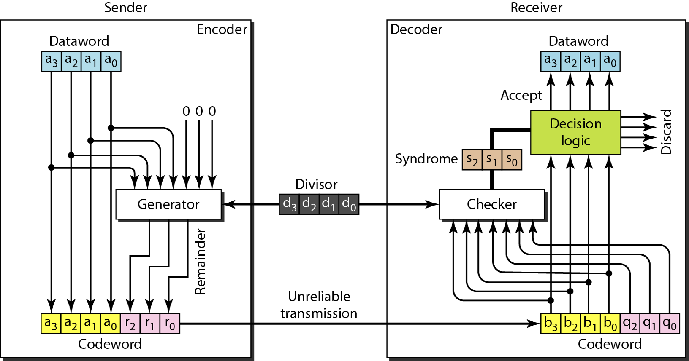

It is a combination of hardware, software, and firmware (software for hardware)

It is implemented in NIC and attaches into host’s system buses

## Sublayers

The data link may be further divided into sublayers, which is explained in detail in [Ethernet](08_Ethernet.md)

## Flow Control

Handles mismatch b/w sender’s and receiver’s speed

| Control Method                    | Type     | Meaning                           |
| --------------------------------- | -------- | --------------------------------- |
| Feedback-Based (More common) | Explicit | Permission required from receiver |
| Rate-Based                        | Implicit | Limit sending rate                |

## Error Types

| Type         | No of Bits | Consecutive Bits? |
| ------------ | :--------: | :---------------: |
| Single-Bit   |     1      |                   |
| Multiple-Bit |     >1     |         ❌         |
| Burst        |     >1     |         ✅         |

## Error Control

|                                                          |                                                              |
| -------------------------------------------------------- | ------------------------------------------------------------ |
| Error detection codes                                    | Detect error                                                 |
| Error/Forward correction codes (FEC)           | Detect & correct error Use in wireless networks         |
| Retransmission/ Automatic Repeat Request (ARQ) | Used along with error detection/correction Block of data with error discarded Transmitter retransmits that block of data |

### Redundancy

Redundant bits added to data to detect & correct errors

### Coding

Process of adding redundancy for error detection/correction

Error-detecting code can detect 
only types of errors for which it is designed;
other types of errors may remain undetected.
There is no way to detect every possible error

| Code          | Steps                                                        | Redundant bits | Total bits $n$ | Memoryless?                                     |
| ------------- | ------------------------------------------------------------ | :------------: | :-----------------: | ----------------------------------------------- |
| Block         | Divide data into set of $k$-bit blocks (called datawords)  Extra info attached to each block Combined blocks called codewords |      $r$       |        $k+r$        | ✅                                               |
| Convolutional | Treats data a series of bits Computes code over continuous series |                |                     | ❌ (Code depends on current & previous i/p) |

### Code Rate

$$
= \frac{k}{n}
$$

|  Code Rate   | $\implies$ | Error Correcting Capability | Bandwidth Efficiency |
| :----------: | :--------: | :-------------------------: | :------------------: |
|  $\uparrow$  |            |        $\downarrow$         |      $\uparrow$      |
| $\downarrow$ |            |         $\uparrow$          |     $\downarrow$     |

## Error Detection Methods

If syndrome = 0 at the receiver, there is no error

|                    | Simple parity check                                          | Horizontal & Vertical Parity check                      | CRC (Cyclic Redundancy Check)                           | Checksum                                                     |
| ------------------ | ------------------------------------------------------------ | ------------------------------------------------------------ | ------------------------------------------------------------ | ------------------------------------------------------------ |
|                    | Use an odd/even parity bit                                   | Use parity bit vertically and horizontally                   | Add $r$ zeros to right of dividend, where $r=$no of redundant bits = length of divisor - 1 Long division using **XOR** | (used in network layer) Find sum of digits If overflow, perform padding Take 1s complement |
| Errors detectable  | $\{1, 3, \dots, 2n+1 \}$ (odd no of errors)             | $\{1, 2, 3, 5, 6, 7, \dots \} \implies R - \{4n\}$           | All                                                          | All                                                          |
| Can correct error? | ❌ (error can be in any position including parity bit itself) |                                                              |                                                              |                                                              |
|                    |  |  |  |                                                              |

### Simple Parity

| Parity | Parity bit = 0 means dataword has |
| ------ | --------------------------------- |
| Odd    | Odd number of ones                |
| Even   | Even number of ones               |

## Mac Layer Throughput

Number of bits sent by MAC (Data Link) layer in given period of time

$$
\begin{aligned}
\text{Throughput} = \frac{\text{Payload}}{\text{Total Time}}
\end{aligned}
$$

## Control Frame

Frames that only contain headers/trailers, and no payload
