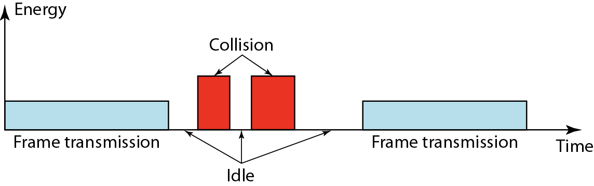
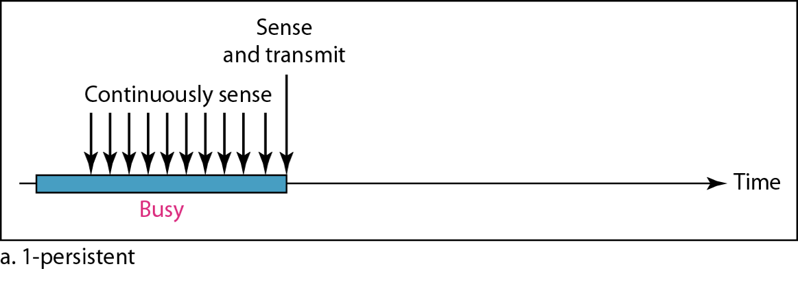
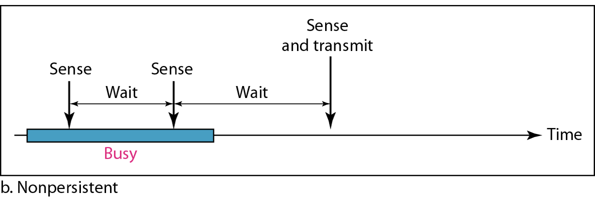
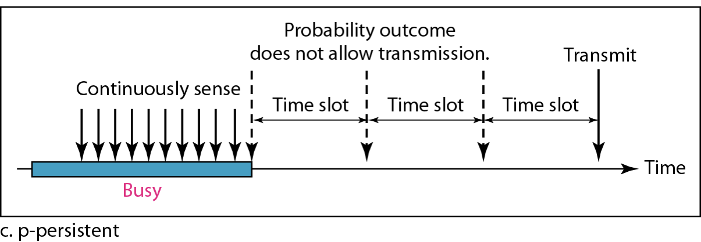
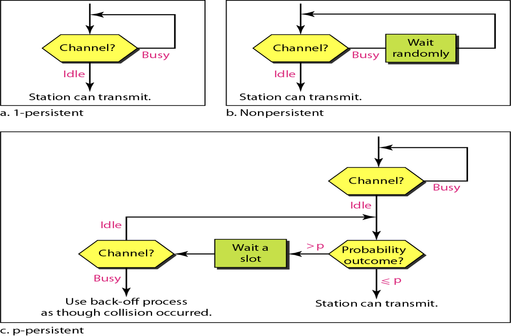

## Access Protocols

|                                 | Random-Access/ Contention                               | Controlled-Access                           | Channelization           |
| ------------------------------- | ------------------------------------------------------------ | ------------------------------------------- | ------------------------ |
|                                 | No station is superior to another No station permits another station to send at the same time Node with packet transmits at full channel data rate All transmission on shared channel |                                             |                          |
| Collisions                      | Moderate                                                     | Little-to-none                              |                          |
| Throughput for smaller networks | Low                                                          | High                                        |                          |
| Throughput for larger networks  | High                                                         | Low                                         |                          |
| Easy to maintain?               | ✅                                                            | ❌                                           |                          |
| Commonly-used?                  | ✅                                                            | ❌ (Hard to control large networks)     |                          |
| Example                         | ALOHA CSMA CSMA/CD CSMA/CA                    | Reservation Polling Token-Passing | FDMA TDMA CDMA |

## Collision

When 2 nodes transmit concurrently

## Carrier-Sensing

When the energy level is higher than usual, that means that there is a collision

However, this method may not suitable for wireless transmission, due to energy loss.

## Persistence Methods

|                     | 1-persistent                                                 | Non-persistent                                               | $p$ - persistent                                             |
| ------------------- | ------------------------------------------------------------ | ------------------------------------------------------------ | ------------------------------------------------------------ |
|                     | Default persistent method                                    |                                                              | Probabilistic mixture of 1-persistent & non-persistent Assume channels are slotted One slot = contention period (one RTT) Used when time slot duration $\ge$ max $T_P$ |
| Steps               | 1. Sense channel 2. if idle, transmit immediately 3. If busy, keep listening | 1. Sense channel 2. If idle, transmit immediately 3. If busy, wait random amount of time and sense channel | - When station ready to send, it senses the channel - If channel is idle, transmits with probability $pp$ - If channel is busy, station waits until next slot. - With probability $q=l-p$, the station then waits for beginning of next slot  - If next slot also idle, either transmit/wait again with probabilities $pp$ & $q$  - Process repeated till either frame transmitted/another station starts transmitting - If another station  transmits, station waits random amount of time & starts again |
| If collision occurs | Wait ranom amount of time & start over                       | Wait random amount of time & start over                      |                                                              |
| Diagram             |  |  |  |

