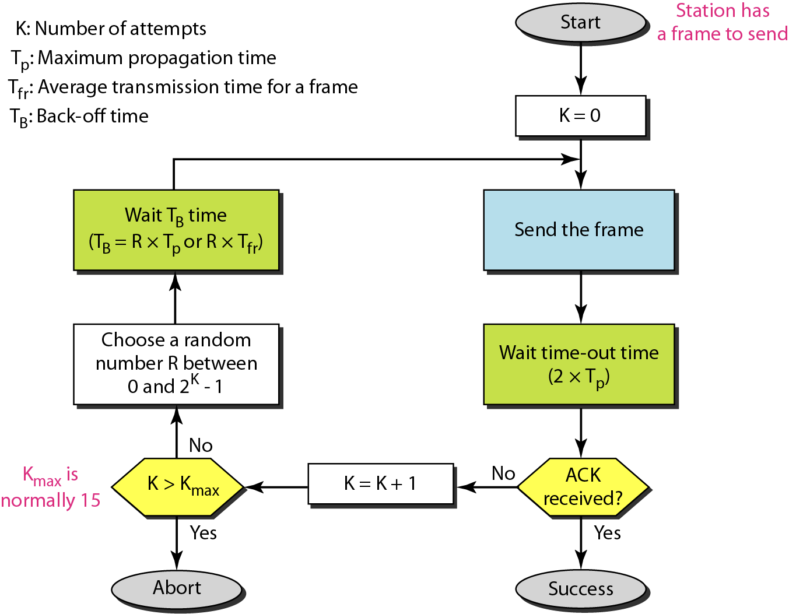
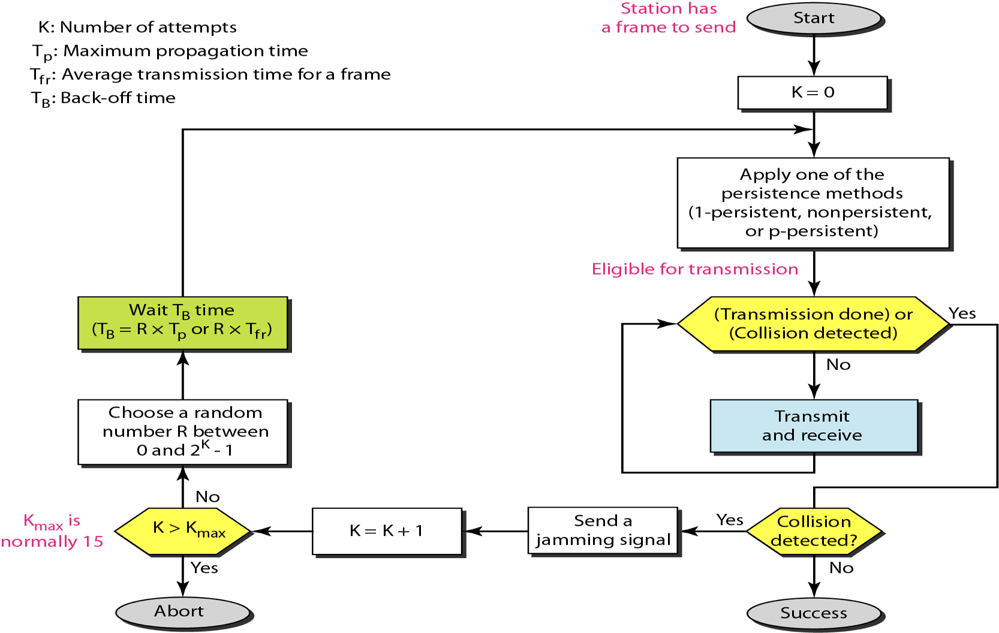
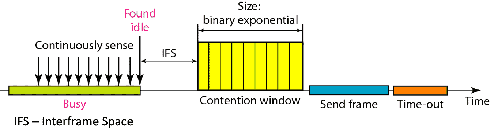
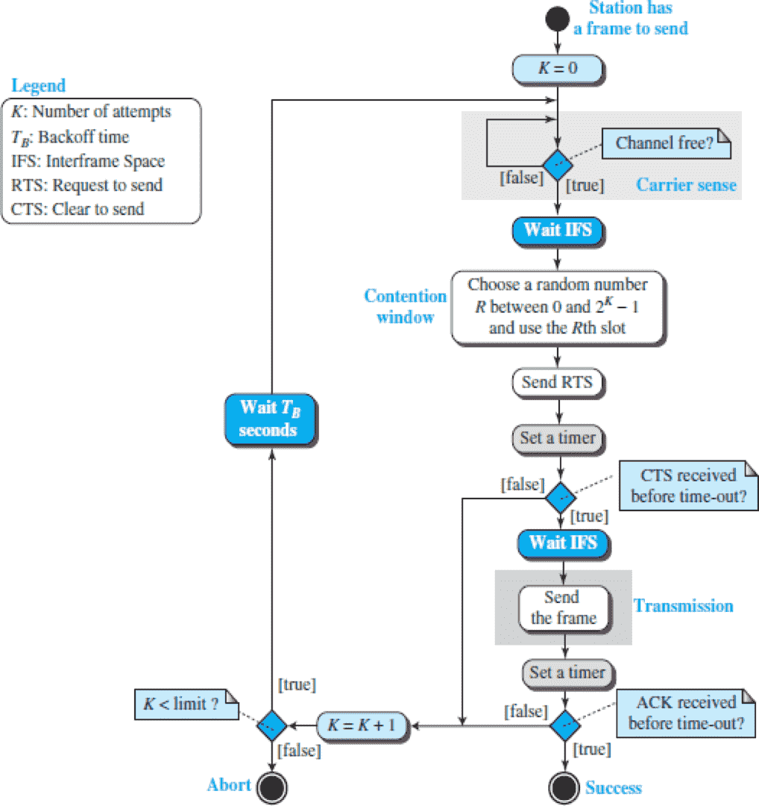
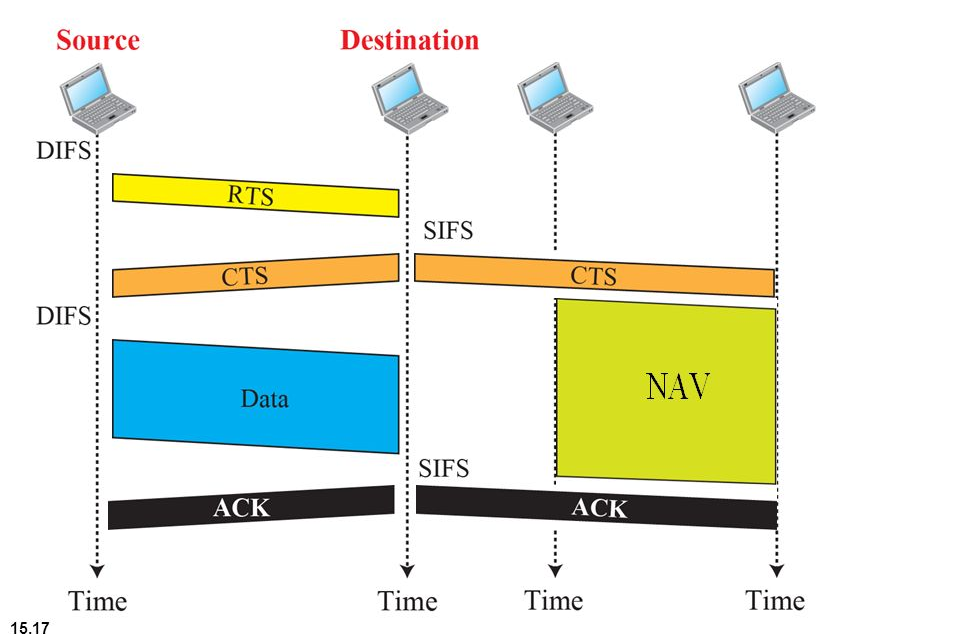
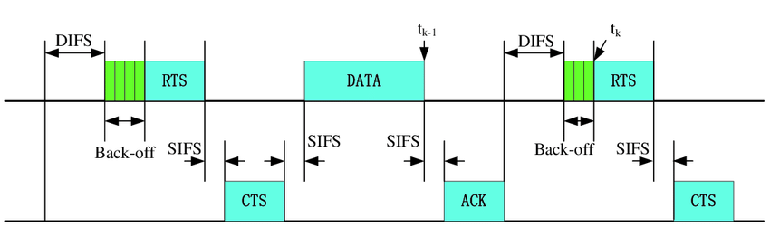
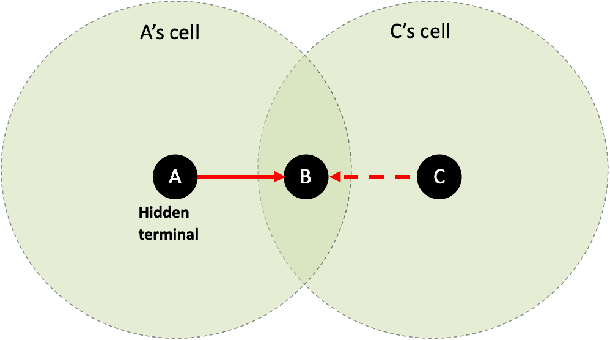
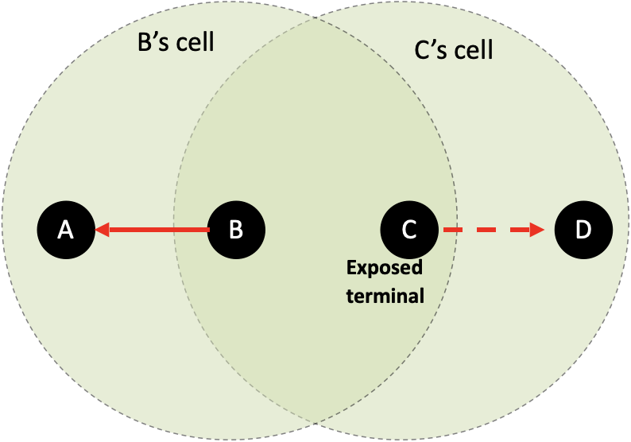

Let

|    Symbol     | Meaning                                                      |
| :-----------: | ------------------------------------------------------------ |
| $T_\text{fr}$ | Time to transmit a frame                                     |
|     $T_p$     | Propagation Delay                                            |
|      $G$      | Average no of frames requested per frame-time                |
|      $S$      | Throughput (Number of packets successfully transmitted per packet time) |
|      $V$      | Vulnerable Time Time bracket for potential collision    |

## Protocols

|                                | Pure ALOHA                                                   | Slotted ALOHA                                                | CSMA                                                         | CSMA/CD                                                      | CSMA/CA                                                      |
| ------------------------------ | ------------------------------------------------------------ | ------------------------------------------------------------ | ------------------------------------------------------------ | ------------------------------------------------------------ | ------------------------------------------------------------ |
| IDK                            |                                                              |                                                              | Carrier Sense Multiple Access Listen before transmission Node does not send if another node already sending Uses [persistence methods](#persistence-methods) | Collision Detection Listen to channel while packet being sent Node stops sending if $\exists$ interference |                                                              |
| Assumptions                    | Stations trying to transmit follow Poisson Distribution      | All frames are of same size Time divided into equal slots (time to transmit a frame) Nodes start transmission only at start of slot If 2/more nodes transmit, all nodes detect collision | Constant length packets No errors, except ones caused by collisions Each host can sense transmissions of all other hosts Propagation delay is small compared to transmission delay | 1. Check line is quiet 2. Detect collision ASAP 3. If collision detected, stop transmission; wait random time and start over |                                                              |
| Preferred for                  | Wired Networks                                               | Wired Networks                                               | (not used; always used with CD or CA)                        | Slow Wired Networks (since efficiency reduces for faster networks; as bandwidth increases, collisions increase) | Wireless Networks (WLAN) (since all signals are broadcasted and collisions cannot be detected) |
| Minimum Frame Length |                                                              |                                                              |                                                              | Frame length such that $T_t > 2 \times T_P$                  |                                                              |
| $V$                            | $2 \times T_\text{fr}$                                       | $T_\text{fr}$                                                | $T_P$                                                        |                                                              |                                                              |
| $S$                            | $G \times e^{-2G}$                                           | $G \times e^{-G}$                                            |                                                              |                                                              |                                                              |
| $G_\text{max}$                 | 1/2                                                          | 1                                                            |                                                              |                                                              |                                                              |
| $S_\text{max}$                 | 0.184                                                   | 0.368                                                        |                                                              |                                                              |                                                              |
| Flowchart                      |  |                                                              |                                                              |  |                                                              |

## CSMA/CD

$$
\begin{aligned}
B &= \frac{\text{PD}}{\text{TD}} \\
&= \frac{
\frac{\text{Distance}}{\text{Speed}}
}{
\frac{\text{Data Size}}{\text{Bandwidth}}
}\\
&= \frac{\text{Distance} \times \text{Bandwidth}}{\text{Speed} \times \text{Data Size}}
\end{aligned}
$$

$$
\begin{aligned}
\text{Throughput } E &= \frac{1}{1+kB} & (k \in [1, 10]) \\
&= \frac{1}{1+k \left( 
\frac{\text{Distance} \times \text{Bandwidth}}{\text{Speed} \times \text{Data Size}}
\right)} \\
\implies E &\propto \frac{1}{\text{Bandwidth}}
\end{aligned}
$$

## CSMA/CA

$$
\begin{aligned}
\text{Maximize Size of contention window}
&= 15 \times \text{RTT} \\
&= 30 \times T_P
\end{aligned}
$$

### DCF

Distributed Coordination Function

DCF sublayer uses CSMA 

- if station has frame to send, it listens to medium

- if medium idle, station may transmit
- else waits until current transmission complete 

No collision detection possible due to wireless network

DCF includes delays that act as a priority scheme

Combination of

|         | Full Form                  | Contains                      |
| ------- | -------------------------- | ----------------------------- |
| CSMA/CA |                            |                               |
| RTS     | Request/Ready to Send      | Duration required for channel |
| CTS     | Clear to Send              | MAC address                   |
| NAV     | Network Allocation Vector  |                               |
| DIFS    | Domething InterFrame Space |                               |
| SIFS    | Something InterFrame Space |                               |

### Steps

When a station wants to transmit data

- It sends an RTS packet to the intended receiver

  - The RTS packet contains the length of the data that needs to be transmitted

  - Any station other than the intended recipient hearing RTS defers transmission for a time duration equal to the end of the corresponding CTS reception
- The receiver sends back CTS packet back to sender if it is available to receive
  - The CTS packet contains the length of the data that original sender wants to transmit 

  - Any station other than the original RTS sender, hearing CTS defers transmission until the data is sent. 
- The original sender upon reception of the CTS, starts transmitting. 

### Flowchart

### Timeline Diagram

|                       Vertical Format                        |                      Horizontal Format                       |
| :----------------------------------------------------------: | :----------------------------------------------------------: |
|  |  |

## Wireless Channel Problems

|              | Hidden Terminal Problem                                      |                   Exposed Terminal Problem                   |
| ------------ | :----------------------------------------------------------- | :----------------------------------------------------------: |
| Description  | Two nodes hidden from each other transmit complete frames to base station |                                                              |
| Disadvantage | Wasted bandwidth for long duration                           |                                                              |
| Solution     | Small reservation packets: RTS+CTS Nodes track reservation interval with internal NAV |                                                              |
| Diagram      |  |  |
