Protocol for connecting multiple computer systems to form a LAN, with protocols to

- control passing of information
- avoid simultaneous transmission by multiple systems

## IEEE 802.3 Data Link Layer Sublayers

| Datalink Sublayer                | Tasks                                                        | Name of frame | Implementation | Protocol                                                     |
| -------------------------------- | ------------------------------------------------------------ | ------------- | -------------- | ------------------------------------------------------------ |
| LLC (Logical Link Control)  | Error Control Flow Control Interconnectivity b/w data link layer of different LANs Multiplex multiple network layer protocols in frame | IEEE 802.3    | Software       | CRC (error-correction) ARQ                              |
| MAC (Medium Access Control) | Framing MAC Addressing Medium Access Control       | IEEE 802.2    | Hardware       | Token-Passing (Wired Token Ring) CSMA/CD (Wired other) CSMA/CA with NAV (Wireless) |

## Diagram

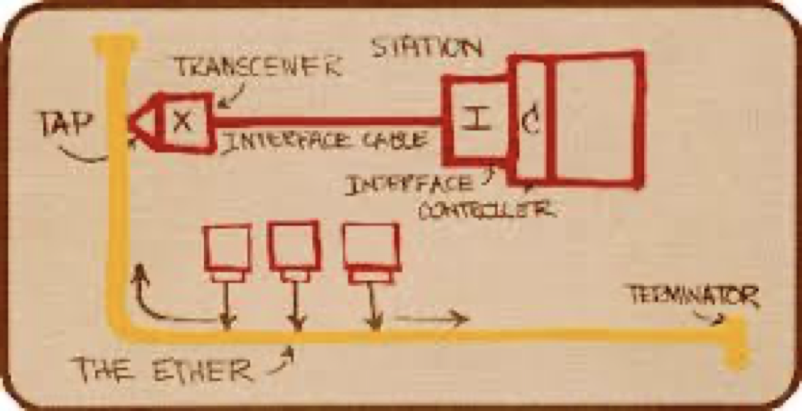

## Domains

| Domain    | Associated with   | Number                                      |                                                              |
| --------- | ----------------- | ------------------------------------------- | ------------------------------------------------------------ |
| Broadcast | Router Connection | No of switches connected to router          |                                                              |
| Collision | Switch Connection | No of half-duplex links connected to switch | Collision occurs as switches are not as intelligent as routers |

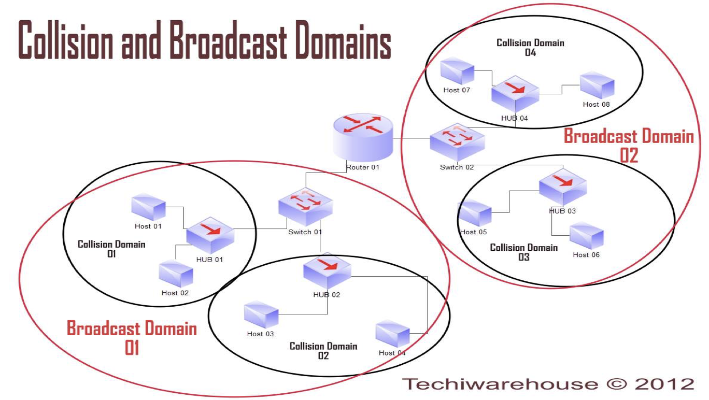

## Topology

|                       |                             Bus                              |                             Star                             |
| --------------------- | :----------------------------------------------------------: | :----------------------------------------------------------: |
|                       |                                                              |                   Active switch in center                    |
| Collision domain      |              All nodes in same collision domain              |          Each spoke runs separate Ethernet protocol          |
| Collisions Prevented? |                              ❌                               |                              ✅                               |
|                       | 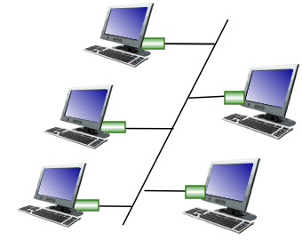 | 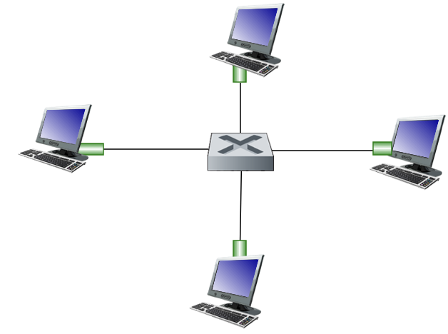 |

## Normal Ethernet Operation

| Receiver receives frame with        |                            |
| ----------------------------------- | -------------------------- |
| Matching destination address        | Data sent to network layer |
| Broadcast address (e.g. ARP packet) | Data sent to network layer |
| Neither of the above                | Discard frame              |

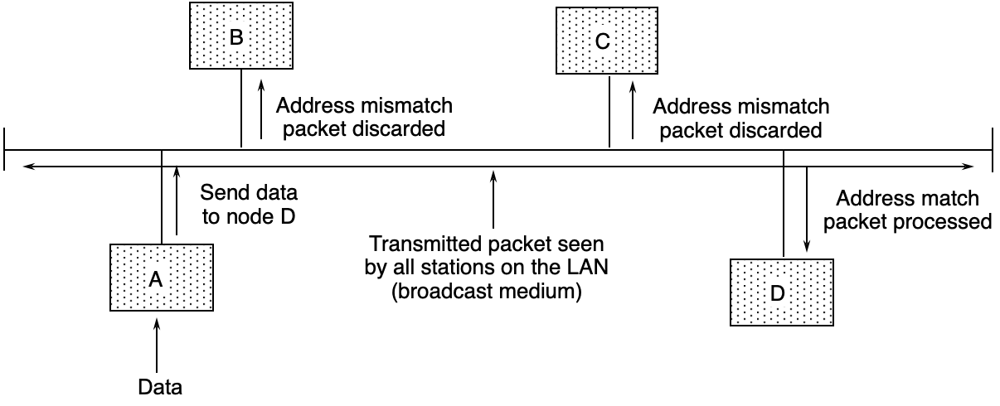

## Types

| Type        |  Speed   |   Connection   | Reliable? | Chance of dropping frames | Access Protocol |
| ----------- | :------: | :------------: | :-------: | :----------------------------: | :------------------: |
| Standard    | 10 Mbps  | Connectionless |     ❌     |              High              |       CSMA/CD        |
| Fast        | 100 Mbps |                |           |                                |                      |
| Gigabit     |  1 Gbps  |                |           |                                |                      |
| Ten-Gigabit | 10 Gbps  |                |           |                                |                      |

## Standard Ethernet Implementations

| Implementation | Topology | Transmission Medium                |
| -------------- | -------- | ---------------------------------- |
| 10Base5        | Bus      | Thick coaxial                      |
| 10Base2        | Bus      | Thin coaxial                       |
| 10Base-T       | Star     | UTP (Unshielded-Twisted-Pair) |
| 10Base-F       | Star     | Fiber                              |

## Steps of Routing to another LAN

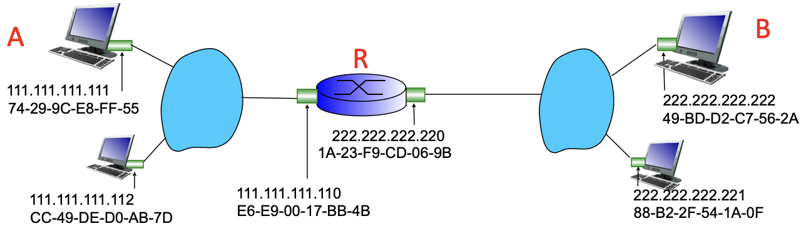

Assuming A has all the required addresses already, and wants to send a message to B via R.

1. Create packet in Network Layer with
   - Source address = A’s IP address
   - Destination address = B’s IP address
2. Create frame in Datalink Layer with 
   - Source address = A’s MAC address
   - Destination address = ==**R’s receiving terminal**== MAC address
3. A sends message to R
4. R receives message
5. R processes and removes frame in Datalink Layer
6. R processes packet in Network Layer
7. R forwards packet with the same source and destination as before in the Network layer
8. R creates frame in the Network layer with
   - Source address = ==**R’s sending terminal**== MAC address
   - Destination address = ==**B’s**== MAC address

## Ethernet Switch

- Examines incoming frame’s MAC address
- Selectively forwards frame to one/more outgoing links when frame is to be forwarded on segment
- Uses CSMA/CD to access segment
- Buffers packets

Every host has dedicated & direction connection to switch

Each link connected to switch is its own collision domain; hosts transmitting simultaneously does not affect other transmissions if they are on different link.

### Characteristics

- Transparent: Hosts are unaware of presence of switches
- Plug-and-Play device: No configuration required by network admin
- Self-Learning mechanism

### Types

|                                             | Cut-through               | Store-and-forward switch |
| ------------------------------------------- | ------------------------- | ------------------------ |
| Begins forwarding data after examining | only first part of header | entire data              |
| Retransmission Time                         | $< T_t$                   | $= T_t$                  |

### Switch Table

Helps switch data from source to destination

| Host MAC Address | Interface to reach host | TTL  |
| ---------------- | ----------------------- | ---- |
|                  |                         |      |

### Self-Learning

1. Check if receiver exists in switch table

2. If yes, go to step 5

3. ‘Flood’ (broadcast) message to all stations

4. Update switch table with receiver’s entry
5. Send to receiver

### Interconnected Switches

Works using the same self-learning process

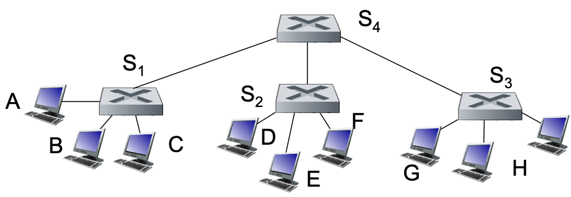

## Switches vs Router

|                      | Switch                  | Router                |
| -------------------- | ----------------------- | --------------------- |
| Store & Forward?     | ✅                       | ✅                     |
| Layer                | Data Link               | Network               |
| Examine              | Data link layer headers | Network layer headers |
| Understand addresses | MAC                     | IP                    |
| Forwarding Table?    | ✅                       | ✅                     |
| Learning Method      | Flooding learning       | Routing algorithms    |

## VLAN

Virtual Local Area Network

Allows us to divide a LAN without any additional switches

VLAN can be defined using one of the following techniques

- Switch port
- MAC addresses of endpoints

### Advantages

VLAN helps overcome the following

- Improve traffic isolation: frames by default can only travel within their own VLAN
- Dynamic membership: ports can be dynamically assigned among VLANs
- Efficient use of switches
- Management of users
- Forwarding between VLANS
- Address Security, privacy and efficiency issues. Data link layer broadcast traffic (ARP, DHCP, unknown location of destination MAC address) need not cross entire LAN.

### Port-Based VLAN

|               |                                                                 |
|---                | :-:                                                                       |
|Details            | [Trunk Port](#trunk-Port) connected to router Traffic isolation something else |
|No of usable ports | $n-1$ (Trunk port unusable)                                      |
| Actual connections | 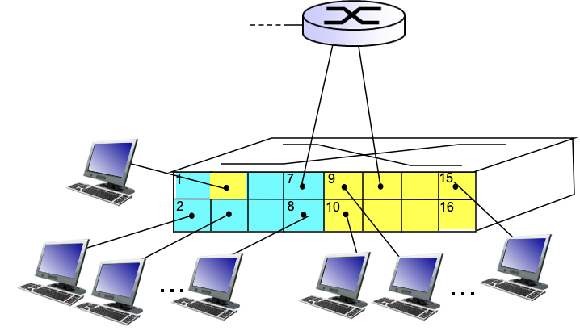 |
| Behaves as | 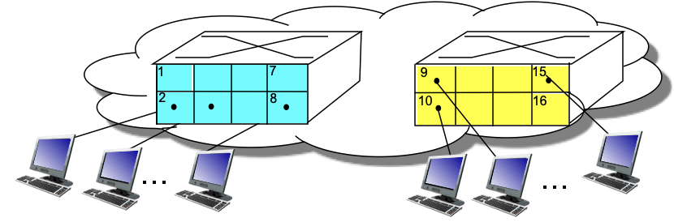 |

### Trunk Port

Carries frames between VLANS defined over multiple physical switches. Frames forwarded over multiple switches must carry VLAN ID info as well, and hence uses [IEEE 802.1Q Frame](#IEEE 802.1Q Frame).

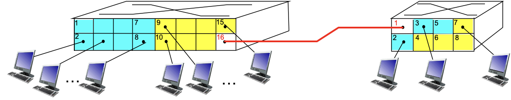

## Ethernet/IEEE 802.1 Frame

All sizes shown in Bytes

| Size    |            |
| ------- | ---------- |
| Minimum | 64 Bytes   |
| Maximum | 1518 Bytes |

|                           Preamble                           |               SFD (Start Frame Delimiter)               | Dest MAC Address | Source MAC Address |                             Type                             | Payload (Data & Padding) |           CRC           |
| :----------------------------------------------------------: | :----------------------------------------------------------: | :-------------------: | :---------------------: | :----------------------------------------------------------: | :---------------------------: | :---------------------: |
|                           7 Bytes                            |                            1 byte                            |        6 Bytes        |         6 Bytes         |                           2 Bytes                            |      $[46, 1500]$ Bytes       |         4 Bytes         |
|                Alternating 1/0 1010…1010                |                        10101010**11**                        |                       |                         |                         Type of Data                         |                               | Cyclic Redundancy Check |
| Part of physical layer header (Processed at physical layer) | Part of physical layer header (Processed at physical layer) |                       |                         | 0800 –> IPv4 0806 –> ARP Frame 8100 –> IEEE 802.1Q Frame 86DD –> IPv6 |                               | Error -> Frame dropped  |
|          Synchronizes sender & receiver clock rates          |                Signals the beginning of frame                |                       |                         |                                                              |                               |                         |

### Example of multiple frames

### Receiver Address Type

| Type      | Receiver Address Value |
| --------- | ---------------------- |
| Unicast   | LSB of first byte = 0  |
| Multicast | LSB of first byte = 1  |
| Broadcast | All bits are 1         |

LSB = Least Significant Bit

## IEEE 802.1Q Frame

Adds/removes additional header fields for frames forwarded between trunk ports

(Empty cells of the following table means that they are the same as regular Ethernet frame)

| Preamble | SFD (Start Frame Delimiter) | Dest Address | Source Add | Tag Protocol Identifier |                 Tag Control Info                  | Type | Data & Padding | CRC            |
| :------: | :------------------------------: | :---------------: | :-------------: | :---------------------: | :-----------------------------------------------: | :--: | :------------: | -------------- |
|          |                                  |                   |                 |           2B            | 12bits VLAN ID field 3bits field like IP TOS |      |                | Recomputed CRC |
|          |                                  |                   |                 |         81-100          |                                                   |      |                |                |

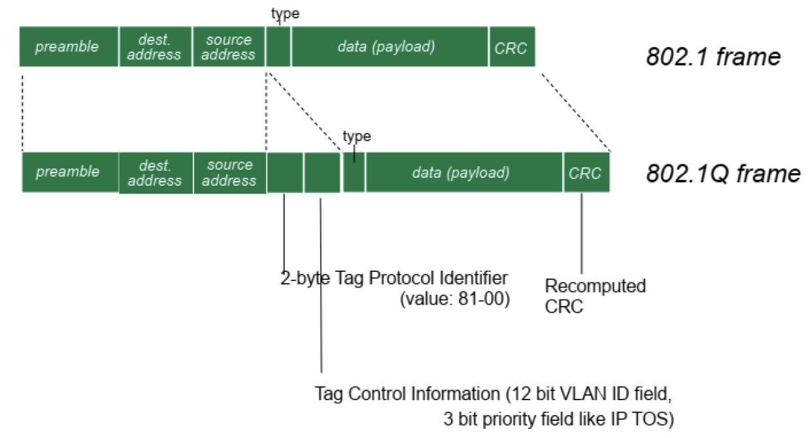

## VLAN Frame

| Preamble | SFD (Start Frame Delimiter) | Dest MAC Address | Source MAC Address | Tag  | Type | Payload (Data & Padding) | CRC  |
| :------: | :------------------------------: | :-------------------: | :---------------------: | ---- | :--: | :---------------------------: | :--: |

Tag is 

|      |      |
| ---- | ---- |
|      |      |
