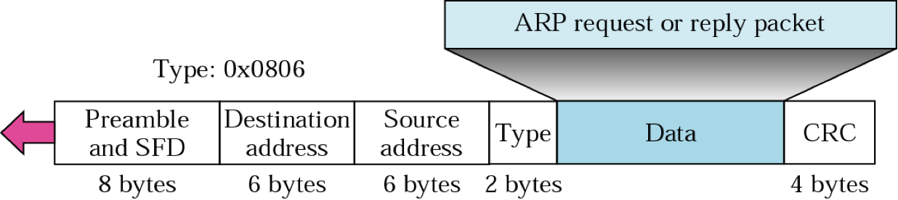
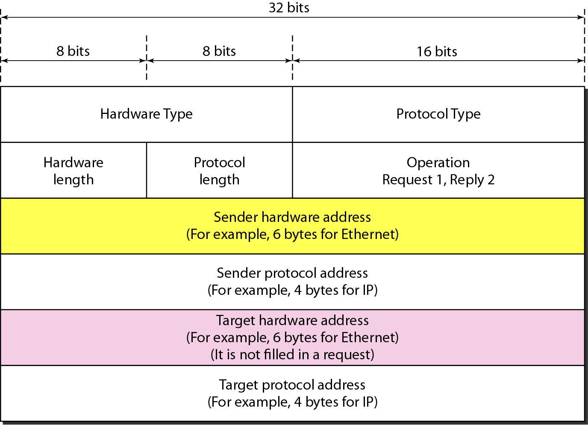

Address Resolution Protocol

Obtain MAC Address from IP address

It is ‘plug-and-play’, as nodes create their ARP tables w/o intervention from network admin

## ARP Procedure

Let’s say node A wants to send message to node B

1. Check ARP Table for B’s MAC address using IP address.
2. If B found, A sends message to B. Stop
3. Else, A **broadcasts** ARP query packet, containing B's IP address
   - dest MAC address = $FF \ FF \ FF \ FF \ FF \ FF$
   - all nodes on LAN receive ARP query
4. B receives ARP packet, replies to A with its (B's) MAC address
   frame sent to A’s MAC address (**unicast**)
5. A adds B’s mac address to its ARP table
6. Go to step 1

| ARP Message Type | Type      |
| ---------------- | --------- |
| ARP Request      | Broadcast |
| ARP Reply        | Unicast   |

## ARP Table

Each IP node on LAN has ARP table, which contains

| IP Address | MAC Address | TTL                                                          |
| ---------- | ----------- | ------------------------------------------------------------ |
|            |             | Time To Live Time after which address mapping will be forgotten Usually 20min |

## ARP Packet

Destination address of the frame will be all 1s, as this will be broadcast

|                    | Meaning                                 | Value                                                        | Size                 |
| ------------------ | --------------------------------------- | ------------------------------------------------------------ | -------------------- |
| Hardware Type      | Type of network on which ARP is running | Ethernet -> 1                                                | 16 bits              |
| Hardware Length    | Length of physical address in bytes     | Ethernet -> 6                                                | 8 bits               |
| Protocol Length    | Length of logical address in bytes      |                                                              | 8 bits               |
| Protocol Type      | Type of IP used                         | IPv4 -> $0800_H$                                             | 16 bits              |
| Operation          | Type of ARP Packet                      | Request -> 1 Reply -> 2                                 | 16 bits              |
| Sender MAC address |                                         |                                                              | 6 bytes for ethernet |
| Sender IP address  |                                         |                                                              | 4 bytes for IP       |
| Target MAC address |                                         | Request (all 0s as MAC address unknown) Reply (returned MAC address) | 6 bytes for ethernet |
| Target IP address  |                                         |                                                              | 4 bytes for IP       |

## Target IP address

| Sender | Receiver | Network   | Value of Target IP address                  |
| ------ | -------- | --------- | ------------------------------------------- |
| Host   | Host     | Same      | Same as destination IP address in IP packet |
| Host   | Host     | Different | IP address of router                        |
| Router | Host     | Same      | Same as destination IP address in IP packet |
| Router | Host     | Different | IP address of router                        |