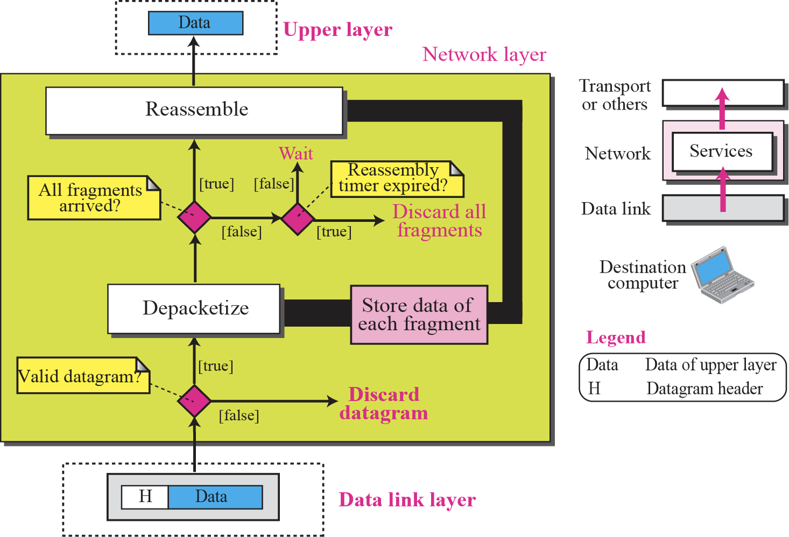
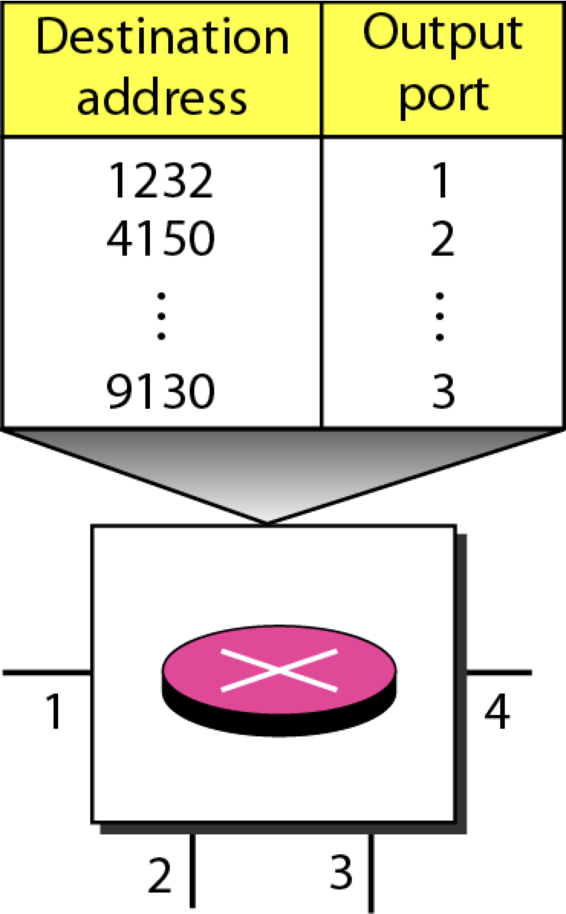
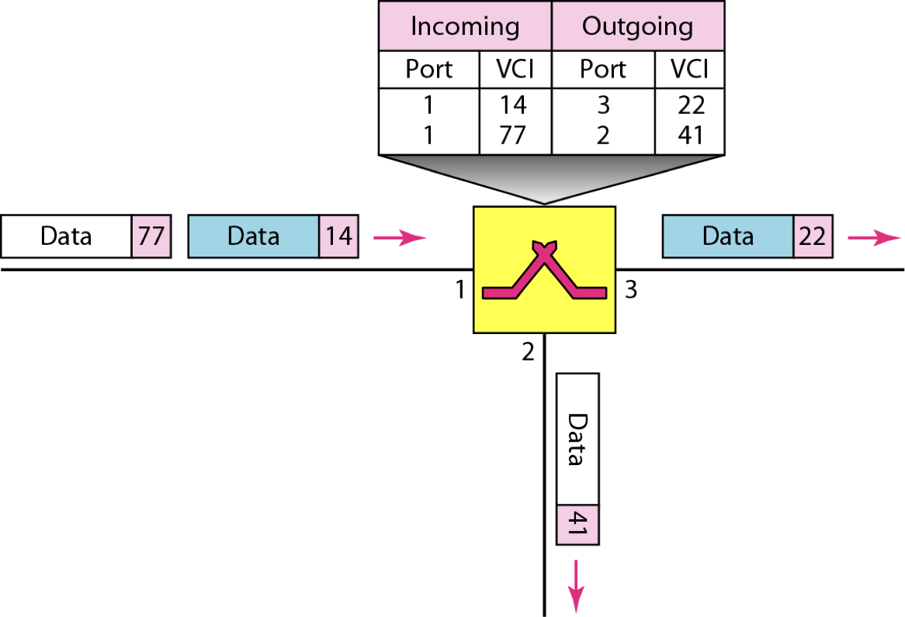
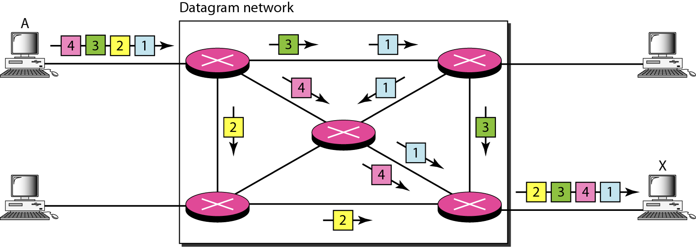
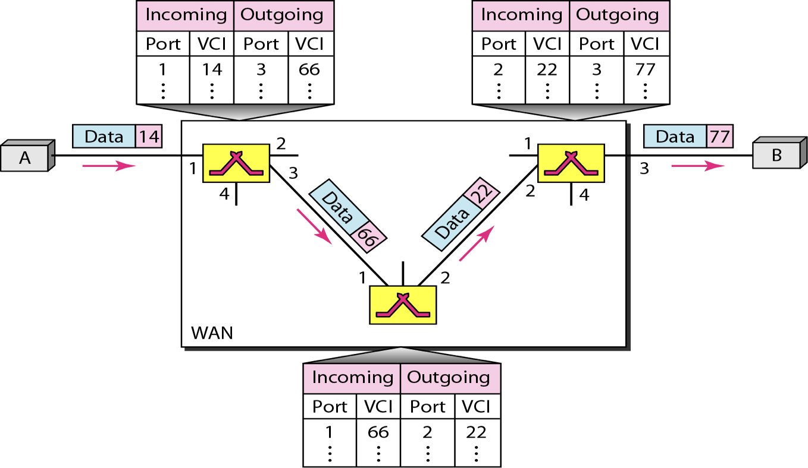
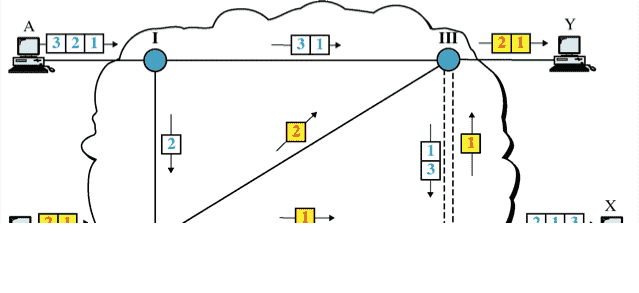
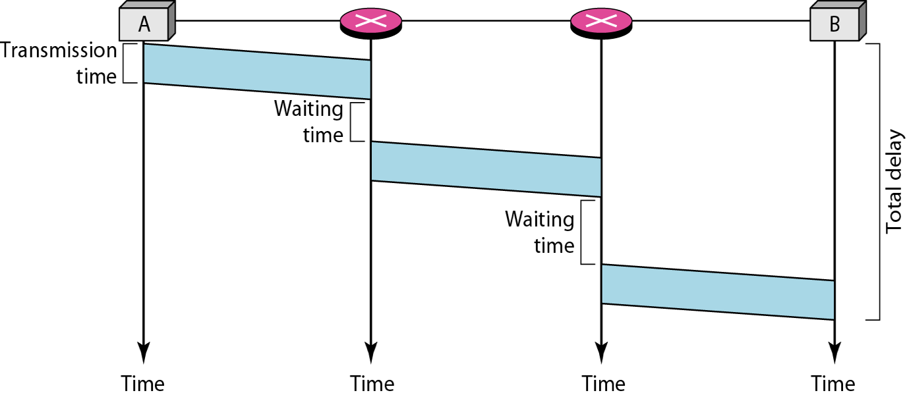
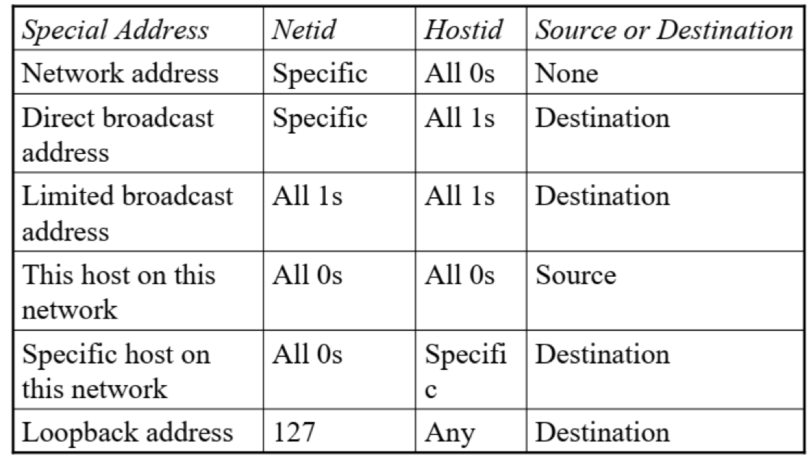
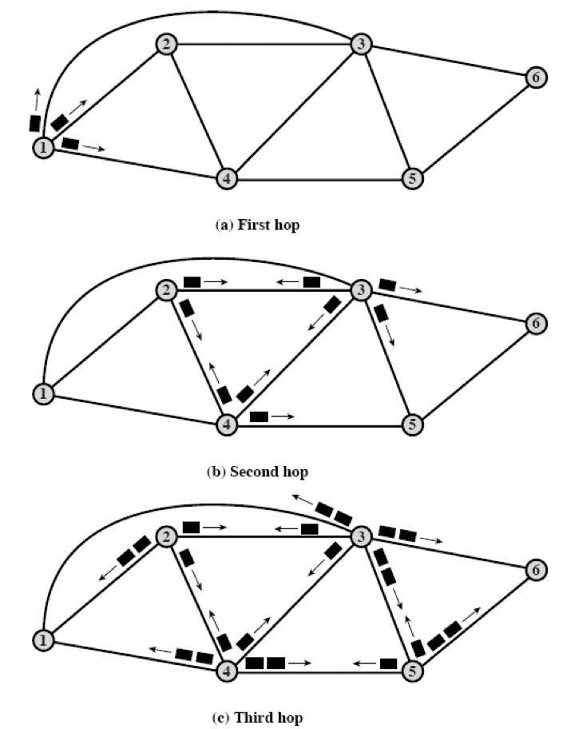
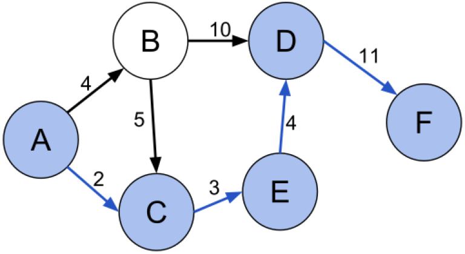

## Summary

### Network Layer @ Source

### Network Layer @ Router

### Network Layer @ Destination

## Packetization

Each packet contains a portion of user data plus some control info (routing info, etc)

Size of packet determined by network and its governing protocol

Packets are received, buffered (stored briefly), then and past on to the next node. This is called as ‘Store-and-forward’

## Packet-Switching Methods

Context already given in [Introduction](./01_Introduction.md)

|                                                              | Datagram Approach                                            | Virtual-Circuit Approach                                     |
| ------------------------------------------------------------ | ------------------------------------------------------------ | ------------------------------------------------------------ |
| Connection Type                                              | Connection-less                                              | Connection-oriented                                          |
| Each packet contains                                         | Destination address                                          | Virtual-circuit ID (implemented in Data Link Layer)     |
| Efficiency                                                   | Better than circuit switched network (channel is always occupied) |                                                              |
| Delay                                                        | > Circuit Switching & Virtual-Circuit                        |                                                              |
| Switch keeps info about connection state                     | ❌                                                            |                                                              |
| Each packet is treated                                       | independently                                                | dependently                                                  |
| Path                                                         | Each node chooses the next node                              | Same path as previous packet of same packet stream (Node does not make any routing decision) |
| Packets can take any possible route based on the link availability | ✅                                                            | ❌                                                            |
| Capacity Guaranteed                                          | ✅                                                            | ❌                                                            |
| Packets always arrive in order                               | ❌                                                            | ✅ (packets  may arrive with different delays  if resource allocation is on demand) |
| Packets not lost                                             | ❌ (due to lack of resources; upper layers ask for retransmission) |                                                              |
| Re-order packets and recover from missing packets            | Receiver                                                     |                                                              |
| Example                                                      | The Internet                                                 | X.25, Frame Relay, ATM                                       |
| Routing Table                                                |  |  |
| Single Channel                                               |  |  |
| Multiple Channels                                            |  |                                                              |
| Delays                                                       | $3 T + 3 \tau + w_1 + w_2$  | $\text{delay}_\text{tot} = \text{delay}_\text{trans} + \text{delay}_\text{prop} + \text{setup delay} + \text{teardown delay}$  |

## IP Addressing

Each IP address is unique and only defines 1 connection to the Internet. Two devices on the internet can never have the same address at the same time. (referring to IP Public addresses)

### Types of Addresses

|                 |      |
| --------------- | ---- |
| Network Address |      |
| Host Address    |      |

### Types of Addressing

| Classful                                                     | Classless                                                    |
| ------------------------------------------------------------ | ------------------------------------------------------------ |
| Entire range of IP addresses is classified into different classes Each class is divided into a fixed number of blocks with fixed size | Variable length blocks                                       |
|                                                              | No of blocks must be power of 2                              |
|                                                              | Beginning address must be divisible by no of addresses (If block has less than 256 addresses, we need to check only the rightmost byte) (If block has less than 65,536 addresses, we need to check only the two rightmost bytes, and so on.) |
| Inflexible                                                   |                                                              |
| Inefficient (wasted IP addresses)                       |                                                              |

## Classful Addressing

### Classes

|                    | A                 | B                 | C                 | D                 | E|
|---                 | ---               | ---               | ---               | ---               | ---|
| Network & Host Part | N.H.H.H | N.N.H.H | N.N.N.H | - (Not for commercial use) | - (Not for commercial use; only for experimentation) |
|Starting bit(s)       | $0$               | $10$              | $110$             | $1110$            | $1111$|
|Range Start         | $1.0.0.0$         | $128.0.0.0$       | $192.0.0.0$       | $224.0.0.0$       | $240.0.0.0$|
|Range End           | $127.255.255.255$ | $191.255.255.255$ | $223.255.255.255$ | $239.255.255.255$ | $255.255.255.255$|
|Casting             | Uni-Cast          | Uni-Cast          | Uni-Cast          | Multi-Cast        | |
|Default Mask (number to AND IP address with to get netid) | $255.0.0.0$       | $255.255.0.0$     | $255.255.255.0$   |                   | |
|No of Network Blocks     | $2^{8-1} - 1$ (1 bit for class) (1 block for private address) | $2^{16-2}-16$ (2 bits for class) (16 blocks for private address) | $2^{24-3}-256$ (3 bits for class) (256 blocks for private address) | 1 | |
|No of Hosts     | $2^{24} \textcolor{hotpink}{-2}$ | $2^{16} \textcolor{hotpink}{-2}$ | $2^{8} \textcolor{hotpink}{-2}$ |                   | |
|Subnetting Possible? | ✅ | ✅ | ❌ | | |
|Supernetting Possible? | ❌ | ❌ | ✅ | | |

- $\textcolor{hotpink}{-2}$ is because

  1. Network address: all host fields = 0
  2. Network broadcast address: all host fields = 1
- $0.0.0.0 \iff 0.255.255.255$ is a special block not belonging to any class
- $127.0.0.0 \iff 127.255.255.255$ is a special block belonging to class A, but it is reserved for loopback(`localhost`): the computer to refer to itself

The outside world recognizes the network via network address, not the individual host-IPs

### Categories of Addresses

Packet with loopback address does not leave the device (will not reach the network)

### Private Addresses

Assigned for private use and not recognized globally, used in

- Isolation
- Connection with network address translation

### Modified Networks

|                                 | Subnetting | Supernetting|
|---                              | ---        | ---|
| | Split large network into smaller networks | Combine smaller network into 1 larger network |
|Subnet Address borrows bits from | hostid     | netid|
|Rules      | No of modified nets must be power of 2 | No of modified nets must be power of 2 |
| |  | Blocks must be contiguous in address  space |
| |  | 3rd byte of first address in supernet must be evenly divisible by number of blocks of supernet |

### Subnetting

Network is divided into several smaller groups, with their own subnet address depending on the hierarchy of subnetting, but still appearing as a single network to the rest of the Internet

Hierarchy changes from `netid:hostid` to `netid:subnetid:hostid`

Only the network administrator knows about the network address and subnet address but router does not

2 routers

- External router has routing table based on network addresses
- Internal router has routing table based on subnetwork addresses.

## Classless Addressing

### Slash Notation

Also called as CIDR (classless inter-domain routing) Notation

Where $n=$ no of 1s in mask (starting from the left side)

## Routing

Determine the most optimal path for packet to take from source to destination

Only possible to pick most optimality with global knowledge about network

### Objective

- Minimize number of hops
- Minimize end-to-end delay
- Maximize available bandwidth

### Criteria for Routing Algo

1. Correctness: correct route and accurate delivery
2. Robustness: adaptive to changes of network topology, in case of node/link failure & varying traffic load
3. Cleverness: ability to detour congestion links & determine connectivity of network
4. Efficiency: rapid finding of route & minimization of control messages

### Classification of Routing Algo

|                               | Static                                                       | Dynamic   |
| ----------------------------- | ------------------------------------------------------------ | --------- |
| Compute route                 | Manually                                                     | Automatic |
| When                          | Prior                                                        | During    |
| Based on                      | Topology Link Capacity                                  |           |
| Life of routing table entry   | Long                                                         | Variable  |
| Change of routing table entry | Fixed                                                        | Variable  |
| Advantage                     | Simple                                                       | Adaptive  |
| Disadvantage                  | Not scalable Not dynamic Cannot react to n/w failures, traffic load changes, n/w size increase | Complex   |
| Suitable for                  | Small & fixed topology networks                              |           |

### Routing Table

Store path information, so that each node knows how to forward packets

Datagram approach & Virtual Circuit method have different types. Refer [Packet-Switching Methods](#Packet-Switching Methods) for the diagram

## Routing Graph

Graphical representation of network with

- vertices: router nodes
- edges: links
- Cost: time delay, monetary cost, congestion level

## Routing Algorithms

| | Flooding                                                                                                                                                                                                                                                                                                                                                                             | Shortest Path Routing | Link State Routing (OSPF: Open Shortest Path First) | Distance Vector Routing (RIP: Routing Information Protocol) |
|---  | ---                                                                                                                                                                                                                                                                                                                                                                                        | ---                   | ---|---  |
| Type | Static                                                                                                                                                                                                                                                                                                                                                                             | Static | Dynamic | Dynamic |
| Steps | Packet sent by node to every neighbor Incoming packets retransmitted on every link (except incoming link) Eventually $\ge 1$ copies arrive at destinatin Each packet is uniquely number, so duplicates are discarded Nodes can remember packets already forwarded to keep network load in bounds Can include hop count in packets | Solve single-source shortest path problem using Dijkstra’s Algo Produces “tree” of routes from source to all points Construct forwarding table containing next hop | Each router reliably floods information about its neighbors to every other router Each router independently calculates the shortest path from itself to every other router, using Dijkstra’s Algo | Each router only knows links to neighbors; does not flood entire network Each router has provisional shortest path (reach B with cost 11 via next hop router D) Routers exchange this information only with neighbors Update best path using info from neighbors Bellman-Ford Algo |
| Advantages | No network info required Robust: All possible routes are tried Can be used for virtual circuit: At least one packet will have taken minimum hop count route All nodes are visited: Useful to distribute information | | |  |
| Diagram |                                                                                                                                                                                                                                                                                                                            |  | |  |
| Works well for |  |  | Large networks | Smaller networks Max hop limit of 15 |
