Inter-Networking Protocol

Responsible for node-to-node transmission

Unreliable: Packets might be lost, corrupted, duplicated, or delivered out of order

## IPv4 Packet Format

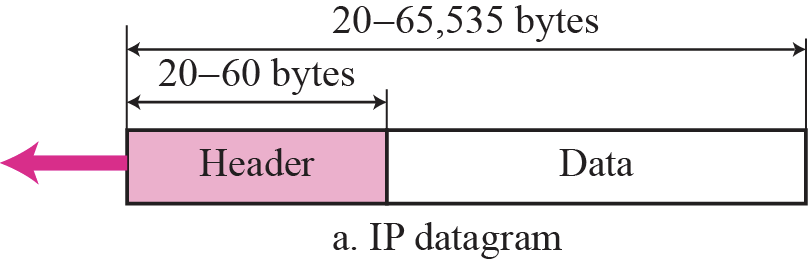

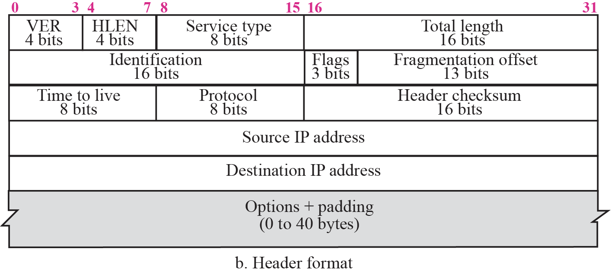

|                      | Meaning                                                      | Size (bits) | Value                                                        |
| -------------------- | ------------------------------------------------------------ | ----------- | ------------------------------------------------------------ |
| Vers                 | Version of IP protocol                                       | 4           |                                                              |
| Hlen                 | Header length w/o options                                    | 4           | Hlen=5 : 20bytes Hlen=15: 60bytes                       |
| TOS                  | Type Of Service (Used for QoS priority)                 | 8           |                                                              |
| Total Length         | Length of packet in bytes, including header & payload        | 16          |                                                              |
| TTL                  | Time To Live Specified how long packet is allowed to remain on Internet Prevents infinite loops Routers decrement by 1 When TTL=0, router discards datagram | 8           |                                                              |
| Protocol             | Specifies format of payload Identify Transport Layer protocol used (TCP/UDP) | 8           | TCP=6 UDP=17 ICMP=1 IGMP=2 (administered by central authority to guarantee agreement) |
| Source IP address    |                                                              | 32          |                                                              |
| Dest IP address      |                                                              | 32          |                                                              |
| Options              | Mainly used to record a router, timestamps, or specify routing | Variable    |                                                              |
| Header Checksum      | Error control                                                |             |                                                              |
| Identification       | Copied into fragment, allows dest to know which fragments belong to which packet | 16          |                                                              |
| Fragmentation Offset | Specifies offset in original packet of data being carried in current fragment | 13          | Multiple of 8 bytes                                          |
| Flags                | Control fragmentation                                        | 3           | - Reserved: 0th bit - Don’t fragment: (1st bit)    - D=1 Don’t fragment    - D=0 Can fragment - More fragments (LSB)    - M=1: More fragments incoming   - M=0: This is last fragment of packet |

## IP Fragmentation

Every network has its own MTU (Maximum Transmission Unit). This is the largest size of packet that can be put on the network.

For eg, Ethernet is 1500 Bytes

What makes fragmentation tricky is that we **don’t** know the MTU of all networks in advance

### Reassembly

|                    |           |                                                              |
| ------------------ | --------- | ------------------------------------------------------------ |
| End Nodes          | Better    | Avoids unnecessary work If any fragment is missing, discard entire packet |
| Intermediate Nodes | Dangerous | Hard to determine how much buffer space required by routers Unreliable when routes in network changes |

Final destination host reusables original packet from fragments (if none of them are lost) with the following steps

1. Check if first fragment has offset field = 0
2. Divide length of first fragment by 8; this value should be equal to offset of 2nd fragment
3. Divide the total length of the first and second fragment by 8; this value should be equal to offset of 3rd fragment
4. Continue process, until fragment with more bit value = 0 is reached

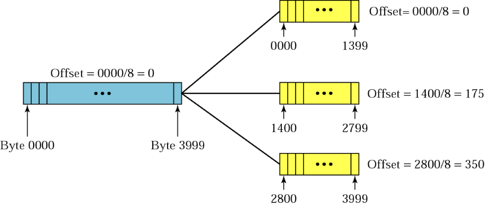

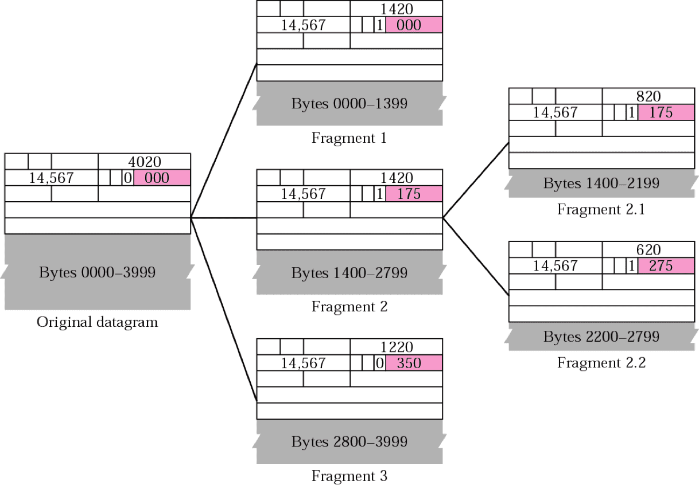

## Fragmentation Types

IP protocol uses non-transparent fragmentation

|               | Transparent Fragmentation                                    | Non-Transparent Fragmentation                                |
| ------------- | ------------------------------------------------------------ | ------------------------------------------------------------ |
| Steps         | - Router breaks large packet into fragments - All fragments sent to same exit router - Reassemble fragments before forwarding to next network | - Router breaks large packet into fragments - Packet fragments not reassembled at intermediate routers - Each fragment is treated as independent packet by routers - Fragments reassembled at final destination host |
| Advantages    |                                                              | Multiple exit routers can be used Higher throughput     |
| Disadvantages | All packets must be routed via same exit router Exit router must know when all pieces have been received Either ‘count’ field or ‘end of packet’ field must be stored in each packet Large overhead: Large packet may fragmented & reassembled repeatedly | When a large packet is fragmented, overhead increases Each fragment must have a header (min 20 bytes) |
|               | 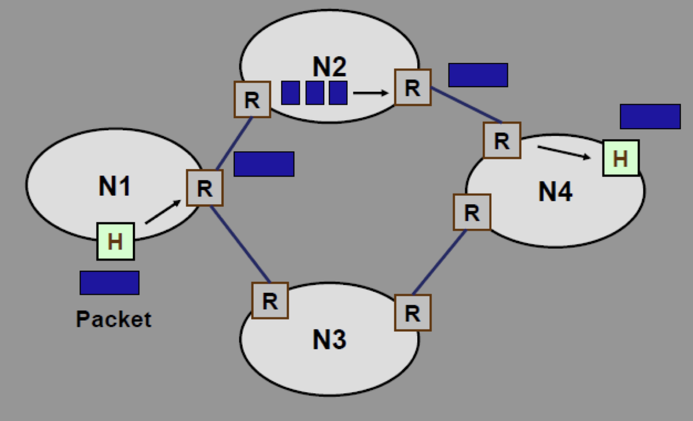 | 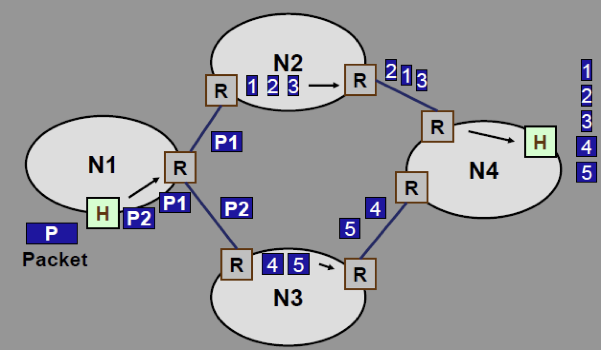 |

## IPv6

(Version 5 was allocated to experimental Internet Stream Protocol)

IPv6 has 128 bits, represented as 8 groups of 4 hex digits each

Eg: $FEDC:BA98:7654:3210:FEDC:BA98:7664:3210$

### Goals

- Providing improved security. 
  - Authentication Header
  - Encrypted Security Payload Header.
- Reduction in size of Routing Tables
- Providing for a single, unique address assignment to mobile hosts.
- Providing support for new as well as older versions of the IP

### Benefits

- Increases address space
- Efficient addressing & routing topology
- Network address is not required (restores end-to-end IP addressing)

### Packet

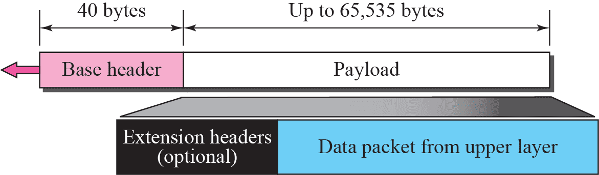

#### Base Header

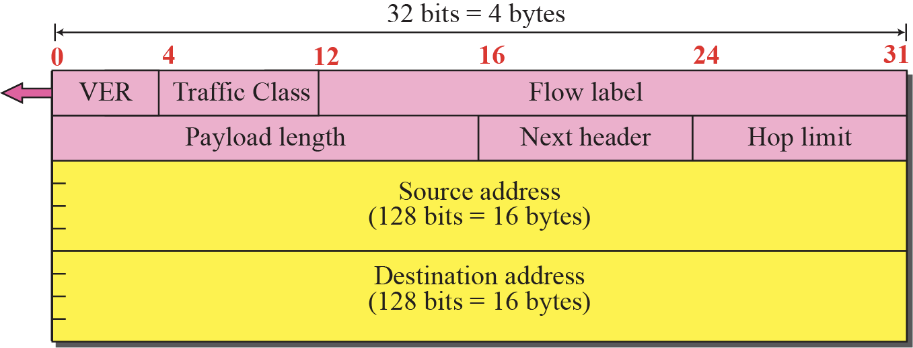

## Mobile IP

Addressing is the main problem in mobile communication

Regular IP addressing is based on the assumption that a host is stationary

- Routers use hierarchical structure of IP address to route packet
- Address is valid only when devices attached to network; if network changes, address is no longer valid

When a host moves from one network to another, IP addressing structure needs to be modified

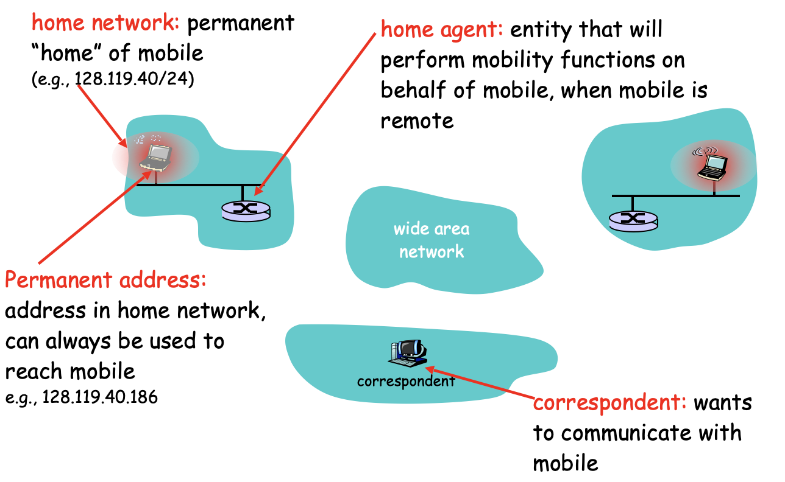

There are 3 options to deal with device changing networks

### Change the address

- DHCP Protocol
- Limitations
  - Configuration files need to be changed
  - Each time computer moves from one network to another, it must be rebooted
  - DNS tables need to be revised so that every other host in the Internet is aware of change
  - If host roams from one network to another during transmission, data exchange will be interruted
    - Since port & IP address of client & server must remain constant for duration of connection

### Combination of 2 addresses to identify device

Host has

- Home address: original address
- Care-of-address: temporary address
  (Associate host with foreign network)
  - When host moves from one network to another, care-of-address changes
  - Mobile host receives its care-of-address during **agent-discovery** & **registration**

#### Agent Discovery

1. Home Agent’s and Foreign Agent’s broadcast their presence on each network to which they are attached; Beacon messages via ICMP Router Discovery Protocol (IRDP)
2. Mobile Node’s listen for advertisement and then initiate registration

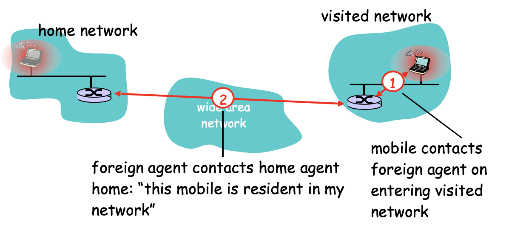

Thus,

- Foreign Agent is now aware of mobile
- Home Agent knows location of mobile

#### Registration

1. When Mobile Node is away, it registers its COA with its Home Agent, usually through Foreign Agent with strongest signal
2. Registration control messages are sent via UDP to well-known port

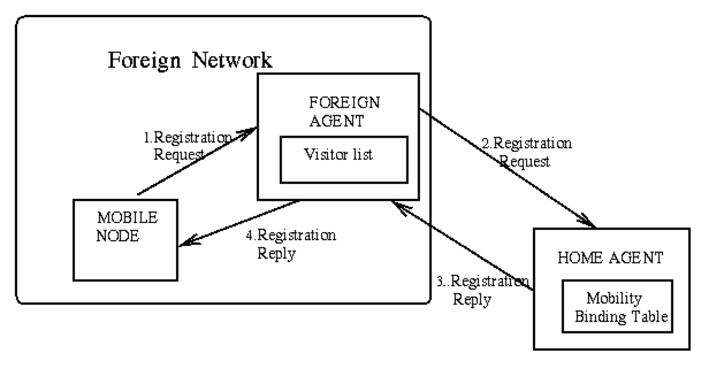

### Tables Maintained

#### Mobility Binding Table

Maintained on Home Agent

Maps Mobile Node’s home address with its current care-of-address

| Home Address | Care-Of-Address | Lifetime (sec) |
| ------------ | --------------- | -------------- |
|              |                 |                |

#### Visitor List

Maintained on Foreign Agent serving the Mobile Node

Maps Mobile Nodes’s home address to its MAC address & Home Address

| Home Address | Home Agent Address | Media Address | Lifetime (sec) |
| ------------ | ------------------ | ------------- | -------------- |
|              |                    |               |                |

### Indirect (Triangle) Routing

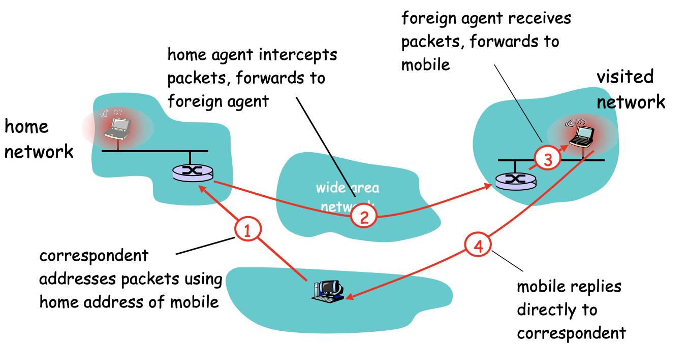

Mobile Node uses 2 addresses

- Home address, used by correspondent (mobile location is transparent to correspondent)
- Care of Address, used by Home Agent to forward packets to mobile

Foreign agent functions may be done by mobile itself

#### Data Transfer Tunnelling

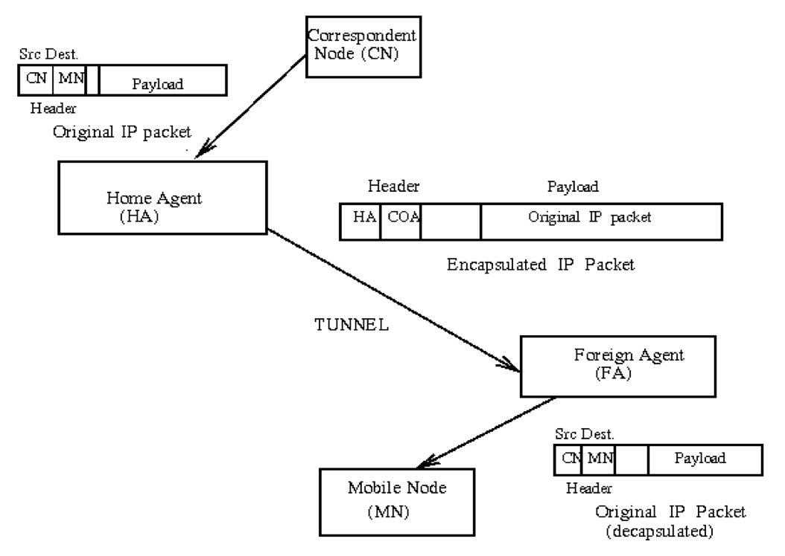

### Problems with Mobile IP

#### Double Crossing

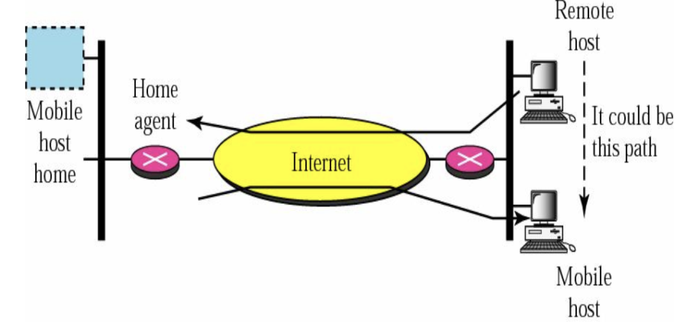

#### Triangle routing

Packet travel as two sides of triangle

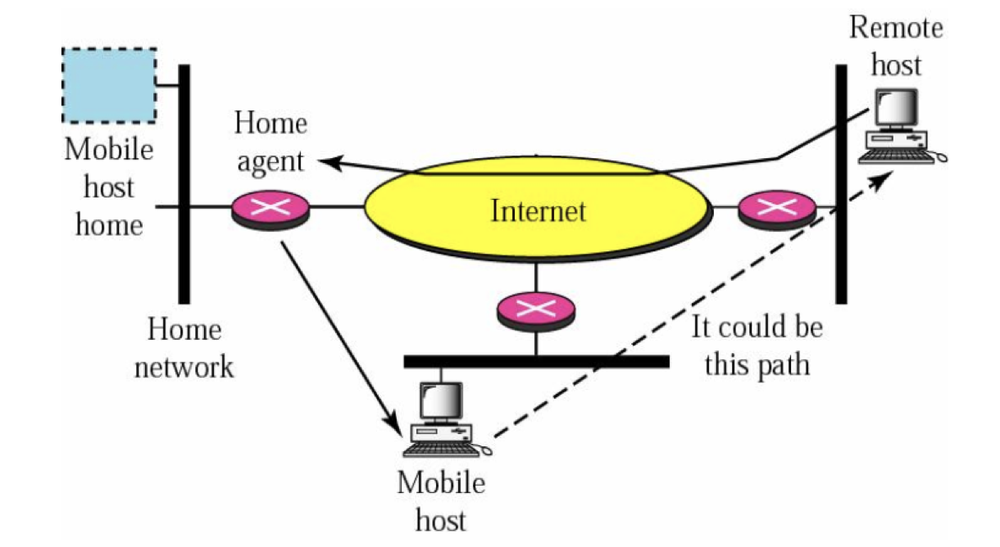