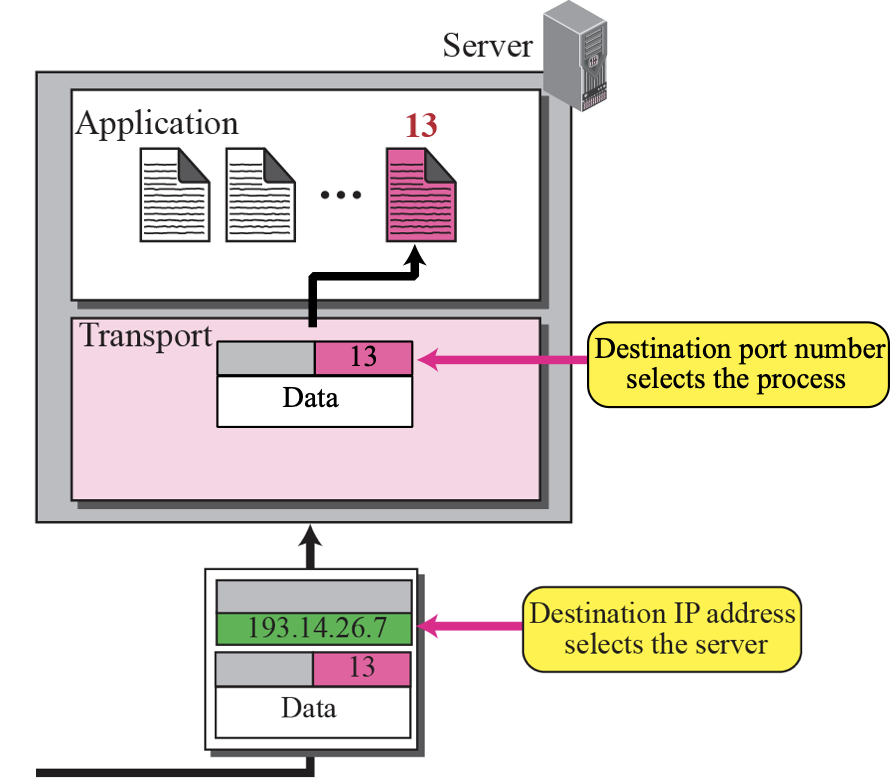
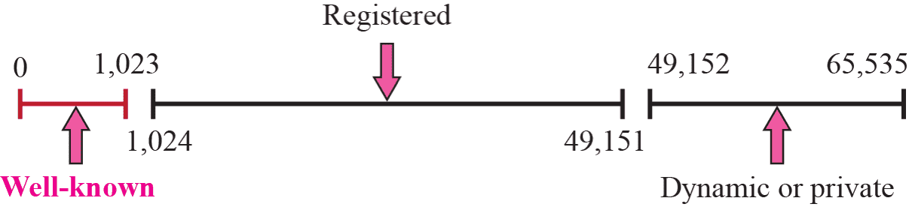
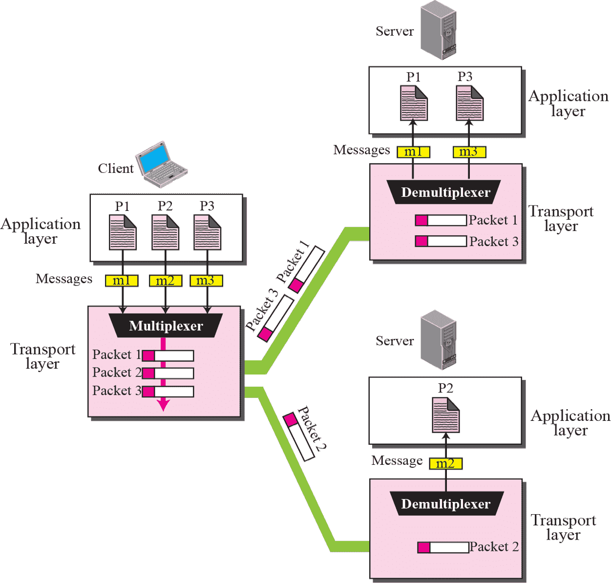
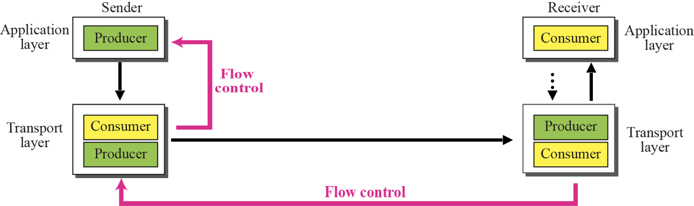
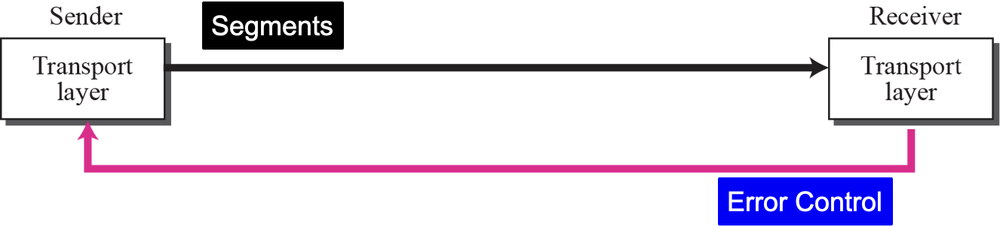
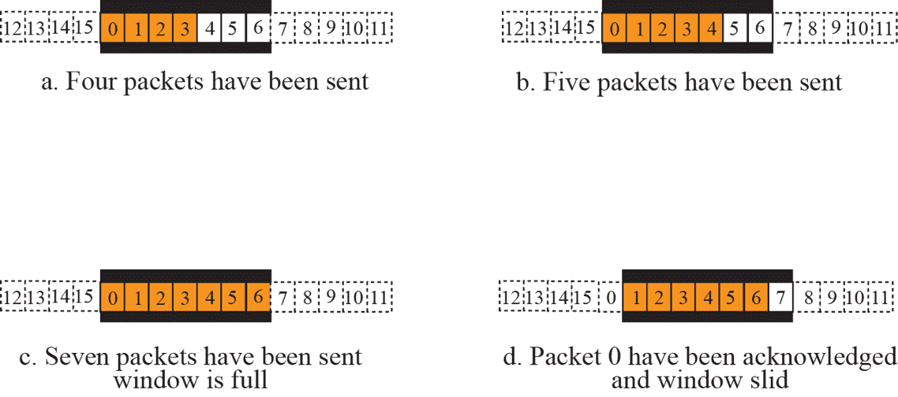
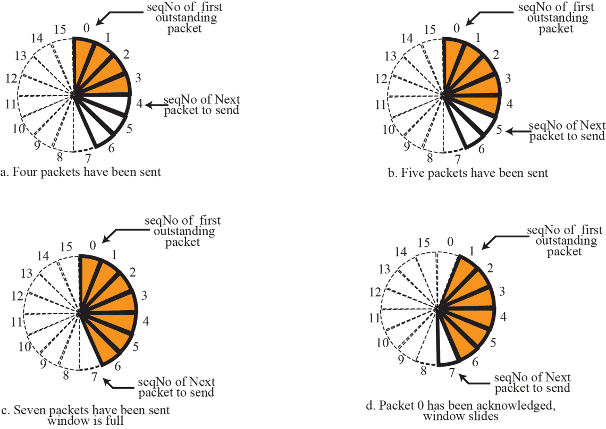

Transport Protocols run on end-devices

| TCP                                                        | UDP                                                          |
| ---------------------------------------------------------- | ------------------------------------------------------------ |
| Connection setup Congestion Control Flow Control |                                                              |
|                                                            | No-frills extension of best-effort IP Delay guarantees Bandwidth guarantees |

## Port Addressing

$[0, 65535]$

- Ephemeral (short-lived) port number
	- $\ge 1,023$
	- used for client
	
- Well-known port number
	- Universal port numbers
	- used for servers

## ICANN

Internet Corporation for Assigned Names and Numbers (ICANN) Ranges

- Well-known ports : 0 ~ 1,023
	- Assigned and controlled by ICANN
- Registered ports : 1,024 ~ 49,151
	- Not assigned and controlled by ICANN
  - Can be registered with ICANN to prevent duplication
- Dynamic ports : 49,152 ~ 65,535
	- Can be used as temporary or private port number

## Socket Address

Combination of IP & Port address

Eg: $200.23.56.8:69$

## Mux & Demux

| Multiplexing                                    | Demultiplexing                                |
| ----------------------------------------------- | --------------------------------------------- |
| Entity accepts items from  more than one source | Entity deliver items to more  than one source |
|                                                 |                                               |

## Delivery

Delivery of items from a producer to a consumer

	- Pushing : sender delivers items whenever they produced
	- Pulling : producer delivers the items after the consumer has requested

## Flow Control

Balance between production and consumption rates

A buffer is a set of memory locations that can hold packets at the sender and receiver

Normally we use two buffers for flow control

1. at sending transport layer
2. at receiving transport layer

## Error Control

1. Detect and discard corrupted segments
2. Keep track of lost and discarded segments and resend them
3. Recognize duplicate segments and discard them
4. Buffer out-of-order segments until the missing segments arrive

### Sequence Number

Each segment to holds a sequence number

Sequence Number helps decide 

- Which packet is to be resent
- Which packet is a duplicate
- Which packet has arrived out of order

Sequence numbers can be repeated

- $0, 1, 2, 3, 4, 5, 6, 7, 0, 1, 2, 3, 4, 5, 6, 7, 0, 1, \dots$

#### Sequence Number Limit

If the header of the frame allows $m$ bits for sequence number, the sequence numbers range from $0 \iff 2m – 1$

The values are modulo $2^m$
$$
\text{Final seq no} = \text{Actual Seq Number } \% \ 2^m
$$
For m = 3, sequence numbers are: 0, 1, 2, 3, 4, 5, 6, 7.

### Acknowledgement

The receiver side can send an acknowledgement for each or a collection of segments that have been received correctly

There can be +ve and -ve ack

## Combination of Flow & Error Control

Flow control requires the use of two buffers, one at the sender site and the other at the receiver site. 

The error control requires the use of sequence and acknowledgment numbers by both sides. 

These two requirements can be combined by using **two numbered buffers**, one at the sender, one at the receiver

### Sliding Window

| Linear Format                                                | Circular Format                                              |
| ------------------------------------------------------------ | ------------------------------------------------------------ |
|  |  |

## Incomplete

Some contributor, please complete using the ppt below
