Applications are the entities that communicate with each other to exchange services

To make any use of the Internet, application programs should run on the two endpoints of a network connection

- “*Client*” applications request service
- “*Server*” applications provide service

A socket is one end of an inter-process communication channel.

## Client Server Model

Many-to-One

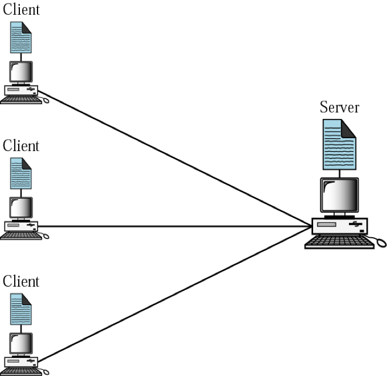

| Server                                                       | Client                                                       |
| ------------------------------------------------------------ | ------------------------------------------------------------ |
| Run all the time (i.e. infinite) Provide service to any client Usually specialize in providing certain type of service, e.g. Mail Listen to a well-known port and passively open connection. | Run when needed, then terminate (i.e. finite) Actively open TCP or UDP connection with Server’s socket |

- Client needs to know existence & address of server 
- However, the server does not need to know the existence or address of the client prior to the connection
- Once a connection is established, both sides can send and receive information

### Connection Establishment

- Both client and server will construct a socket
- The process to establish a socket on the client side is different from the process to establish a socket on the server side

## P2P (Peer-to-Peer) Model

Every node in the network acts alike

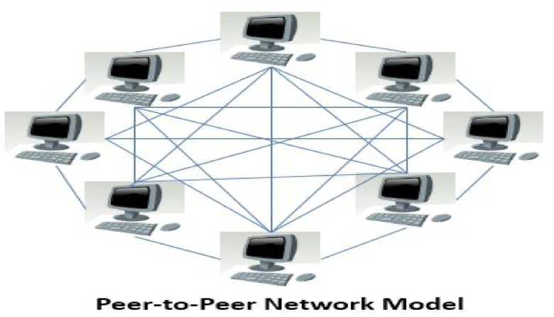

### Advantages

- No central point of failure
- Scalability

- Since every peer is alike, it is possible to add more peers to the system and scale to larger networks

### Disadvantages

- Decentralized coordination; How to keep global state consistent?
- All nodes may not be equal

  - Computing power
  - Bandwidth

## HTTP

HyperText Transfer Protocol

- HTTP 1.0: RFC 1945
- HTTP 1.1: RFC 2068 (persistent TCP)

Used for Client-Server model

- Client: Browser request & receive Web objects
- Server: Web server sends objects in response to requests

### Properties

- Uses TCP
  - 
- “Stateless”
  - A ‘state’ is information kept in memory
    of a host, server or router to reflect
    past events: such as routing tables,
    data structures or database entries
  - HTTP server maintains no information about past client requests
  - Protocols that maintain “state” are complex!
    - history (state) is maintained
    - if server/client crashes, views of “state” may be inconsistent, must be reconciled
    - state is added via ‘cookies’

### Steps

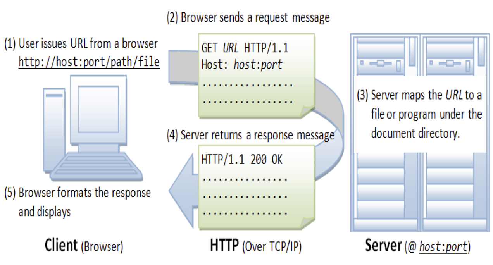

### Types

|                                                | Non-Persistent HTTP                                          | Persistent HTTP without Pipelining                           | Persistent HTTP with Pipelining                              |
| ---------------------------------------------- | ------------------------------------------------------------ | ------------------------------------------------------------ | ------------------------------------------------------------ |
| Max no of objects sent over TCP connection     | 1                                                            | Multiple                                                     | Multiple                                                     |
| Used in HTTP Version                           | HTTP/1.0                                                     |                                                              | HTTP/1.1                                                     |
| Categories                                     |                                                              |                                                              |                                                              |
| Steps                                          | 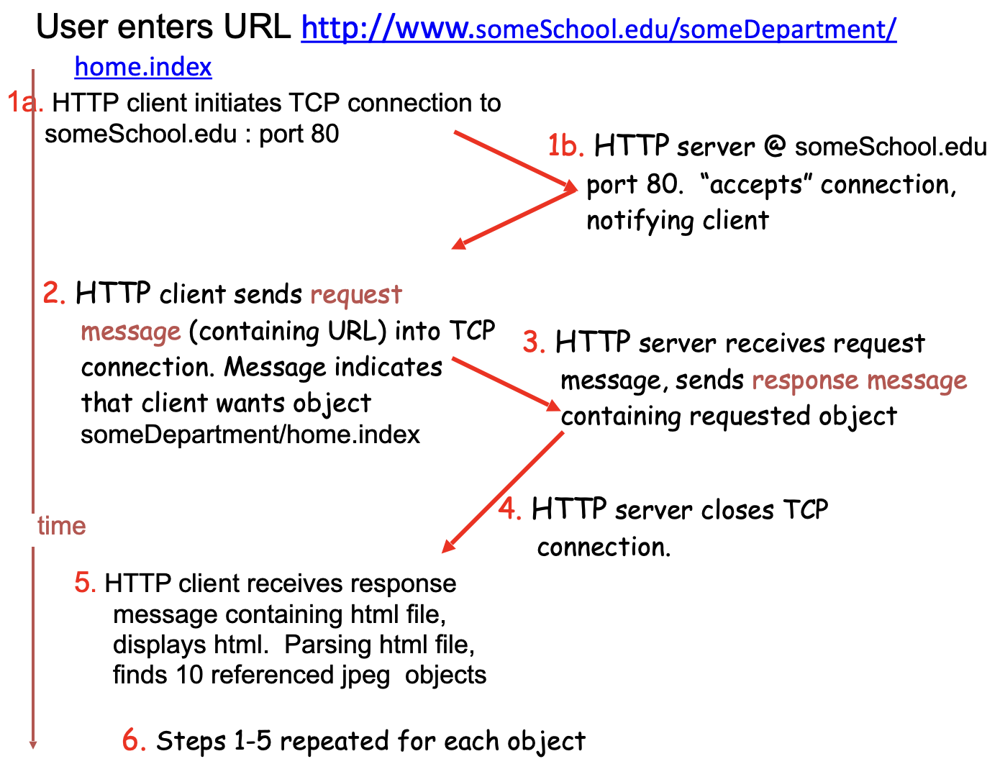 | Server leaves connection open after sending response Subsequent HTTP messages  between same client/server sent over open connection Client issues new request only when previous response has been received One RTT for each referenced object | Server leaves connection open after sending response Subsequent HTTP messages  between same client/server sent over open connection Client sends requests as soon as it encounters a referenced object 1 RTT for all referenced objects |
| Total Response Time ($n =$ no of objects) | $n (2 \ \text{RTT} + \text{Transmit Time})$ - one RTT to initiate TCP connection - one RTT for HTTP request & first few bytes of HTTP response to return - file transmission time | $n (1 \ \text{RTT} + \text{Transmit Time})$                  | $1 \ \text{RTT} + n(\text{Transmit Time})$                   |
| Disadvantages                                  | - requires 2 RTTs per object - OS overhead for each TCP connection - browsers often open parallel TCP connections to fetch referenced object | 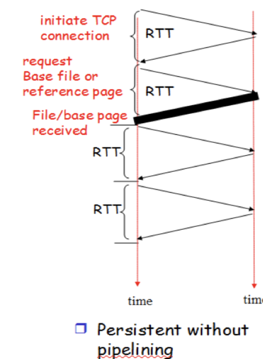 |  |

| Non-Persistent & Non-Parallel                                | Non-Persistent & Parallel                                    |
| ------------------------------------------------------------ | ------------------------------------------------------------ |
| 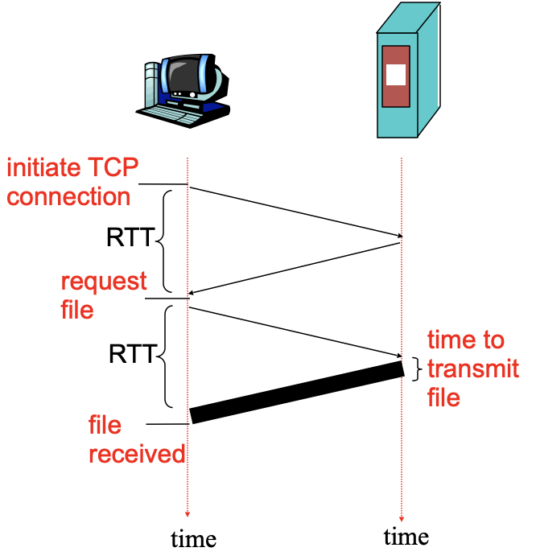 | 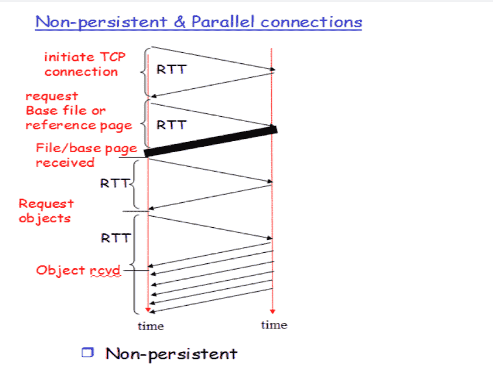 |

## HTTP Messages

|         | HTTP Request                                                 | HTTP Response                                                |
| ------- | ------------------------------------------------------------ | ------------------------------------------------------------ |
| Format  | 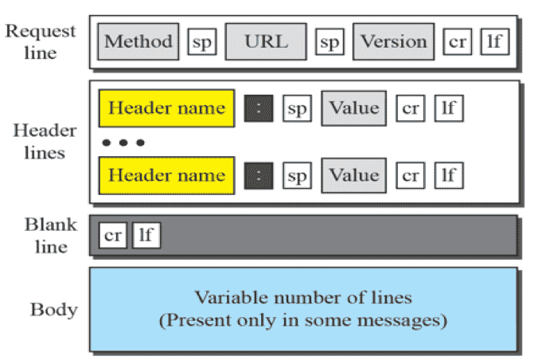 | 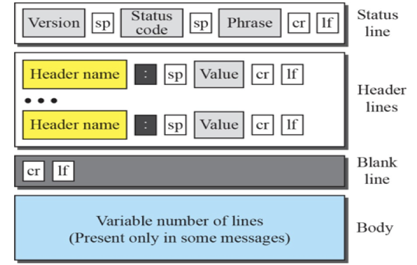 |
| Example | 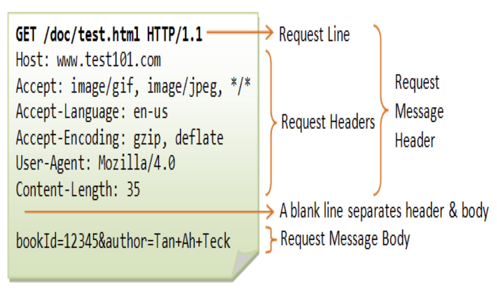 | 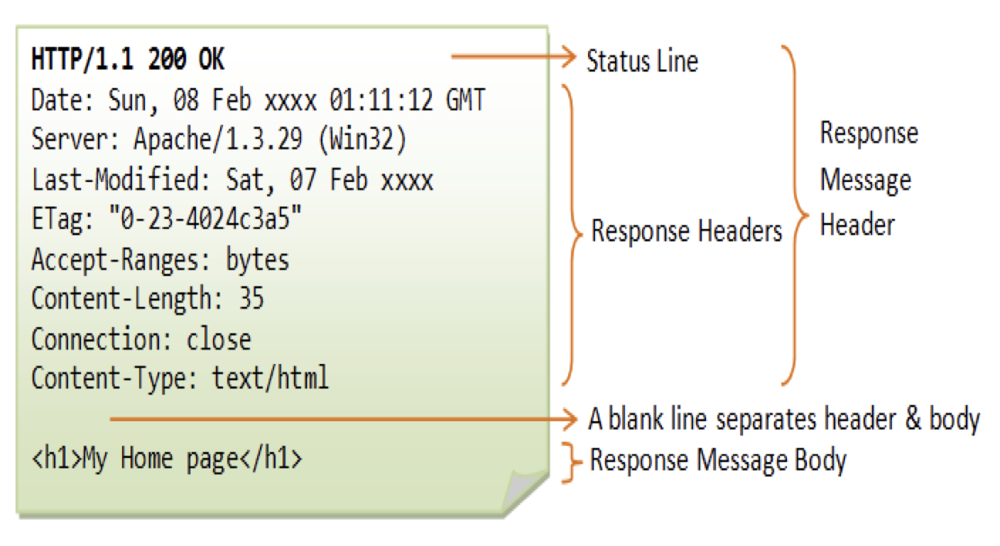 |

### Headers

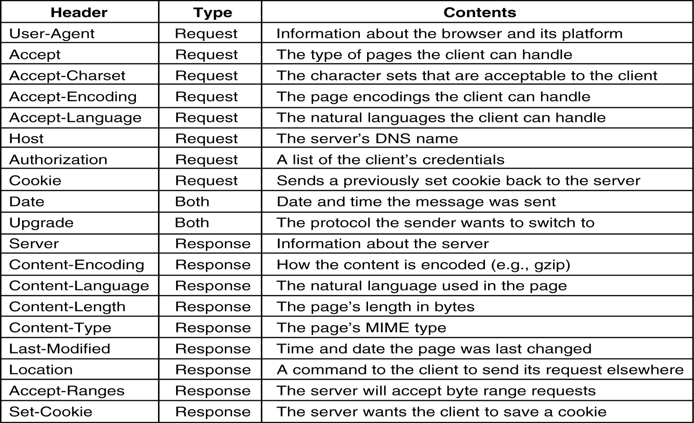

### Responses

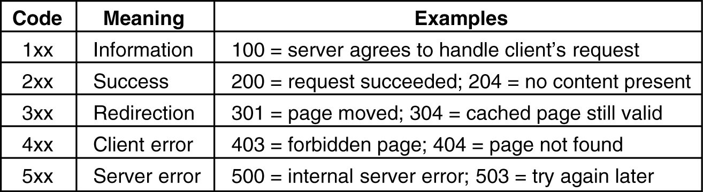

## HTTP Methods

