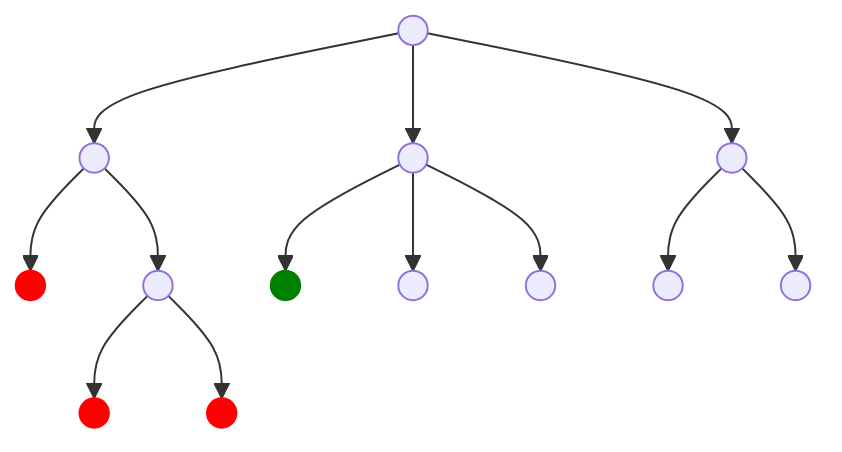
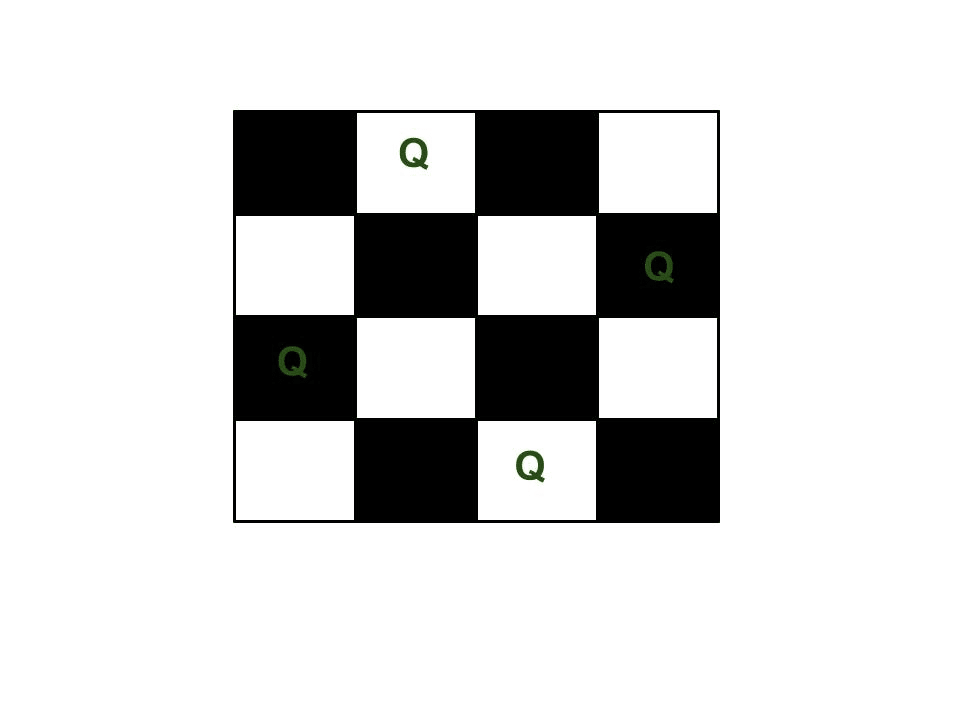
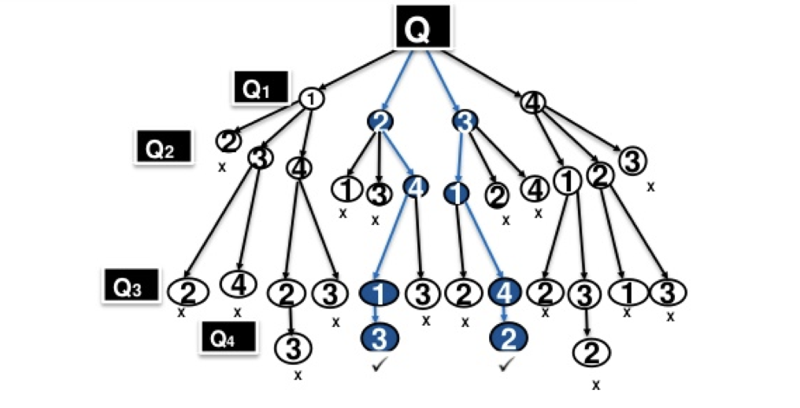
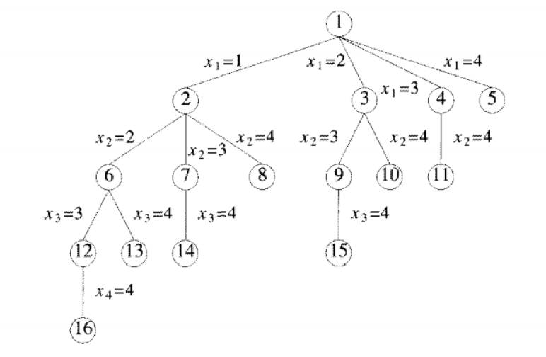
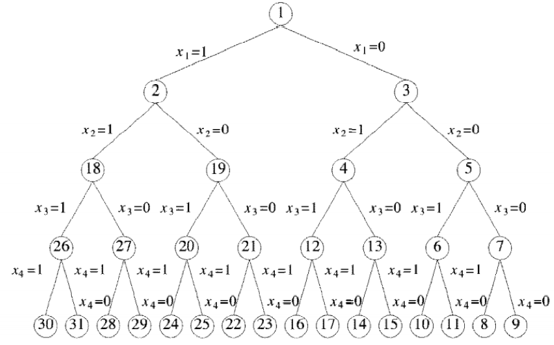

A general algorithm that

- incrementally builds candidates to the solutions
- backtracks/abandons candidate $c$ once it is found that $c$ cannot help attain valid solution

It is an important tool for solving constraint satisfaction problems, such as crosswords, verbal arithmetic, Sudoku, and many other puzzles.

## Types

- Find a path to success
- Find all paths to success
- Find the best path to success

## Pseudocode

```pseudocode
Backtrack(x)
	if x is not a solution
		return false
	if x is a new solution
		add to list of solutions
	
	backtrack(expand x)
```

## Terminology

| Term                               | Meaning                                                      |
| ---------------------------------- | ------------------------------------------------------------ |
| Problem State                      | Node in Depth-First Search Tree                              |
| State Space                        | Set of all paths from root $\to$ other nodes                 |
| Solution States                    | Problem states for which path from root node defines a tuple in solution space<br />In variable tuple size formulation tree, all nodes are solution states<br />In fixed tuple size formulation tree, only leaf nodes are solution states |
| Answer states                      | Solution states for which path from root defines a tuple that is a member of set of solutions<br />These states implicit constraints |
| State Space Tree                   | Tree organization of solution space                          |
| Static trees/<br />Fixed-Size      | Independent of problem instance being solved                 |
| Dynamic trees/<br />Variable-Sized | Dependent of problem instance being solved                   |
| Live node                          | Generated node whose all children have not been generated yet |
| E-Node                             | Live nodes whose children are currently being generated/explored |
| Dead node                          | Generated node that is not to be expanded any further        |
| Promising Node                     | Node can lead to feasible solution                           |
| Non-Promising Node                 | Node cannot lead to feasible solution                        |
| Pruned state space tree            | State space tree consisting of expanded nodes                |
|                                    |                                                              |

## Backtracking Tree Structure



## Sudoku

Obviously, the brute force approach would be randomly try all combinations of solutions, but the probability of getting the answer right in just a few attempts is very low, and hence, it is very computationally expensive.

## N Queens Problem

Place $n$ queen pieces on a chess board such that

- none of them can attack eachother
- no two queens in same row, same column or diagonal

### Steps

1. Each recursive call attempts to place a queen in a specific column.
2. For a given call, the state of the board from previous placements is known (i.e. where are the other queens?)
3. Current step backtracking: If a placement within the column does not lead to a solution, the queen is moved "down" the column (to the next row)
4. Previous step backtracking: When all rows in a column have been tried, the call terminates and backtracks to the previous call (in the previous column)
5. If a queen cannot be placed into column $i$, do not try to place one in column $(i+1)$, rather, backtrack to column $(i-1)$ and move the queen that had been placed there. Using this approach we can reduce the number of potential solutions even more

### Algorithm

| Clash    | Possible if                                                  |
| -------- | ------------------------------------------------------------ |
| Row      | Won’t happen cuz every iteration goes to next row implicitly |
| Column   | If a queen is placed in column i, no other queen is placed in the same column |
| Diagonal | If two queens are placed at positions $(i,j)$ and $(k,l)$, then they are on the same diagonal only if<br/>$\vert j – l\vert  = \vert i – k \vert$ |

```pseudocode
Algorithm NQueens(k, n)
{
	for i=1 to n
	{
		if Place(k, i)
		{
			x[k] = i
			if(k=n)
				write(x[1:n])
			else
				NQueens(k+1, n)
		}
	}
}

Algorithm Place(k, i)
{
	for j=1 to k-1
	{
		if (
			x[j] == i // same col
			or
			abs(x[j]-i) == abs(j-k) // diagonal
    )
    	return false
	}
	
	return true
}
```

### Time Complexity

| Approach                                                     | Complexity |
| ------------------------------------------------------------ | ---------- |
| Brute Force                                                  | $n^n$      |
| Refactored Brute Force<br />(modify to prevent from checking queens occupying same rows) | $n!$       |
| Backtracking                                                 | $2^n$      |

### 4x4 Example

Only has 2 solutions

- $(2, 4, 1, 3)$
- $(3, 1, 4, 2)$





where

- level 1, 2, 3, 4 correspond to queen 1, 2, 3, 4 respectively
- value at each node represents the position of the corresponding queen

## Sum of Subsets

From a given set, find subset of numbers whose sum adds up to a given number

Given n positive integers $\{w_1, \dots, w_n\}$ and a positive integer $S$. Find all subsets of $w1, \dots wn$ that sum to $S$. Let $\{x_1, x_2, x_3, \dots, x_n\}$ takes value either 0 or 1.

- If $x_i = 1$ then $w_i$ is chosen
- If $x_i=0$ then $wi$ is not chosen

### Using BFS

Edges from level $i$ nodes to level $i+1$ nodes are labeled with the value of $x_i$ which is either zero or one. 

All paths from the root to a leaf node define the solution space. 

The left subtree of the root defines all subsets containing $w_1$ while the right subtree defines all subsets not containing $w_1$ etc. 

Variable-Sized tree with 24 leaf nodes which represent 16 possible tuples.



### Using DFS

Solution states are the leaf nodes 

The state space tree organization described here will be called static/Fixed sized tees. 

The tree organizations are independent of the problem instance being solved. Either fixed sized or variable sized tree can be opted. 

For some problems it is advantageous to use different tree organizations for different problem instances



### Algorithm

```pseudocode
Algorithm SumOfSub(s, k, r)
{
	// generate left child
	x[k] = 1
	
	if s+w[k] == m
		write(x[1:k])
	
	else if s+w[k]+w[k+1] <= m
		SumOfSub(s+w[k], k+1, r-w[k])
	
	// generate right child
	if (
		s+r-w[k] >= m
		and
		s+w[k+1] <= m
	)
	{
		x[k] = 0
		SumOfSub(s, k+1, r-w[k])
	}
}
```

### Complexity

|              |                   |
| ------------ | ----------------- |
| Brute Force  | $2^n$             |
| Backtracking | $2^n$, but faster |

