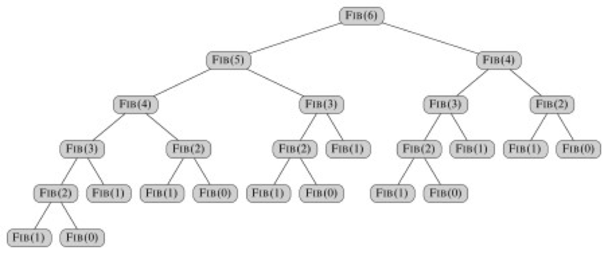
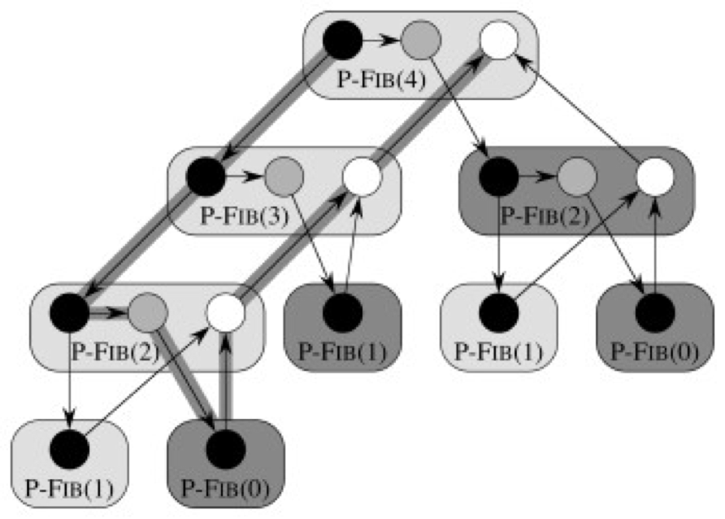
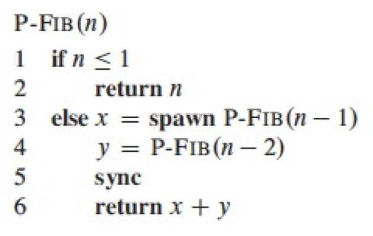

## Multi-Threading

Ability of a single core of a CPU to have concurrent threads of execution, supported by the OS

The threads share the resources of the single/multiple cores, including computing units, cache, and TLB (translation look-aside buffer)

### Real-Life Examples

- Web Browsers
  - Download multiple files at the same time
  - One website blocking downloads will not affect other downloads
- Web Servers
  - A thread web server handles each request with a new thread
  - There is a thread pool and each time a new request comes in, it is assigned to a thread from the thread pool

## Parallelization

Multi-threading a single algorithm so that some of its instructions can be executed simultaneously

This can be applied to scheduling & managing multiple algorithms, each running concurrently on their own threads and possibly sharing resources.

## Types of Multi-Threading

|                 | Static     | Dynamic                                                      |
| --------------- | ---------- | ------------------------------------------------------------ |
| Type of Control | Explicit   | Implicit                                                     |
| Real Control    | Programmer | Concurrency Platform<br />(maps concurrency opportunities specified by programmer to actual static threads) |
| Flexible        | ❌          | ✅                                                            |

## Dynamic Multi-Threading

| Keyword    | Meaning                                                      |
| ---------- | ------------------------------------------------------------ |
| `parallel` | Add to loop construct such as `for`<br />Indicates each iteration can be executed in parallel |
| `spawn`    | Create a parallel subprocess, then keep executing current process |
| `sync`     | Wait here until all active parallel threads created by this instance of the program finish |

`parallel` and `spawn` are not compulsory to be followed; they do not force parallelism, they just say that this is permissible. A scheduler will make the decision concerning allocation to processors.

However, if parallelism is used, sync must be respected. For safety, there is an explicit sync at the end of every procedure.

## Example: Fibonacci

```pseudocode
F(0) = 0
F(1) = 1
F(i) = F(i-1) + F(i-2), for i ≥ 2
```



### Non-Parallel

```pseudocode
fib(n):
	if n <= 1
		return n
	else
		x = fib(n-1)
		y = fib(n-2)
		return x + y
```

$$
\begin{aligned}
T(n)
&= T(n − 1) + T(n − 2) + \theta(1) \\
&= \theta(F_n)
\end{aligned}
$$

This grows exponentially, this is not very efficient.

### Parallel

```pseudocode
fib(n):
	if n <= 1
		return n
	else
		x = spawn fib(n-1)
		y = fib(n-2)
		sync
		return x + y
```

`sync` is required to avoid `x` and `y` getting summed before `x` is computed. Even if there wasn’t an explicitly-mentioned `sync`, every function does an implicit `sync` and then only terminates

## Modelling Dynamic Multi-Threading

Consider a computation DAG (Directed Acyclic Graph) $G=(V, E)$

- Vertices represent instructions/strand
  - A strand is a sequence of non-parallel instructions
  - A strand with multiple successors means that all but one of them must have spawned.
  - A strand with multiple predecessors means that they join at a sync statement.
- Edges represent dependencies between edges
  - $(u, v) \in E$ means $u$ must execute before $v$
    - This means that $u$ and $v$ are in series
  - All $(u, v) \not \in E$ means that they are $u$ and $v$ are logically parallel

We assume an ideal parallel computer with sequentially-consistent memory: it behaves as if instructions are executed sequentially in some full ordering consistent with orderings within each thread (consistent with partial-ordering of computation DAG)



Rounded rectangles are not part of the formal model, but they help organize the visualization by collecting together all strands for a given call

The colors are specific to this example and indicate the corresponding code: black indicates that the strand is for lines 1-3; grey for line 4; and white for lines 5-6


