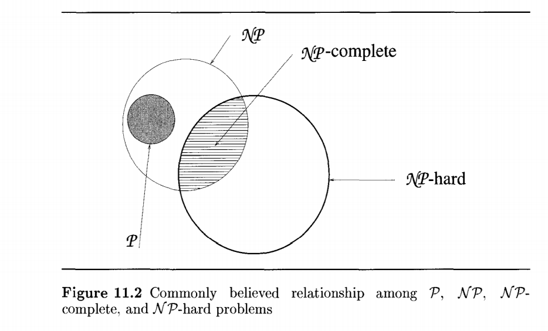
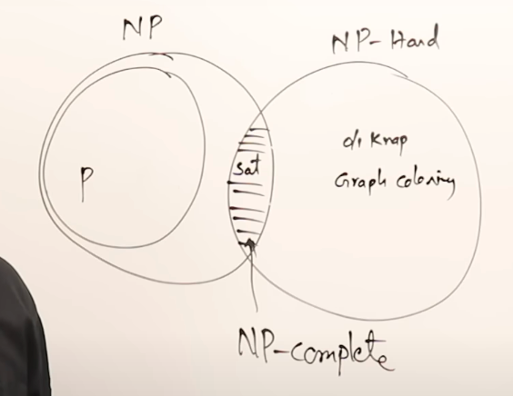

## Problems



|                                  | P             | NP                | NP Complete                                                  | NP Hard                                                      |
| -------------------------------- | ------------- | ----------------- | ------------------------------------------------------------ | ------------------------------------------------------------ |
| Can be solved using __ algorithm | Deterministic | Non-Deterministic | Non-Deterministic                                            | Non-Deterministic                                            |
| Time Complexity (Solving)        | Polynomial    | Exponential       | Exponential                                                  | Exponential                                                  |
| Time Complexity (Verification)   | Polynomial    | Polynomial        |                                                              | Exponential                                                  |
| Type of problem                  | Any           | Any               | Decision Problem                                             | Any                                                          |
| IDK                              |               |                   | Problem L  is NP Complete if<br />- L is in NP<br />- Every problem in NP is reducible to L in polynomial time |                                                              |
| Example                          |               |                   | Determination of hamiltonian cycle<br />Determination of satisfaction level of boolean formula | Circuit Satisfactory<br />Vertex Cover<br />Halting problems |



## Problem Properties

### Reducible

$L_1 \underset{\text{reduces to}}{\propto} L_2 \iff$ there is a way to solve $L_1$ using a deterministic algorithm that solves $L_2$ in polynomial time

This is transitive, ie, $L_1 \propto L_2, L_2 \propto L_3 \implies L_1 \propto L_3$

### Polynomially-Equivalent

$L_1$ and $L_2$ are polynomially-equivalent $\iff (L_1 \propto L_2) \land (L_2 \propto L_1)$

To show that a problem $L_2$ is NP-Hard, it is sufficient to show that $L_1 \propto L_2$, where $L_1$ is a problem already known to be NP-Hard.

Due to transitivity, if satisfiability $\propto L_1$ and $L_1 \propto L_2 \implies$ Satisfiability $\propto L_2$

To show that an NP-Hard decision problem is NP-Complete, we just need to find a polynomial time non-deterministic algorithm for it.

## P & NP Algorithms

| P Algorithm   | NP Algorithm                       |
| ------------- | ---------------------------------- |
| Deterministic | Non-Deterministic                  |
| Polynomial    | Polynomial                         |
|               | Used to solve exponential problems |

## Non-Deterministic Algorithms

|             |                                                   |
| ----------- | ------------------------------------------------- |
| `choice(S)` | Arbitrarily choose one of the elements in set $S$ |
| `failure()` | Signals unsuccessful completion                   |
| `success()` | Signals successful completion                     |

### Non-Deterministic Search Algorithm

```pseudocode
Algo Nsearch(a, n, key)
{
	c = Choice([1, n]);
	
	if (a[c] == key)
  	success()
	else
    failure();
}
```

### Non-Deterministic Sort of +ve integers

```pseudocode
Algo Nsort(a, n)

	for i=1 to n
		b[i] = 0
	
	// randomly place elements
	for i=1 to n
		c = choice([1, n])
		if b[c] != 0 // element already not there
			b[c] = a[i]
		else // element exists at same position
			failure()
			
	// verify order
	for i=1 to n
		if b[i] > b[i+1]
			failure()

	sucess()
```

### Non-Deterministic Binary Knapsack

```pseudocode
Algo NDBK(profits, weights, min_profit, max_weight)
	taken_profit = 0
	taken_weight = 0
	
	for i=1 to n do
		c = choice(0, 1)
		
		if c == 1 then
      taken_profit += profits[i]
      taken_weight += weights[i]
  
  if (
    (taken_profit >= min_profit) &&
    (taken_weight <= max_weight)
  )
  	success()
  else
  	failure()
```

### Clique Problem

A clique is complete subgraph of a given graph, ie, every node of the subgraph is connected to each other.

```pseudocode
Algo clique(a) // adjacency matrix
	s = [] // subgraph
	
	// randomly add elements
	for i=1 to a.length
		c = choice(0, 1)
		
		if c==1
			s.add(
				(i, j)
			)
	
	// verify subgraph
	for i=1 to a.length
		for j=1 to a.length
			i not connected to j then
				failure()
				
	success()
```

### Satisfiability

```pseudocode
Algo sat(E, n)
	for i=1 to n do
		x[i] = choice(false, true)
	
	if E(x[1], ..., x[n]) then
		success()
	else
		failure()
```

## NP-Hard Graph Problems

To prove that a problem $L_2$ is NP-hard

1. Pick a problem $L_1$ already known to be NP-hard
2. Show how to obtain (in polynomial deterministic time) an instance $I'$ of $L_2$ from any instance $I$ of $L_1$ such that from the solution of $I'$, we can determine (in polynomial deterministic time) the solution to instance $I$ of $L_1$
3. Conclude from 2. that $L_1 \propto L_2$
4. Conclude from 1 & 3 and transitivity that $L_2$ is NP-hard

### Clique Decision Problem


### Node Cover Decision Problem


### Chromatic Number Decision Problem


