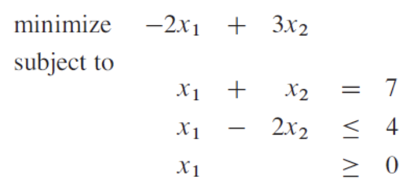
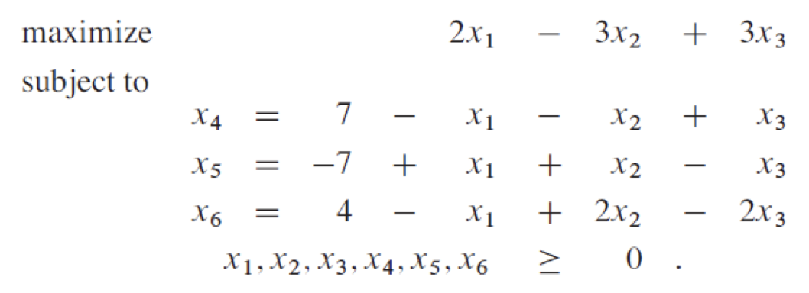

If we can specify the objective as a linear function of variables, and if we can specify the constraints on resources as equalities/inequalities, we have a linear programming problem

I already did optimization course, so I’ve skipped a lot.

## Conversions

- Convert from min problem to max problem
  - Negate the coefficients in objective function
- If some of the variables do not have $\ge 0$ constraints
  - Add $\ge 0$ constraints $x'_j > 0, x''_j > 0$
  - Replace $x_j \to x'_j - x''_j$
  - Replace $c_j x_j \to c_j x'_j - c_j x''_j$
  - Replace $a_{ij} x_j \to a_{ij} x'_j - a_{ij} x''_j$
  - Any feasible solution obtained corresponds to
    - $\bar x_j = \hat x'_j - \hat x''_j$
    - $\hat x'_j = \bar x_j, \hat x''_j = 0, \text{ if }\bar x_j \ge 0$
    - $\hat x''_j = \bar x_j, \hat x'_j = 0, \text{ if }\bar x_j \le 0$
- Convert constraint $\ge k \implies \le -k$
- Convert constraint $= k \implies \le k \ \& \ge k$
- Add slack

