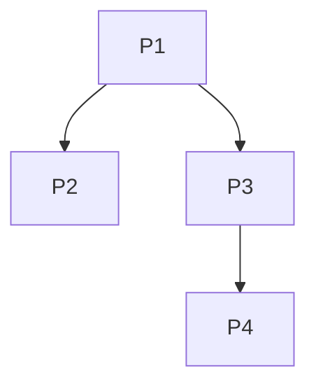
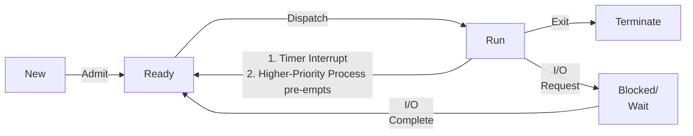
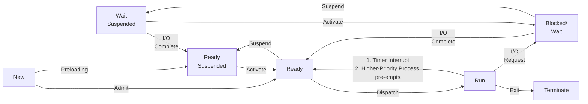
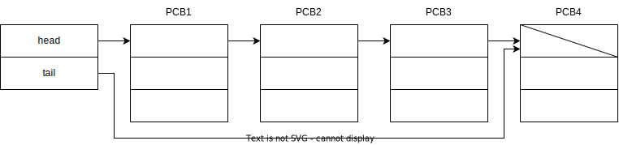
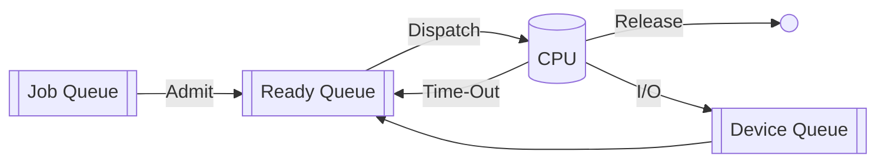

## Process

Program in execution

Smallest unit of work

### Types

- User processes
- System processes

### Example

#### Interpretations

- $P_1$ **spawns** $P_2$ and $P_3$, and is their **parent**
- $P_2$ and $P_3$ are **children** of $P_1$

## Program vs Process

|                         | Program     | Process                                    |
| ----------------------- | ----------- | ------------------------------------------ |
| Active?                 | ❌ (Passive) | ✅                                          |
| Requires resources?     | ❌           | ✅                                          |
| Segments required       | Text (Code) | Text (Code) Data Stack Heap |
| Type of memory required | Secondary   | Primary                                    |

## Registers

| Register                            | Pointer? | Stores                                        |
| ----------------------------------- | :------: | --------------------------------------------- |
| Base register                       |    ✅     | Starting address of process in Primary Memory |
| Limit register                      |          | Length of the process                         |
| Flag register                       |          |                                               |
| GPRs General purpose Registers |          |                                               |
| PC Program Counter             |    ✅     | Address of next instruction to be executed    |
| Index pointer                       |    ✅     |                                               |

## Memory Layout of a Process

| Segment | Stores                                                       |
| ------- | ------------------------------------------------------------ |
| Text    | Code                                                         |
| Data    | Global variables                                             |
| Stack   | - Function Calls - Return address arguments - Local variables |
| Heap    | - Dynamic data - Data structures in memory              |

## Process State Transition Diagram

### 5-State

In very early systems that didn’t have virtual memory

Jobs are picked by job scheduler and CPU scheduler

#### New $\to$ Ready

Promoting a program into a process has some work associated with it for the OS

- Creates PCB
- Address space

(I missed some points)

### 7-State (Virtual Memory)

Further explanation has been uploaded on LMS

Similar to 5-State, but has 2 more states

- Blocked suspended: Wait for I/O or event; kept in secondary memory
- Ready Suspended: Wait for CPU but kept in secondary memory

#### Equivalent Names

- Activate = Swap-in
- Suspend = Swap-out

#### Wait $\to$ Wait Suspended State

1. In case all processes are in wait state (let’s say all are waiting for I/O)
   1. OS shifts some waiting processes into **wait suspended queue** (in secondary memory)
   2. Then, the OS brings in programs from the Job Queue (in secondary memory), and loads them into primary memory.
2. There is ready and wait processes, but there isn’t enough primary memory available
   1. So the OS shifts some waiting processes into **wait suspended queue** (in secondary memory) to free up some primary memory

#### Run $\to$ Ready Suspended

- Processes in the ready or running state but are swapped out of main memory and placed in the disk 
- The process will transition back to ready state whenever the process is again brought onto the main memory

#### New $\to$ Ready

PCB address space

Just-in Time process

#### New $\to$ Ready Suspended

Pre-emptive computations are performed

PCB, address space are generated **before-hand**

Some designers think it is necessary, others argue otherwise

## PCB/TCB

Process/Task Control Block

It stores the [Context of a Process](#Context-of-a-Process)

Whenever CPU requires details on any process, it will refer to PCB

## Context of a Process

- State
- Process id $\to$ unique number
- PC
- Register Contents
    - Flag
    - Index Pointer
    - GPRs (General Purpose Registers)
- CPU Scheduling info
    - Priority no
    - Scheduling info
    - Pointer to scheduling queues
- Memory management info
    - Base register
    - Limit register
    - Virtual memory
    - Page Table, Segment Table
- Accounting info
    - Amt of CPU Time used
- I/O Info
    - I/O devices alloted
    - List of open file(s)

## Context Switching

Whenever there is a switch from one process to another, the OS

1. saves/stores the context of the previous process
2. loads/restores the context of the current process

The ‘process’ can be a program/interrupt service routine; this interrupt can be Maskable/Non-Maskable Interrupt

### Context-Switch Time

This is an overhead, as it is not ‘useful work’ and is just ‘book-keeping’.

Depends on

- architecture of the system
- amount of ‘context’ information that is required to be stored/loaded

## Process Scheduler

|                     | Job Scheduler                                                | CPU Scheduler                                | Mid-Term                              |
| ------------------- | ------------------------------------------------------------ | -------------------------------------------- | ------------------------------------- |
| Type                | Long-Term                                                    | Short-Term                                   | Medium-Term                           |
| Executing Frequency | $\downarrow$                                                 | $\uparrow$ (CPU Burst is faster)        |                                       |
| Task                | Selects processes to be loaded into Ready Queue              | Allocates process from ready queue $\to$ CPU | Swap-In Swap-Out                 |
| Goal                | Ensure good mix of CPU-Bound and I/O-Bound operations Controls degree of multi-programming | Ensure max CPU-utilization                   | **Modify** degree of multiprogramming |

### Medium Term Scheduler Flowchart

{ loading=lazy }
### Degree of multi-programming

No of programs kept in primary memory

### CPU-I/O Bound

| CPU-Bound                                | I/O-Bound                                         |
| ---------------------------------------- | ------------------------------------------------- |
| Process spends most of its time with CPU | Process spends most of its time in I/O operations |
| Short burst time                         | Long burst time                                   |

### Overhead %

% time spent on scheduling decision

$$
\begin{aligned}
&\text{Overhead} \% \\
&=
\frac{\text{Scheduling Decision Time}}{\text{Process Execution Time} + \text{Scheduling Decision Time}} \times 100 \%
\end{aligned}
$$

We want to minimize this.

## Queues

Each queue has queue header containing pointers to the first and last PCBs of list

### Job Queue

set of all processes in system

stored in secondary memory

{ loading=lazy }

### Ready Queue

Processes that are ready to execute

Stored in primary memory

### Device Queue

Set of processes waiting for I/O device

## Queuing Diagram

Represents queues, resources and the corresponding flows

Very similar to state transition diagram, but the focus is on the queues

