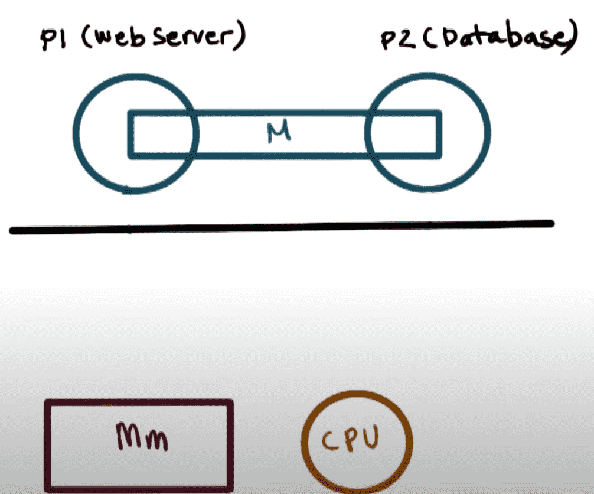

## Concurrent Programming

Making programs having cooperating processes that are set to achieve a common goal

## IPC

Inter-Process Communication

Transfer data/info between address space, while ensuring protection and isolation

| IPC                        | Meaning                                                      |                           Diagram                            | ✅<br />Advantage |     ❌<br />Disadvantage     |
| -------------------------- | ------------------------------------------------------------ | :----------------------------------------------------------: | :--------------: | :-------------------------: |
| Pipes<br />(Shared buffer) | - Exchange of messages<br />- Named pipes allow processes on different computers to communicate over the network |  |  OS in control   |          Overhead           |
| Shared Memory              | One process creates a portion of memory that another process accesses |  |   No overhead    | May require re-writing code |
| Message Queue              | Ordered list of memory segments where processes store and retrieve data |                                                              |                  |                             |
| Process Synchronization    | mutex lock<br />semaphore<br />monitors                      |                                                              |                  |                             |
| Files                      | - Parent process creates 2 files before forking child process<br />- Child inherits file descriptors from parent, and they share the file pointers<br />- Can use one for parent to write and child to read, other for child to write and parent to read |                                                              |                  |                             |

```bash
ipcs -a ## (linux only)
```

Lists all IPC facilities which has read access for the current process. It provides details abou message queue, semaphore, and shared memory.

Every IPC facility has unique key and identifier, which is used to identify an IPC facility.


## Thread

Basic unit of CPU utilization

### Components

- thread ID
- program counter
- stack
- set of registers

### Advantages of Multi-Threading

| Advantage        | Description                                                  |
| ---------------- | ------------------------------------------------------------ |
| Responsiveness   | One thread can provide response, while other threads are blocked/slowed down due to intensive operations |
| Resource-sharing | Multiple tasks can be performed in a single address space    |
| Economy          | Creating, managing, context-switching between multiple threads is faster than that of multiple processes |
| Scalability      | Utilization of multiprocessor architecture                   |

### Types of Threads

| Thread Type   | Description                                                  |
| ------------- | ------------------------------------------------------------ |
| User Thread   | Threads that application programmers put in programs<br />Without kernel support |
| Kernel Thread | Supported within kernel of OS                                |

In a specific implementation, user threads must be mapped to kernel threads

| User Thread $\to$ Kernel Thread Mapping | Example                                          |
| --------------------------------------- | ------------------------------------------------ |
| One $\to$ One                           | Windows 95 $\leftrightarrow$ Windows XP<br />DOS |
| Many $\to$ One                          | Word Processor Application                       |
| Many $\to$ Many                         | Linux<br />Solaris                               |

### Thread Libraries

Provide API for programmers to create and manage threads

May be implemented in

- user space: no kernel support
- kernel space: involves system calls, requires kernel with thread library support

3 present-day thread libraries

- POSIX Pthreads
- Win32 Threads
- Java Threads
  Implementation of threads depends on which OS and hardware the JVM (Java Virtual Machine) is running on, ie, Pthreads/Win32

## Critical Section Problem

|                  |                                                              |
| ---------------- | ------------------------------------------------------------ |
| Mutual Exclusion | Only one process can execute at a time in their critical section |
| Progress         | If no process is currently executing in their critical section, and one or more processes want to execute their critical section, then only the processes not in their remainder sections can participate in the decision, and the decision cannot be postponed indefinitely.<br />( i.e. processes cannot be blocked forever waiting to get into their critical sections. ) |
| Bounded Waiting  | Process requesting entry into their critical section will get a turn eventually, and there is a limit on how many other processes go first |

### Mutex Lock

```c
do {
	acquire_lock() // returns when it is safe for process to enter critical section
	
	critical section
	
	release_lock() // allow another process to acquire lock
	
	remainder section
} while(True);
```

```c
acquire_lock(){
	while(! available){
		// if not available, then keep waiting until available
		; // causes busy waiting to keep checking if available
	}
	
	// if available
	available = False;
}

release_lock(){
	available = True;
}
```

❌ Busy loop is used to block processes in the acquire phase. These types of locks are referred to as **spinlocks**, because the CPU just spins while blocking the process, thus wasting CPU cycles. This is especially bad on single-CPU single-threaded machines, as this blocks the entire computer, and does not allow any process to release the lock.

✅ Spinlocks do not have overhead of a context switch, so they are effectively used on multi-threaded machines, when it is expected that the lock will be released after a short time.

## Semaphores

Counters to control access to shared resources, used as a locking mechanism to prevent processes from accessing a particular resource while another process is performing operations on it.

Actually implemented as sets.

> Semaphore is actually an old railroad term, referring to the crossroad ‘arms’ that prevent cars from crossing the tracks at intersections.
>
> - If the semaphore is on (the arms are up), then a resource is available (cars may cross the tracks)
> - else (the arms are down), then resources are not available (the cars must wait) 

## Dining-Philosophers Problem

> Consider five philosophers sitting around a table, in which there are five chopsticks evenly distributed and an endless bowl of rice in the center, as shown in the diagram below. ( There is exactly one chopstick between each pair of dining philosophers. )These philosophers spend their lives alternating between two activities: eating and thinking.
>
> - When it is time for a philosopher to eat, it must first acquire two chopsticks - one from their left and one from their right.
> - When a philosopher thinks, it puts down both chopsticks in their original locations.


### Solution

Array of semaphores `chopsticks[0 ... (n-1)]`

Here, $n=5$

```c
do {
	wait(chopstick[i]);
	wait(chopstick[(i+1)%n]);
	
	// eat
	
	signal(chopstick[i]);
	signal(chopstick[(i+1)%n]);
	
	// think

} while(true);

void wait(s)
{
  s--;
}

void signal(s)
{
  s++;
}
```

❌ But suppose that all five philosophers get hungry at the same time, and each starts by picking up their left chopstick. They then look for their right chopstick, but because it is unavailable, they wait for it, forever, and eventually all the philosophers starve due to the resulting deadlock.

## Monitor

Monitor is a class in which

- all data is private
- only one method within any given monitor object may be active at a time.
- methods may only access the shared data within the monitor and any data passed to them as parameters, ie, they cannot access any data external to the monitor

```c
monitor Monitor_Name
{
  // shared variable declarations
  
  procedure P1(){;}
  procedure P2(){;}
  ...
  procedure Pn(){;}
  
  initialization_code(){;}
}
```

### Data Type `condition`

Variable `X` of type `condition` has only two legal operations

- `X.wait()`
    - Blocks a process until some other process calls `signal()`
    - adds the blocked process onto a list associated with that condition
- `X.signal()`
    - does nothing if there are no processes waiting on that condition
    - Otherwise, it wakes up exactly one process from the condition's list of waiting processes


### Disadvantage

If a process P within the monitor issues a `signal()` that would wake up process Q also within the monitor, then there would be two processes running simultaneously within the monitor, violating the exclusion requirement.

Solutions for this

- Signal and wait
  When process P issues the `signal()` to wake up process Q, P then `waits()`, either for Q to leave the monitor or on some other condition
- Signal and continue
  When P issues the `signal()`, Q `waits()`, either for P to exit the monitor or for some other condition.

## Dining Philosophers Solution using Monitors

Philosopher $i$ can set variable `state[i] = EATING` only if two neighbours are not eating

```c
cond = (
  (state[(i+4) % 5] != EATING) and
  (state[(i+1) % 5] != EATING)
)
```

### Full Implementation

```c
monitor DP
{ 
    status state[5]; 
    condition self[5]; 
  
    // Pickup chopsticks 
    Pickup(int i) 
    { 
        // indicate that I’m hungry 
        state[i] = hungry; 
  
        // set state to eating in test() 
        // only if my left and right neighbors  
        // are not eating 
        test(i); 
  
        // if unable to eat, wait to be signaled 
        if (state[i] != eating) 
            self[i].wait; 
    } 
  
    // Put down chopsticks 
    Putdown(int i) 
    { 
  
        // indicate that I’m thinking 
        state[i] = thinking; 
  
        // if right neighbor R=(i+1)%5 is hungry and 
        // both of R’s neighbors are not eating, 
        // set R’s state to eating and wake it up by  
        // signaling R’s CV 
        test((i + 1) % 5); 
        test((i + 4) % 5); 
    } 
  
    test(int i) 
    { 
  
        if (state[(i + 1) % 5] != eating 
            && state[(i + 4) % 5] != eating 
            && state[i] == hungry) { 
  
            // indicate that I’m eating 
            state[i] = eating; 
  
            // signal() has no effect during Pickup(), 
            // but is important to wake up waiting 
            // hungry philosophers during Putdown() 
            self[i].signal(); 
        } 
    } 
  
    init() 
    { 
      // Execution of Pickup(), Putdown() and test() 
      // are all mutually exclusive, 
      // i.e. only one at a time can be executing 
      for i = 0 to 4 
      { 
        // Verify that this monitor-based solution is 
        // deadlock free and mutually exclusive in that 
        // no 2 neighbors can eat simultaneously 
        state[i] = thinking; 
      }
    } 
} // end of monitor 
```

