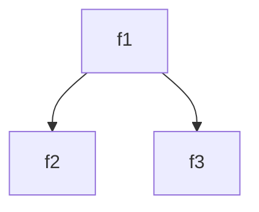

C mechanism to transfer control to any program point ==**higher**== in the current stack, ie, to go to a function that called the current function.

It is a form of ‘non-local goto’

For eg, if we have 3 functions `f1(), f2(), f3()`, such that `f1()` invokes `f2()` and `f3()`. The calling diagram will be represented as follows



| Direction of jump  | Long jump possible? |
| ------------------ | ------------------- |
| Higher $\to$ lower | ❌                   |
| Lower $\to$ Higher | ✅                   |
| Adjacent           | ❌                   |

## Requirements

|                         | Description                                                  | Returns                                                      |
| ----------------------- | ------------------------------------------------------------ | :----------------------------------------------------------- |
| `setjmp.h`              | Header file                                                  | N/A                                                          |
| `jmp_buf jb`            | Store ‘environment’ of return point.<br />It is a pointer to a structure.<br />Stores<br />- current register content<br />- stack pointer<br />- Program counter | N/A                                                          |
| `int setjmp(jb)`        | Set return point, by saving current state of program execution in `jb` | 0                                                            |
| `void longjmp(jb, val)` | Restores register context from jump buffer env<br/>Sets function’s return value register to `val`<br/>Jumps to the old PC value stored in jump buffer `jb` | It itself does not return anything, but<br />causes `setjmp()` to return |

$$
\text{longjmp}(jb, \textcolor{hotpink}{k}) 
\text{ causes setjmp to return} \\
\text{return val} = \begin{cases}
1, \textcolor{hotpink}{k} = 0 \\
k, \textcolor{hotpink}{k} \ne 0
\end{cases}
$$

## Example

```c
#include <stdio.h>
#include <longjmp.h>

jmp_buf jb;

void f1()
{
  printf("Entering f1()");
  
  f2();
  
  printf("Exiting f1()");
}

void f2()
{
  printf("Entering f2()");
  
  f3();
  
  printf("Exiting f2()");
}

void f3()
{
  printf("Entering f3()");

  longjmp(buf);
  
  printf("Exiting f3()");
}

void main()
{
  printf("Entering main() function");
  
  setjmp(jb);
  f1();
	
  printf("Exiting main() function");
}
```

### Output

```
Entering main() Function
Entering f1()
Entering f2()
Entering f3()
Exiting main() Function
```

Notice how the exiting and return statements of `f1(), f2(), f3()` are skipped.
