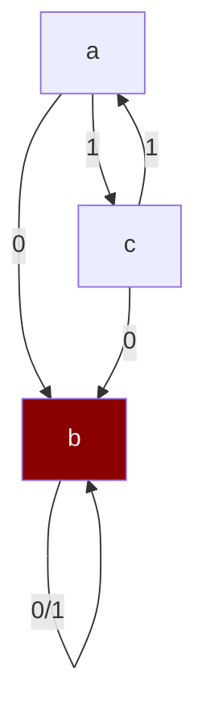

## Automator

| Symbol | Meaning                        | Description                                   |
| ------ | ------------------------------ | --------------------------------------------- |
| A      | Automator                      | State Machine (same as DD)               |
| FA     | Finite Automator               | Automator with finite no of states            |
| DFA    | Deterministic Finite Automator | FA where $\exists$ next state $\forall$ states |

States are the only mechanism for a FA to “remember” what it has seen of input string so far

## DFA

- Can have more than one accept state
- Start state can also be an accept state
- DFA accepts $\epsilon \iff$ start state is accepting state

| Notation                                                     | Meaning                |
| ------------------------------------------------------------ | ---------------------- |
| $\enclose{circle}{q_0}$                                      | State                  |
| $\overset{1}{\longrightarrow}$                               | Transition $\delta$    |
| $\enclose{circle}{q_0} \overset{1}{\longrightarrow} \enclose{circle}{q_1}$ | $\delta(q_0, 1) = q_1$ |
| $\enclose{circle}{\enclose{circle}{\ q_5 \ }}$               | Accepting State        |

| Symbol                                                       | Meaning                                                      |
| ------------------------------------------------------------ | ------------------------------------------------------------ |
| $Q$                                                          | Set of States                                                |
| $q_0$                                                        | Starting State                                               |
| $F$                                                          | Set of Final States                                          |
| $\Sigma$                                                     | Alphabet                                                     |
| $\begin{aligned} &\delta: Q \times \Sigma \to Q \\ & \delta(\text{Current State}, \text{Input}) \end{aligned}$ | State Transition Function                                    |
| $\begin{aligned} &\delta^*: Q \times \Sigma^* \to Q \\ & \delta(\text{Current State}, \text{Input}) \end{aligned}$ | Extended State Transition Function ==(Recursive traversal including $\epsilon$)== |

$$
\begin{aligned}
\delta (q, \epsilon) &= q \\
\delta^* (q, \epsilon) &= \{q, \ \dots\}
\end{aligned}
$$

DFA seen as 5-Tuple

$$
\text{DFA} = D(Q, \Sigma, \delta, q_0, F)
$$

## Language of a Machine

If $L$ is the set of all strings that machine $M$ accepts, then we say

- $M$ recognizes $L$
- $L$ is the language of machine $M$

### Notes

- Machine may accept several strings, but recognizes only one language
- If a machine accepts no strings, it still recognizes one language: empty language $\phi$

## Regular Language

A language $L$ is regular if it is recognized by some DFA $M$ $\implies L(M)= L$

Operations on a regular language gives another regular language(s)

### Closure Properties

Regular languages are closed under these operations

- $L1 \cup L2$
- $L1 \cap L2$
- $L1 - L2$

### Combination of Machines

Rather than deriving machines for everything, we can use the above operations to combine machines.

If

- $Q_1, Q_2$ are states of $M_1, M_2$
- $M_3$ is combined machine and $Q_3$ is the pair of states in $M_3$

Then

- For $L1 \cup L2 \to F_3 = [F_1 \times Q_2] \cup [F_2 \times Q_1]$
- For $L1 \cap L2 \to F_3 = F_1 \times F_2$
  Cross-Product of 2 DFA
- Max no of states in $Q_3$ is given by $|Q_3|_\max = |Q_1| \times |Q_2|$

## DFA-Decidable Decision Problem

A decision problem that is solveable by algorithm that

- takes input of string of length $n$
- uses constant amount of memory
- runs in exactly $n$ steps

## Regular Expression

Expression for which a FA exists, which can be used by a regular language.

## Dead State

Also called as Sink/Trap state

- Once a machine enters a dead state, there is no way out
- Remaining input are ignored
- Only has self loop
- The input string is rejected

In the following diagram, `b` is the deadstate

## Complement of DFA

- Accepting states $\to$ Non-Accepting states
- Non-Accepting states $\to$ Accepting states

$$
\begin{aligned}
L& \implies
M = ( Q, Σ, δ, q_0, F ) \\L'& \implies
M' = ( Q, Σ, δ, q_0, Q-F ) \\
\end{aligned}
$$

## Reversing a regular expression

Given a DFA

1. Reverse all arrows of transitions of the DFA
2. Swap the start state and accepting state
   If there are 2 start states, use $\epsilon$ transition
3. Convert NFA $\to$ DFA

## Grep

**G**et **re**gular ex**p**ression

utility for identifying regular expressions