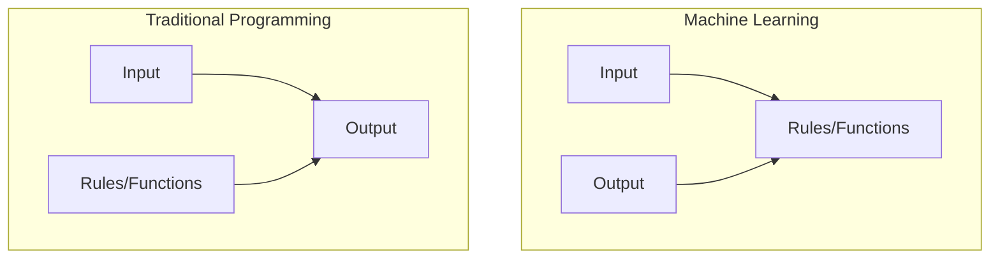
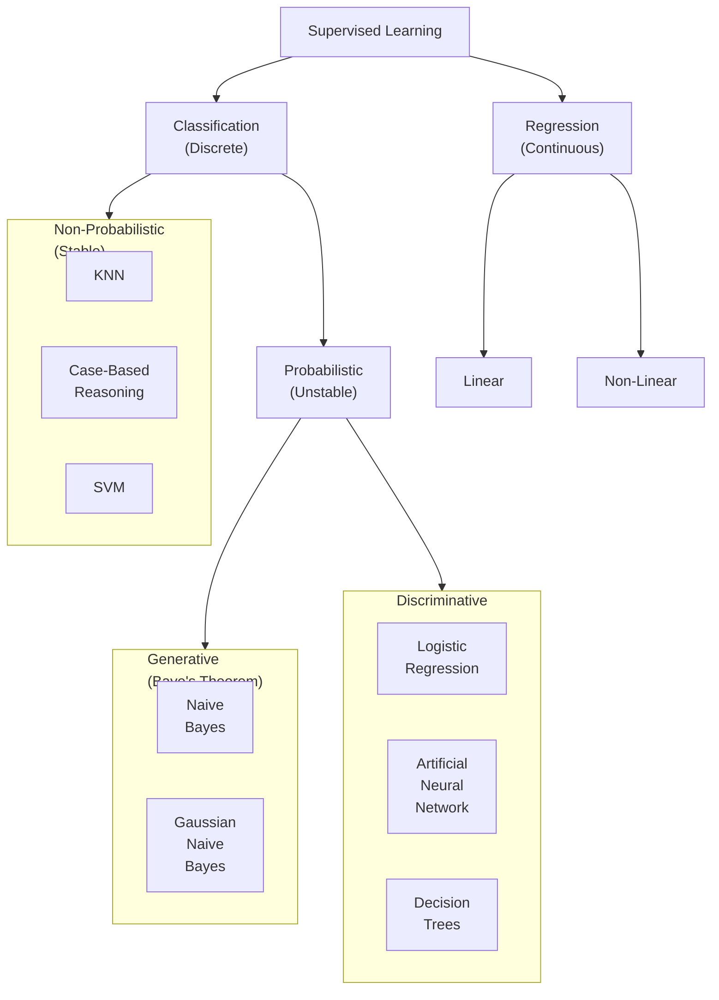

## Machine Learning

Subfield of pattern recognition and computational learning theory in artificial intelligence.

> Field of study that gives the oputer the ability to learn without being explicitly programmed
>
> ~ Arthur Samuel

> Computer program is said to learn from experience E with respect to some class of tasks T and performance measure P, if its performance at tasks in T, as measured by P, improves with experience E.
>
> ~ Tom Mitchell

> Machine Learning is programming computers to optimize a performance criterion using example data or past experience.
>
> ~ Ethem Alpyadin

## Why do we need ML?

To perform tasks which are easy for humans, but difficult to generate a computer program for it.

## Components of ML

### Data

Data can be structured/unstructured

Test-Training Split is usually 80-20

### Task

### Model

A functional mapping between input and output

#### Techniques

- Bias-Variance Tradeoff
- Regularization
- Overfitting

### Learning Algorithm

Gradient Descent

### Loss Function

- Mean Squared Error
- Root Mean Squared Error
- Cross-Entropy

### Evaluation

In sample testing

- Accuracy
- Precision
- Recall
- F1-Score

### Out of Sample Testing

## Supervised Learning

Uses labelled data, to derive a mapping between input examples and target variable.

### Regression

### Classification

Derived from regression

### Lazy/Instance-Based Learning

Store the training examples instead of lraning explicit desrcipiton of the target function.

Output of the learning algorith for a new instance not only depends on it, but also on its neighbors.

The best algorithm is KNN (K-Nearest Neighbor) Algorithm.

Useful for recommender system.

## Unsupervised Learning

### Clustering

Classification of unlabelled data

### Density Estimation

## Semi-Supervised Learning

There exists some amount of labelled data and large amount of unlabelled data. We can label the unlabelled data using the labelled data.

For example, **love** is labelled as emotion, but **lovely** isn’t

### Active Learning

Learning system is allowed to choose the data from which it learns.

There exists a human annotator.

Useful for gene expression/cancer classification

### Cotraining

### Semi-Supervised SVM

## Reinforcement Learning

**Agent** (machine getting trained) learns in realtime, from experience of interacting in the environment.

It is similar to a kid learning from experience.

Best algorithm is **Q-Learning algorithm**.

## Bayesian Learning

Conditional-probabilistic learning tool, where each observed training expmle can incrementally inc/dec the estimated probability that a hypothesis is correct.

Useful when there is chance of false positive.
For eg: Covid +ve

## Deep Learning

Contains neural network, where each neuron is a logistic regression model.

### Types of Neural Networks

- Feedforward
  No of neurons in intermediate layers is constant
- Recurrent
  Useful for time-series data
- Convolution
  Useful for image-based

## Multi-Dimensional Data

can be hard to work with as

- requires more computing power
- harder to interpret
- harder to visualize

### Feature Selection

### Dimension Reduction

Using Principal Component Analysis

Deriving simplified features from existing features

Easy example: using area instead of length and breadth.
