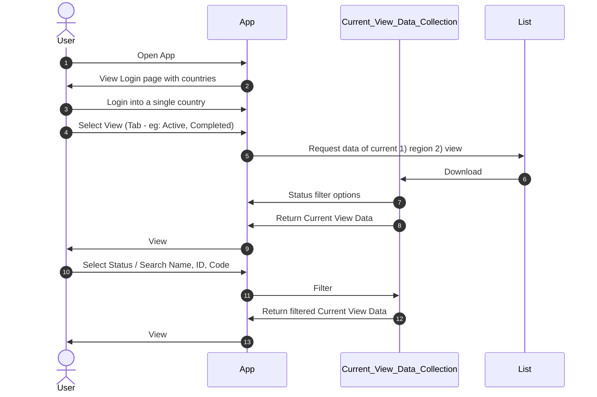
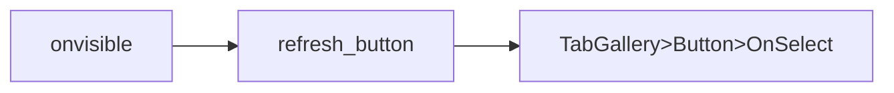
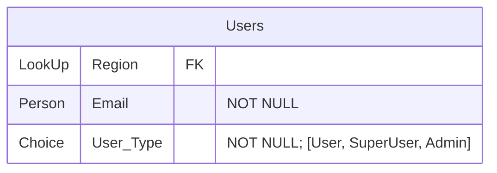

# PowerApps Best Practices

This is the document with the codes complementing my presentation. Kindly refer to the presentation for all the visuals.

Kindly check out https://uni-notes.netlify.app/Tools/PowerPlatform/ for my open-source collection of notes for the entire collection of my learnings.

[toc]

## Best Practices: User Journey

### Color Scheme

Reckitt Secondary Blue using Reckitt Brand Guidelines

|                                                    | Color Code     |
| -------------------------------------------------- | -------------- |
| **Twilight Blue**<br />(Reckitt’s Secondary Color) | R0 G88 B170    |
| **Grey**                                           | R250 G250 B250 |

### Interface

- Minimal elements
- Use primary & secondary color selectively
- Use font-weights (bold, regular, thin) appropriately
- Use icons wherever possible

### Filters

Compromise between flexibility and simplicity

- Too many controls will be confusing
- Too few controls would be inflexible

We usually have

- 1 person filter
- 1 status/choice filter
- Fuzzy search

### Fuzzy Search

Fuzzy search only works for collections! Use the performance tips below to optimize the loading of data from datasource into collections.

```javascript
// <- or operation of search strings
true in ForAll()

// <- and operation of search strings
Not(false in ForAll())
```

```javascript
Filter(
  collection_name,
  If(
    Not(false in ForAll( // <- and: match all substrings
      Split(
        Trim(Search_Input.Text),
        " "
      ) As substring,
      true in ForAll( // <- or: match any column
        [
          Col1,
      		Col2,
      		Col3
        ] As column, // columns to search
        substring.Value in Substitute(column, " ", "")
    		// Use substring.Value.Value for choice columns
    )
    )),
    true,
    false
  )
)
```

### Deep Linking

#### `App.Onvisible`

```js
Set(
    param_item_id,
    Param("item_id")
);
If(
  !IsBlank(param_item_id),
	Set(
    selected_stability_code,
    param_item_id
  );
	Select(go_to_manage_item);
)
```

#### `go_to_manage_item` button

Create a button to do the navigation, because PowerApp does not allow `Navigate()` in onvisible

```js
Navigate('Screen_to_Manage_Item');
```

#### Generate Link

```
https://<applink>?param1=value1&param2=value2&param3=value3
```

For example,

```
https://<applink>?item_id=100
```

## Best Practices: Data Quality

No code associated here. Just a matter of using best database principles.

Kindly refer to the video.

## Performance

### Loading animations

1. Add image
2. Set its visibility as `data_loading`

### Loading Data

Try to do as much as possible on the server-side. ‘Lazily load’ only what is required in the current tab onto local collection for repeated operations, such as fuzzy search.





`TabGallery>Button>OnSelect`

```javascript
Set(
    data_loading,
    true
); // this is for toggling any loading animations you have
Set(
    new_tab_selected,
    ThisItem.ID
);
If(
    new_tab_selected = varTabSelected,
    Blank(),
    Reset(Status_Dropdown)
);
Set(
    varTabSelected,
    new_tab_selected
);
// repetition of filter() is required to overcome delegation issue
ClearCollect( // non-delegable
    current_view_data,
    Switch( // non-delegable
      varTabSelected,
      1,
      Filter(
        my_list,
        Region.Value = country,
        Status.Value = "Active"
      ),
      2,
      Filter(
        current_region_data,
        Region.Value = country,
        Status.Value = "Cancelled"
      )
    )
);
Set(
    data_loading,
    false
);
```

`Refresh` Button

```javascript
Select(
    Tab,
    varTabSelected,
    Tab_Button
);
```

### Getting a single row

Use `Lookup` instead of `First(Filter())`

- `Lookup` is delegable, `First(Filter())` is non-delegable
- `Lookup` will stop at first match, `First(Filter())` will search the entire data even after first match and then return the first

## Permissions

### Requirement


| Role       | Access                                                       |
| ---------- | ------------------------------------------------------------ |
| Owners     | Should have full-control                                     |
| Superusers | Should have privileged control over the items, but cannot access the backend |
| Users      | Can only access the app                                      |
| No access  | No access                                                    |

### Solution

#### Maintain SharePoint List



#### SharePoint Permissions

1. Go to site permissions
2. Advanced permission settings
3. Create permissions group and give permissions according to the below
4. Create custom permission levels according to the below

| Role       | Sharepoint Permission Level | List Permission Level |
| ---------- | --------------------------- | --------------------- |
| Owners     | Full-control                | Full-control          |
| Superusers | Contribute (Custom)         | Contribute (Custom)   |
| Users      | Read (Custom)               | Contribute (Custom)   |
| No access  | No access                   | No access             |


| Level             | Steps                                                        |
| ----------------- | ------------------------------------------------------------ |
| Custom Read       | Read access permission level with only `Open  -  Allows users to open a Web site, list, or folder in order to access items inside that container.` |
| Custom Contribute | Contribute access permission level with <br />1. `Add Items  -  Add items to lists and add documents to document libraries.` <br />2. `Edit Items  -  Edit items in lists, edit documents in document libraries, and customize Web Part Pages in document libraries.` <br />3. `View Items  -  View items in lists and documents in document libraries.` <br />4. `View Pages  -  View pages in a Web site.` <br />5. `Open  -  Allows users to open a Web site, list, or folder in order to access items inside that container.` |

#### Trick to do this faster

- First, edit the permission of the new group `Users` to `Custom Contribute`

- Then go to each list’s settings and specify do not inherit from parent

- Come back to site settings, and edit the permission to `Read`

- Add `Everyone but external users` to `Users`

  - Do this last to avoid any accidental access

- This way you don't have to edit list settings each time, only the site settings :)
