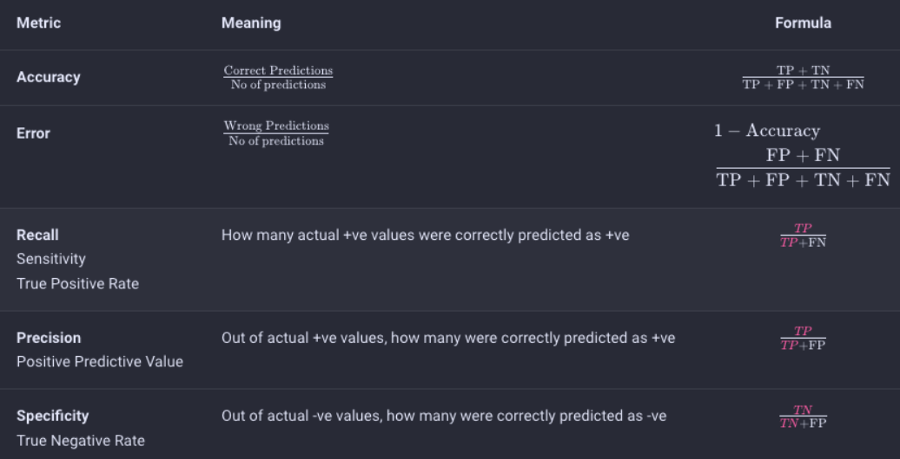

# 📝 Contributing

Welcome to our open-source project! We love your input! We want to make contributing to this project as easy and transparent as possible, whether it's:

- Reporting a Bug
- Discussing the Current State of the Code
- Submitting a Fix
- Proposing New Features
- Becoming a Moderator

We appreciate your interest in contributing to our repository. Before you get started, please take a moment to review the guidelines below.

## 🚀 Guidelines

1. Fork the repository and clone it locally.
2. Create a new branch for your changes.
3. Make your changes and test them locally. All notes must be in markdown only. If you're not familiar with markdown, please refer to [this](https://gdscbpdc.github.io/2022-2023/02_Markdown/).
4. If you're fixing a bug, please include a test case that demonstrates the bug.
5. Submit a pull request (PR) to the `main` branch of the original repository. All pull requests must address an issue. Write clear and concise commit messages and pull request descriptions.
6. Your PR will be reviewed by a moderator. If there are any requested changes, make them and push them to your branch, and your PR will be updated automatically.
7. Once your changes are approved and merged, you can delete your branch.

## 🤔 Issues and Feature Requests

If you find a bug or have a feature request, please open an issue in the repository. Please provide a clear and concise description of the issue or request, and include any relevant information, such as error messages or steps to reproduce.

## Want to introduce new course? 🤩

1. Navigate to docs > *relevant folder the course belongs to*
2. Click on *Add file*
3. On the text field for the file name, first write the course name you want to introduce
4. Then type `/`. This creates a new folder
5. You can add more folders similarly
6. Finally, give the new file a name (for example, `Topic.md` (Do not forget the file extension))
7. Finally, click *Commit changes*.

## 💡 Additional Tips

- Use tables over lists whenever possible. This helps in grouping related concepts.

- Use mermaid flowcharts to simplify processes, flows, trees. 

- Use LaTeX for mathematical/scientifical expressions. (Blurry images are not cool 😔👎)

$$
\int x^2 = \frac{x^3}{3}
$$

## ⚖️ License

By contributing, you agree that your contributions will be licensed under Open Software License 3.0.

Check the license [here](https://github.com/uni-notes/uni-notes/blob/main/license)

## 👋 Conclusion

We welcome contributions from everyone, and we appreciate your help in making our project better. Thank you for your support!
