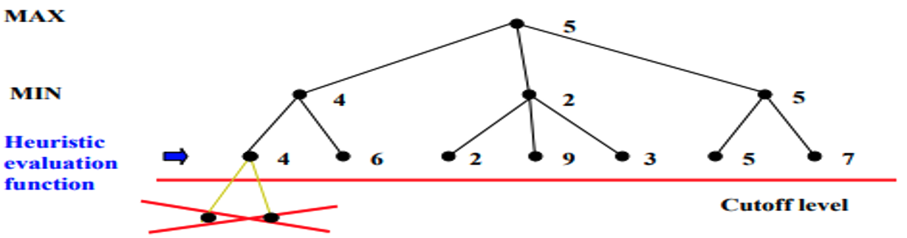

# Adversarial Search

Also called as Game Playing

## Game

A game can be defined as a type of search in AI which can be formalized of the following elements

1. Initial state
2. Terminal state
2. Player$(s)$
3. Action$(s)$
4. Result$(s, a)$ - It is the transition model, which specifies the result of moves in the state space.
5. Terminal-Test$(s)$ - Terminal test is true if the game is over, else it is false at any case. 
6. Utility$(s, p)$ - A utility function gives the final numeric value for a game that ends in terminal states $s$ for player $p$.

A game tree is a tree where nodes of the tree are the game states and Edges of the tree are the moves by players. Game tree involves initial state, actions function, and result Function.

## Types of Games

|       | Deterministic | Non-Deterministic (Chance/Randomness) |
| ----- | -------- | -------- |
| Fully Observable |        Chess  |       Monopoly   |
| Partially Observable |      Battleship    |       Card games   |

## Zero Sum game

- In Zero-sum game each agent's gain or loss of utility is exactly balanced by the losses or gains of utility of another agent.
- One player of the game tries to maximize one single value, while other player tries to minimize it.
- Examples are tic tac toe and chess.

## Mini-Max Algorithm

Algo to determine optimal moves for utility maximizing agent in fully-observable, deterministic games

Min-max is complete and optimal

### Assumption

Opponent behaves optimally, ie always perform the move that is worst for us

### Logic

- Utility of each node is computed bottom up from leaves toward root. 
- At each MAX node, pick move w/ max utility
- At each MIN node, pick move w/ min utility

### Limitations

Really expensive for trees with large branding factor (complex games such as Chess, Go)

Complexity = $O(b^m)$

Can be overcome with $\alpha \beta$ Pruning

## $\alpha \beta$ Pruning

Alpha Beta Pruning

- Optimized mini-max
- Form of meta-reasoning
- Used to reduce branching factor, hence handles complex games as well 
- Maintain two parameters in depth-first search
  - $\alpha =$ highest value found yet for MAX along any path
    - $\alpha_\text{root} = - \infty$

  - $\beta =$ lowest value found yet for MIN along any path
    - $\beta_\text{root} = + \infty$

- Prune (skip) a subtree once it is known to be worse than current $\alpha$ or $\beta$
- If $\alpha > \beta$, stop evaluating children

### Implications

- Solution does not change
- Complexity = $O(b^{m/2})$

## Cut-off Search

- Cutoff search tree before terminal state reached
- Use heuristic of minimax value at leaves, instead of utility

## Deep Blue

- Minimax
- $\alpha\beta$ pruning
- Progressive deepening
- Parallel computing
- uneven tree development

14-16 levels deep

