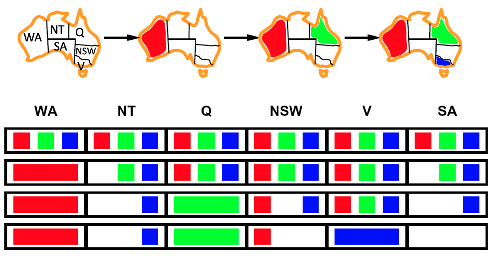

# Constraint Satisfaction Problem

Identification problem: These are problems in which we must simply identify whether a state is a goal state or not

- State is defined by
  - Variables $X_i$
  - with values from Domain $D$

- Goal test is a set of constraints

CSPs are represented as constraint graphs, where nodes represent variables and edges represent constraints between them.

## Constraints

| Type     | Example                                      |
| -------- | -------------------------------------------- |
| Implicit | A $\ne$ B                                    |
| Explicit | (A, B) $\in$ { (red, green), (red, blue), …} |

## Graph Coloring

| Problem                          | Contraint Graph                      |
| -------------------------------- | ------------------------------------ |
|  |  |

|             |                          |
| ----------- | ------------------------ |
| Variables   | WA, NT, Q, NSW, SA, V, T |
| Domain      | {Red, Green, Blue}       |
| Constraints | WA $\ne$ NT …       |

## N-Queens

|             | Formulation 1                                                | Formulation 2                                                |
| ----------- | ------------------------------------------------------------ | ------------------------------------------------------------ |
| Variables   | $X_{ij}$                                                     | $Q_k$                                                        |
| Domain      | $\{ 0, 1 \}$                                                 | $\{ 1, 2, \dots, N \}$                                       |
| Constraints | $\sum_{i, j} X_{ij} = N$  | Implicit: $\forall i, j$: non threatening $(Q_i, Q_j)$ Explicit: $(Q, _1, Q_2) \in \{ (1, 3), (1, 4), \dots \}$ |

## IDK

- Binary CSP: Each constraint relates at most 2 variables
- Binary constraint graph: nodes are variables, arcs show constraints

## Cryptarithmetic

|             |                    |
| ----------- | ------------------ |
| Variables   |                    |
| Domain      | $[0, 9]$           |
| Constraints | alldiff(variables) |

## Sudoku

|             |                                                              |
| ----------- | ------------------------------------------------------------ |
| Variables   | $X_{ij}$                                                     |
| Domain      | $[1, 9]$                                                     |
| Constraints | 9-way all diff for each column 9-way all diff for each row 9-way all diff for each sub-grid |

## Types

| Variable Type | Domain   |                                              | Examples               |
| ------------- | -------- | -------------------------------------------- | ---------------------- |
| Discrete      | Finite   | Size $d$ means $O(d^n)$ complete assignments | Boolean satisfiability (np-complete) |
|               | Infinite (integers, strings) |  | Job Scheduling (Vars are start/end times for each job) Linear constraints solvable Non-linear undecidable |
| Continuous    |          | Linear constraints solvable in polynomial time by LP methods | Start/end times for Hubble telescope observations |

### Constraints

| Variety      |                 | Example                            |
| ------------ | --------------- | ---------------------------------- |
| Unary        | Single variable | SA $\ne$ Green                     |
| Binary       | Pairs           | SA $\ne$ WA                        |
| Higher-Order |                 | Cryptarithmetic column constraints |

| Enforcement        |                                                              | Example               |
| ------------------ | ------------------------------------------------------------ | --------------------- |
| Soft (Preferences) | Represented by cost for each var assignment Gives constrained optimization problems | Red better than green |
| Hard               |                                                              |                       |

## Standard Search Formulation

States are defined by the values assigned so far (partial assignments)

- Initial state: Empty assignment
- Successor function: assign value to unassigned variable
- Goal test: current assignment is complete and satisfies all constraints

## IDK

## Backtracking Search

Backtracking = DFS + variable-ordering + fail-on-violation

Assumption: assignments are commutative (order of assignment doesn’t matter)

1. Fix an ordering for variables, and select values for variables in this order
2. Consider assignments to a single var at each step
3. Check constraints on the go
   - When selecting values for a variable, only select values that don’t conflict with any previously assigned values
   - If no such values exist, backtrack and return to the previous variable, changing its value

Can solve n-queens for $n \le 25$

## Filtering/Pruning

To improve performance, we consider filtering which checks if we can prune the domain of unassigned variables ahead of time. 

To improve performance, we can prune subtrees that will inevitably lead to failure

### Forward Checking

- Whenever a new variable is assigned, we can run forward checking and prune the domains of unassigned variables adjacent to the newly assigned variable in the constraint graph.
- Basically we eliminate all the values from the domain of the adjacent variables which could cause violation of any constraint.

This propagates info from assigned to unassigned vars, but doesn’t provide early detection for all failures

Time Complexity: $O(n^2 d^3)$

### Arc Consistency

An arc $X \to Y$ is consistent $\iff \forall x$ in the tail, $\exists y$ in the head which could be assigned without violating a constraint

- Forward checking only enforces consistency of arcs pointing to each new assignment
- More advanced: If $X$ loses a value, neighbors of $X$ need to be rechecked
- Arc consistency detects failure earlier than forward checking
- Can be run as a pre/post-processing step for each assignment

Note: delete from tail

Time Complexity: $O(n^2 d^2)$

But detecting all possible future problems is np-hard

#### Limitations

- After enforcing arc consistency
  - Can have one solution left
  - Can have multiple solutions left
  - Can have no solutions left (and not know about it)
- Arc consistency still runs inside a backtracking search

#### AC3 Algorithm

1. Turn each binary constraint represented as undirected edge into 2 directed arcs

   Eg

   - $A \ne B \implies A \ne B, B \ne A$
   - $A < B \implies A < B, B > A$

2. Add all arcs to agenda $Q$

3. Repeat until $Q$ empty

   1. Take an arc $(X_i, X_j)$ off $Q$ and check it
   2. $\forall X_i , \exists X_j$: For every element of $X_i$ there should be at least one element of $X_j$ that satisfies condition 
   3. Remove any inconsistent values from $X_i$
   4. if $X_i$ has changed, add all arcs of the form $(X_k, X_i)$ to agenda
      1. If arc $X_k \rightarrow X_i$ is already in $Q$, don't add it again

#### Ordering

| Ordering                                        |                                                              | Disadvantage                               |
| ----------------------------------------------- | ------------------------------------------------------------ | ------------------------------------------ |
| MRV: Minimum Remaining Values/ “Fail-Fast” | Choose “most constrained var”, ie the var with the fewest legal left values in domain |                                            |
| LCV: Least Constraining Value                   | Choose least constraining value Ie, var that rules out the fewest values in the remaining vars | Extra computation for re-running filtering |
| Degree                                          | Choose node with highest degree  Choose var involved in most no of constraints on other unassigned vars |                                            |
| Min-Conflicts                                   | chooses randomly any conflicting variable, i.e., the variable that is involved in any unsatisfied constraint, and then picks a value which minimizes the number of violated constraints (break ties randomly) |                                            |
