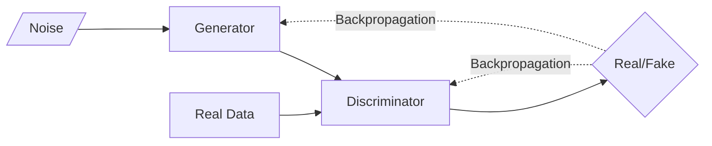

# Generative AI

## LLM

Large Language Models

### Limitations

- Bias
- Hallucinations
- Expensive to build & run

### ChatGPT

1. Train supervised policy
   1. Provide prompt
   2. Labeler demonstrates desired output behavior
   3. Fine-tune model
2. Collect comparaison data & train reward model
   1. Prompt and several model outputs are samples
   2. Labeler ranks outputs from best to worst
   3. Data used to train reward model
3. Policy optimization

## GAN

Generative Adversarial Networks

